# 1. Machine Learning ≈ Looking for Function

第一堂课，是要简单跟大家介绍一下machine learning还有deep learning的基本概念。

那所谓的机器学习到底是什么呢？顾名思义，机器他具备有学习的能力。事实上，机器学习概括来说可以用一句话来描述机器学习这件事，**机器学习就是让机器具备找一个函式的能力**。

​	那机器具备找函式的能力以后,他确实可以做很多事,举例来说

1. 假设你今天想要叫机器做语音辨识,机器听一段声音,產生这段声音对应的文字,那你需要的就是一个函式,这个函式的输入是声音讯号,输出是这段声音讯号的内容。那你可以想像说 这个可以把声音讯号,当作输入文字当作输出的函式,显然非常非常的复杂，他绝对不是,你可以用人手写出来的方程式,这个函式他非常非常的复杂,人类绝对没有能力把它写出来,所以我们期待凭藉著机器的力量,把这个函式自动找出来，这件事情,就是机器学习。
2. 假设我们现在要做,影像辨识 那这个影像辨识,我们需要什麼样的函式呢？这个函式的输入是一张图片,他的输出是什麼呢？他是这个,图片裡面 有什麼样的内容。
3. 或者是大家都知道的AlphaGo,其实也可以看作是一个函式,要让机器下围棋 我们需要的,就是一个函式 这个函式的输入,是棋盘上黑子跟白子的位置,输出是什麼 输出是机器下一步,应该落子的位置 假设你可以,找到一个函式 这个函式的输入,就是棋盘上黑子跟白子的位置,输出就是下一步应该落子的位置,那我们就可以让机器做自动下围棋,这件事 就可以做一个AlphaGo。

# 2. Different types of Functions ≈ Different Task of Machine Learning

随著我们要找的函式不同,机器学习有不同的类别,那这边介绍几个专有名词给大家。

1. **Regression**：Regression的意思是说,假设我们今天要找的函式,他的输出是一个数值,他的输出是一个 scalar,那这样子的机器学习的任务,我们称之為Regression。

   那这边举一个Regression的例子,假设我们今天要机器做的事情,是预测未来某一个时间的,PM2.5的数值 你要叫机器,做的事情是找一个函式,这个我们用f来表示,这个函式的输出,是明天中午的PM2.5的数值,他的输入可能是种种跟预测PM2.5,有关的指数 包括今天的PM2.5的数值,今天的平均温度,今天平均的臭氧浓度等等,这一个函式可以拿这些数值当作输入,输出明天中午的PM2.5的数值,那这一个找这个函式的任务,叫作Regression。

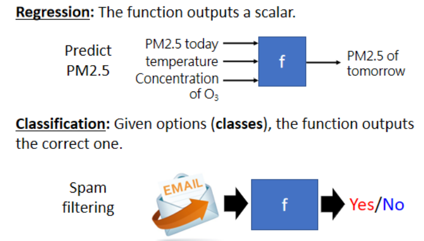

2. **Classification**：那Classification这个任务,要机器做的是选择题。我们人类,先準备好一些选项 那这些选项,又叫作类别 又叫作classes,我们现在要找的函式它的输出,就是从我们设定好的选项裡面,选择一个当作输出 那这个问题,这个任务就叫作Classification。

   举例来说,现在每个人都有gmail account,那gmail account裡面有一个函式,这个函式可以帮我们侦测一封邮件,是不是垃圾邮件,这个函式的输入是一封电子邮件,那他的输出是什麼呢,你要先準备好你要机器选的选项,在侦测垃圾邮件这个问题裡面,可能的选项就是两个,是垃圾邮件 或不是垃圾邮件,Yes或者是No,那机器要从Yes跟No裡面,选一个选项出来,这个问题叫作Classification,那Classification不一定只有两个选项,也可以有多个选项 。

   举例来说,alpha go本身也是一个Classification,的问题 那只是这个Classification,他的选项是比较多的,那如果要叫机器下围棋,你想做一个 alpha go的话,我们要给机器多少的选项呢,你就想想看 棋盘上有多少个位置,那我们知道棋盘上有19乘19个位置,那叫机器下围棋这个问题 其实,就是一个有19乘19个选项的选择题,你要叫机器做的就是找一个函式,这个函式的输入是棋盘上,黑子跟白子的位置,输出就是从19乘19个选项裡面,选出一个正确的选项,从19乘19个可以落子的位置裡面,选出下一步应该要落子的位置,那这个问题也是一个分类的问题。

   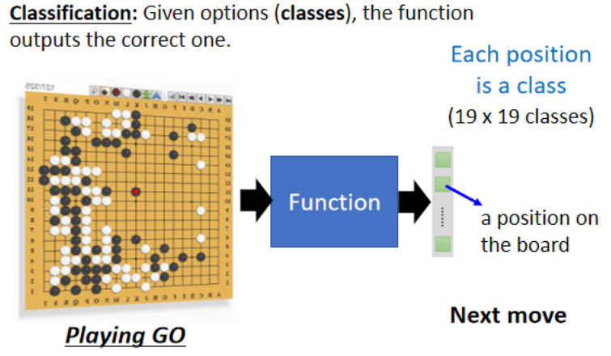

3. **Structured Learning**：也就是机器今天不只是要做选择题,不只是输出一个数字 还要產生,一个有结构的物件。

   举例来说,机器画一张图 写一篇文章,这种叫机器產生有结构的东西的问题,就叫作Structured Learning,那如果要讲得比较拟人化,比较潮一点 Structured Learning,你可以用拟人化的讲法说,我就是要叫机器学会创造这件事情

# 3. Case Study

我们说,机器学习就是要找一个函式,那机器怎麼找一个函式呢,那这边要用个例子跟大家说明说。

在讲这个例子之前 先跟大家说一下,说这一门课有一个youtube的频道[https://www.youtube.com/c/HungyiLeeNTU](https://www.youtube.com/c/HungyiLeeNTU),然后这个我会把上课的录影,放到这个youtube的频道上面。那為什麼突然提到,这个youtube的频道呢,因為我们等一下要举的例子,跟youtube是有关係的,youtuber在意的,就是这个频道的流量。在youtube后台,你可以看到很多相关的资讯，比如说每一天按讚的人数有多少,每一天订阅的人数有多少,每一天观看的次数有多少,我们能不能够根据,一个频道过往所有的资讯去预测,它明天有可能的观看的次数是多少呢,我们能不能够**找一个函式,这个函式的输入是youtube上面,youtube后台是我的资讯,输出就是某一天,隔天这个频道会有的总观看的次数**.

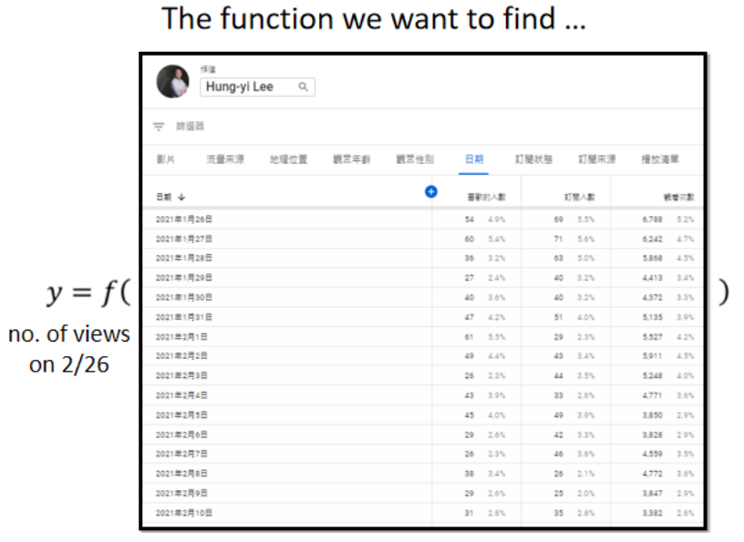

机器学习找这个函式的过程,分成三个步骤,那我们就用Youtube频道,点阅人数预测这件事情,来跟大家说明这三个步骤,是怎麼运作的

## 3.1. Design a Model

### 3.1.1. Function with Unknown Parameters

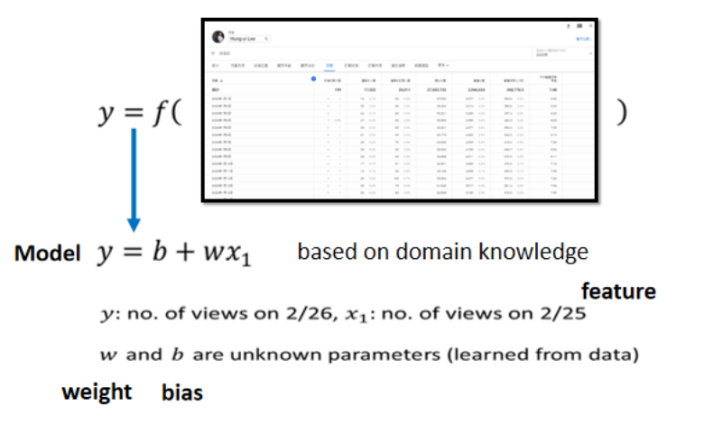

第一个步骤是我们要**写出一个,带有未知参数的函式**,简单来说就是 我们先猜测一下,我们打算找的这个函式$F$,它的数学式到底长什麼样子。举例来说,我们这边先做一个最初步的猜测,我们写成这个样子
$$
y=b+w*xₗ
$$
这边的每一个数值是什麼呢,这个y啊 就假设是今天吧,不过今天还没有过完,所以我还不知道,今天总共的点阅次数是多少,所以这件事情是我们未知的。 $y$是我们準备要预测的东西,我们準备要预测的是今天,2月26号这个频道总共观看的人。 $xₗ$是这个频道,前一天总共观看的人数,$y$跟$xₗ$都是数值。b跟w是未知的参数,它是準备要透过资料去找出来的,我们还不知道w跟b应该是多少,我们只是隐约的猜测，**这个猜测往往就来自於,你对这个问题本质上的了解,也就是Domain knowledge**,所以才会听到有人说,这个做机器学习啊,就需要一些Domain knowledge,.

所以我们这个能够预测未来点阅次数的函式$F$,它就一定是前一天的点阅次数,乘上w 再加上b呢,我们先不知道 这是一个猜测,也许我们觉得说,这个今天的点阅次数,总是会跟昨天的点阅次数有点关联,所以我们把昨天的点阅次数,乘上一个数值,但是总是不会一模一样,所以再加上一个b做修正,当作是对於2月26号,点阅次数的预测,这是一个猜测,它不一定是对的,我们等一下回头会再来修正这个猜测。

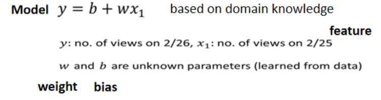

那现在总之,我们就随便猜说,$y=b+w*xₗ$,而b跟w是未知的,这个带有未知的参数的Function 我们就叫做Model,所以我们常常听到有人说,模型 Model,**Model这个东西在机器学习裡面,就是一个带有,未知的Parameter的Function**,

这个$xₗ$是这个Function裡面我们已知的,已经知道的东西,它是来自於Youtube后台的资讯,我们已经知道2月25号,点阅的总人数是多少,这个东西叫做**Feature**,而$w$跟$b$是我们不知道的,它是Unknown的Parameter,那这边我们也给$w$跟$b$,给他一个名字,这个跟Feature做相乘的未知的参数,这个w 我们叫它weight,这个没有跟Feature相乘的,是直接加下去的,这个我们叫它**Bias**,那这个只是一些名词的定义而已,等一下我们讲课的时候,我们在称呼,模型裡面的每一个东西的时候,会更為方便,好那这个是第一个步骤.

### 3.1.2. Define Loss from Training Data

第二个步骤,是我们要定义一个东西叫做Loss,**Loss它也是一个Function,那这个Function它的输入,是我们Model裡面的参数**。我们的Model叫做,$y=b+w*xₗ$,而$b$跟$w$是未知的,是我们準备要找出来的,所谓的这个Loss啊,它是一个Function,这个Function的输入,就是$b$跟$w$,所以L它是一个Function,它的输入是model裡面的Parameter,那这个Loss 这个Function,**这个Function输出的值代表说,现在如果我们把这一组未知的参数,设定某一个数值的时候,这笔数值好还是不好**。

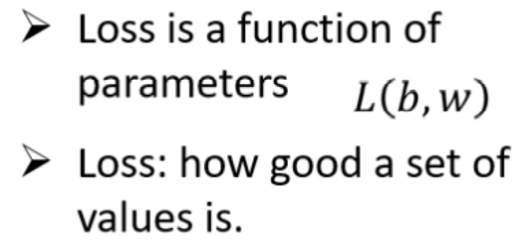

那这样讲可能你觉得有点抽象,所以我们就举一个具体的例子,假设现在我们给未知的参数的设定是$b$,这bias等於0.5k,这个$w$呢直接等於1,那这个Loss怎麼计算呢,如果我们b设0.5k,这个$w$设1,那我们拿来预测,未来的点阅次数的函式 就变成,y等於0.5k加1倍的xₗ,那这样子的一个函式,这个0.5k跟1,他们所代表的这个函式,它有多少呢,这个东西就是Loss.

我们要怎麼计算这个Loss呢,这个我们就要**从训练资料来进行计算**。在这个问题裡面,我们的训练资料是,这一个频道过去的点阅次数,举例来说,从2017年到2020年的点阅次数,每天的这个频道的点阅次数都知道,这边是假的数字啦,随便乱编的,好  所以那我们知道,2017年1月1号,到2020年12月31号的,点阅数字是多少,接下来我们就可以计算Loss。我们把2017年1月1号的点阅次数,代入这一个函式裡面,我们已经说我们想要知道,b设定為0.5k,$w$设定為1的时候,这个函式有多棒,当b设定為0.5k,w设定為1的时候,我们拿来预测的这个函数,是y等於0.5k加一倍的xₗ,那我们就把这个xₗ代4.8k,看它的预测出来的结果是多少,所以 根据这一个函式,根据$b$设0.5k,w设1的这个函式,如果1月1号,是4.8k的点阅次数的话,那隔天应该是4.8k乘1加0.5k,就是5.3k的点阅次数,那隔天实际上的点阅次数,1月2号的点阅次数我们知道吗,从后台的资讯裡面 我们是知道的,所以我们可以**比对一下,现在这个函式预估的结果,跟真正的结果,它的差距有多大**,这个函式预估的结果是5.3k,真正的结果是多少呢,真正的结果是4.9k,那这个真实的值叫做**Label**,它是高估了,高估了这个频道可能的点阅人数,那就可以计算一下这个差距,计算一下估测的值,跟真实的值的差距,这边**估测的值用y来表示,真实的值用ŷ**来表示,你可以计算y跟ŷ之间的差距,得到一个eₗ,代表估测的值跟真实的值之间的差距,那**计算差距其实不只一种方式**,我这边把y跟ŷ相减,直接取绝对值,算出来的值是0.4k。

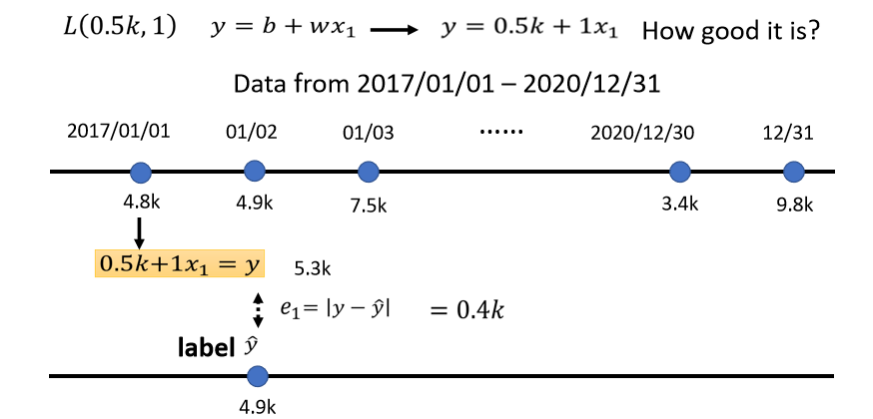

那我们不是只能用1月1号,来预测1月2号的值,我们可以用1月2号的值,来预测1月3号的值,如果我们现在的函式是,y等於0.5k加一倍的xₗ,那1月2号,根据1月2号的点阅次数,预测的1月3号的点阅次数的,值是多少呢 是5.4k,以xₗ代4.9k进去,乘1在加0.5k 等於5.4k,接下来计算这个5.4k,跟真正的答案,跟Label之间的差距,Label是7.5k,看来是一个低估,低估了这个频道,在1月3号的时候的点阅次数,才可以算出e₂,这个e₂是,y减y跟ŷ之间的差距,算出来是2.1k,那同一个方法,你就可以算过这三年来,每一天的预测的误差,假设我们今天的Function,是y等於0.5k加一倍的xₗ,这三年来每一天的误差,通通都可以算出来,每一天的误差都可以给我们一个小e。接下来我们就把每一天的误差,通通加起来,加起来然后取得平均,这个大N代表我们的训验资料的个数,就是三年来的训练资料,就365乘以3,每年365天 所以365乘以3,那我们算出一个L,我们算出一个大L,这大L是每一笔训练资料的误差,这个e相加以后的结果,这个大L就是我们的Loss.**大L越大,代表我们现在这一组参数越不好,这个大L越小,代表现在这一组参数越好**。

**估测的值跟实际的值之间的差距,其实有不同的计算方法**,在我们刚才的例子裡面,我们是算y跟ŷ之间,绝对值的差距,这一种计算差距的方法,得到的这个大L,得到的Loss叫 mean absolute error,缩写是**MAE**,如果你今天的e是用,相减y平方算出来的,这个叫mean square error,又叫**MSE**,那MSE跟MAE,他们其实有非常微妙的差别.我们就是选择MAE,作為我们计算这个误差的方式,把所有的误差加起来,就得到Loss,那你要选择MSE也是可以的,在作业裡面我们会用MSE,那有一些任务,如果y和ŷ它都是机率,都是**机率分佈**的话,在这个时候,你可能会选择**Cross-entropy**,这个我们都之后再说,我们这边就是选择了MAE,那这个是机器学习的第二步.

我刚才举的那些数字,不是真正的例子,以下的数字,是真实的例子,是这个频道真实的后台的数据,所计算出来的结果,那我们可以调整不同的w,我们可以调整不同的b,求取各种w 求取各种b,组合起来以后,我们可以為不同的w跟b的组合,都去计算它的Loss,然后就可以画出以下这一个**等高线图.**

在这个等高线图上面,越偏红色系,代表计算出来的Loss越大,就代表这一组w跟b越差,如果越偏蓝色系,就代表Loss越小,就代表这一组w跟b越好。拿这一组w跟b,放到我们的Function裡面,放到我们的Model裡面,那我们的预测会越精準,所以你就知道说,假设w在负0.25,这个b在负500,就代表说呢这个W在负0.25,b在负500 就代表说,这个频道每天看的人越来越少,而且Loss这麼大,跟真实的状况不太合,如果w代0.75 b代500,那这个正确率,这个估测会比较精準,那估测最精準的地方看起来,应该是在这裡啦,如果你今天w代一个很接近1的值,b带一个小小的值,比如说100多,那这个时候估测是最精準的,那这跟大家的预期可能是比较接近的,就是你拿前一天的点阅的总次数,去预测隔天的点阅的总次数,那可能前一天跟隔天的点阅的总次数,其实是差不多的,所以w设1,然后b设一个小一点的数值,也许你的估测就会蛮精準的。**那像这样子的一个等高线图,就是你试著试了不同的参数,然后计算它的Loss,画出来的这个等高线图,叫做Error Surface。**那这个是机器学习的第二步

### 3.1.3 Optimization

第三步要做的事情,其实是解一个**最佳化的问题**。如果你不知道最佳化的问题,是什麼的话也没有关係,我们今天要做的事情就是,找一个w跟b,把未知的参数,找一个数值出来,看代那一个数值进去,可以让我们的大L,让我们的Loss的值最小,那个就是我们要找的w跟b,那这个可以让loss最小的w跟b,我们就叫做$w*$ 跟 $b*,$代表说他们是最好的一组w跟b,可以让loss的值最小.

在这一门课裡面 我们唯一会用到的,Optimization的方法,叫做Gradient Descent。為了要简化起见,我们先假设我们未知的参数只有一个,就是$w$,我们先假设没有b那个未知的参数,只有w这个未知的参数。那当我们w代不同的数值的时候,我们就会得到不同的Loss,这一条曲线就是error surface,只是刚才在前一个例子裡面,我们看到的error surface,是二维的是2D的,那这边只有一个参数,所以我们看到的这个error surface,是1D的.

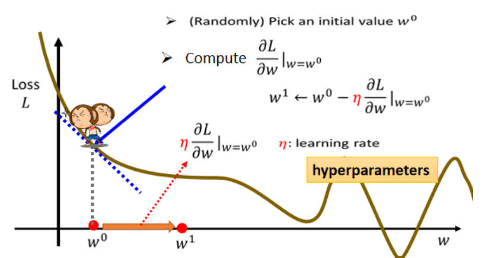

**那怎麼样找一个w,去让这个loss的值最小呢?**

1. 那首先你要**随机选取一个初始的点**,那这个初始的点,我们叫做**$w₀$**,那这个初始的点往往真的就是随机的,那在往后的课程裡面,我们其实会看到也许有一些方法,可以给我们一个比较好的w零的值.我们先当作都是随机的,那假设我们随机决定的结果,是在w0这个地方。
2. 那接下来你就要计算,**在w等於w0的时候,w这个参数对loss的微分是多少**$∂L/∂w |(w=w^0 )$,如果你不知道微分是什麼的话,那没有关係反正我们做的事情就是,计算在这一个点,在w₀这个位置的error surface的切线斜率,也就是这一条蓝色的虚线,它的斜率,那如果这一条虚线的斜率是负的,那代表什麼意思呢,代表说左边比较高 右边比较低,在这个位置附近,左边比较高 右边比较低。那如果左边比较高右边比较低的话,我们就把w的值变大,那我们就可以让loss变小,如果算出来的斜率是正的,就代表说左边比较低右边比较高,是这个样子的,左边比较低右边比较高,如果左边比较低 右边比较高的话,那就代表我们把w变小了,w往左边移 我们可以让Loss的值变小,那这个时候你就应该把w的值变小
3. **往Loss比较低的地方跨出一步。**那这一步要跨多大呢？这一步的步伐的大小取决於两件事情。
   第一件事情是**这个地方的斜率有多大**,这个地方的斜率大,这个步伐就跨大一点,斜率小步伐就跨小一点。
   另外 除了斜率以外,就是除了微分这一项,还有另外一个东西会影响步伐大小,这个东西我们这边用$η$来表示,**这个$η$叫做learning rate,叫做学习速率**,这个learning rate 它是怎麼来的呢,它是你自己设定的,你自己决定这个$η$的大小,如果$η$设大一点,那你每次参数update就会量大,你的学习可能就比较快,如果η设小一点,那你参数的update就很慢,每次只会改变一点点参数的数值,那这种你在做机器学习。**需要自己设定的东西,叫做hyperparameters**

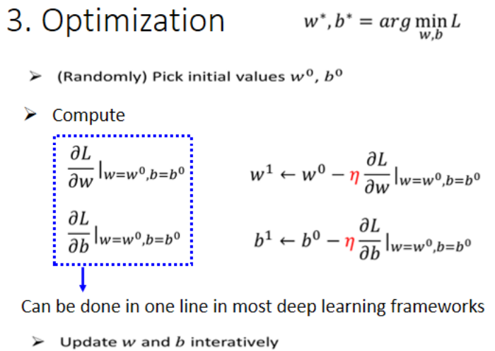

那我们说我们要把w⁰往右移一步,那这个新的位置就叫做w¹,这一步的步伐是η乘上微分的结果,那如果你要用数学式来表示它的话,就是把w⁰减掉η乘上微分的结果,得到w¹
$$
w^1←w^0-η \frac{∂L}{∂w}|(w=w^0 )
$$
那接下来你就是反覆进行刚才的操作,你就计算一下w¹微分的结果,然后再决定现在要把w¹移动多少,然后再移动到w²,然后你再继续反覆做同样的操作,不断的把w移动位置,最后你会停下来.

**什麼时候会停下来呢?**往往有两种状况

- 第一种状况是你失去耐心了。你一开始会设定说,我今天在调整我的参数的时候,我在计算我的微分的时候,我最多计算几次,你可能会设说,我的上限就是设定100万次,就我参数更新100万次以后,我就不再更新了,**那至於要更新几次,这个也是一个hyperparameter**,这个是你自己决定的,做一个deadline是明天,那你可能更新的次数就设少一点,对它下周更新的次数就设多一点,

- 那还有另外一种理想上的,停下来的可能是,今天当我们不断调整参数,调整到一个地方,它的微分的值就是这一项,算出来正好是0的时候,如果这一项正好算出来是0,0乘上learning rate η还是0,所以你的参数就不会再移动位置,那假设我们是这个理想的状况,我们把w⁰更新到w¹,再更新到w²,最后更新到wᵗ有点卡,wᵗ卡住了,也就是算出来这个微分的值是0了,那参数的位置就不会再更新,

你可能会马上发现说,Gradient Descent 这个方法,有一个巨大的问题,我们没有找到真正最好的解,我们没有找到那个,可以让Loss最小的那个w,在这个例子裡面,把w设定在右侧红点附近这个地方,你可以让loss最小,但是如果 Gradient Descent,是从W^0^这个地方,当作随机初始的位置的话,也很有可能走到W^T^这裡,你的训练就停住了,你就没有办法再移动w的位置。那右侧红点这一个位置,这个真的可以让loss最小的地方,叫做**global 的minima**,而W^T^这个地方叫做**local 的minima**,它的左右两边,都比这个地方的loss还要高一点,但是它不是整个error surface上面的最低点。

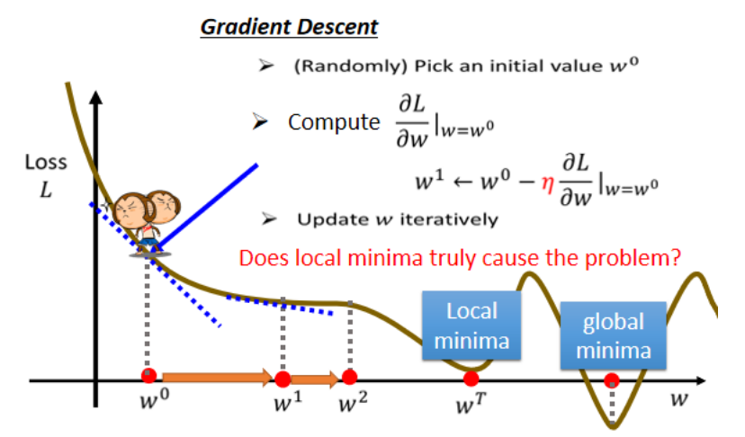

所以常常可能会听到有人讲到,**Gradient Descent,不是个好方法,这个方法会有local minima的问题**,没有办法真的找到global minima,但教科书常常这样讲,农场文常常这样讲,但这个其实只是幻觉而已,事实上,假设你有做过深度学习相关的事情,假设你有自己训练network,自己做过Gradient Descent 经验的话,其实**local minima是一个假问题**,我们在做Gradient Descent 的时候,真正面对的难题不是local minima,到底是什麼,这个 我们之后会再讲到,在这边你就先接受,先相信多数人的讲法说,Gradient Descent,有local minima的问题,在这个图上在这个例子裡面,显然有local minima的问题,但之后会再告诉你说,Gradient Descent真正的痛点,到底是什麼。

刚才举的例子,是只有一个参数的例子而已,那实际上我们刚才的模型有两个参数,有w跟b,那有两个参数的情况下,怎麼用Gradient Descent呢？其实跟刚才一个参数没有什麼不同,若一个参数你没有问题的话,你可以很快的推广到两个参数。我们现在有两个参数,都给它随机的初始的值,就是$w⁰$跟$b⁰$你要计算w跟loss的微分,你要计算b对loss的微分,计算是在w等於w⁰的位置,b等於b₀的位置,在w等於w₀的位置,b等於b⁰的位置,你要计算w对L的微分,计算b对L的微分,

$$
\frac{∂L}{∂b} |(w=w^0,b=b^0 )
$$

$$
\frac{∂L}{∂w} |(w=w^0,b=b^0 )
$$

计算完以后,就根据我们刚才,一个参数的时候的做法,去更新w跟b,把w⁰减掉learning rate,乘上微分的结果得到w¹,把b⁰减掉learning rate,乘上微分的结果得到b¹
$$
w^1←w^0-η \frac{∂L}{∂w} |(w=w^0,b=b^0 )
$$

$$
b^1←b^0-η \frac{∂L}{∂b} |(w=w^0,b=b^0 )
$$

如果你不会算微分的话,不用紧张,在deep learning 的framework裡面,或在我们作业一,会用的pytorch裡面,算微分都是程式自动帮你算的,你就写一行程式,自动就把微分的值就算出来了,你就算完全不知道自己在干嘛,也还是可以把微分的值算出来,所以这边,如果你根本就不知道微分是什麼,不用担心,这一步骤就是一行程式,这个等一下之后在做AE的时候,大家可以自己体验看看,那就是反覆同样的步骤,就不断的更新w跟b,然后期待最后,你可以找到一个最好的w,$w^*$ 跟最好的b $b^*$.

如果在这一个问题上,它操作起来是什麼样子,假设,你随便选一个初始的值在这个地方,那你就先计算一下w对L的微分,跟计算一下b对L的微分,然后接下来你就要更新w跟b,更新的方向就是w对L的微分,乘以η再乘以一个负号,b对L的微分,算出这个微分的值,你就可以决定更新的方向,你就可以决定w要怎麼更新,那把w跟b更新的方向结合起来,就是一个向量,就是这个红色的箭头,我们就从这个位置移到这个位置,

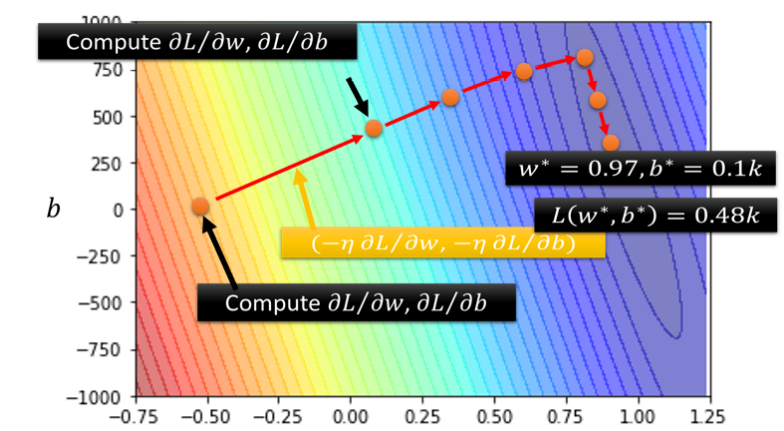

然后再计算一次微分,然后你再决定要走什麼样的方向,把这个微分的值乘上learning rate,再乘上负号,你就知道红色的箭头要指向那裡,你就知道怎麼移动w跟b的位置,一直移动一直移动一直移动,期待最后可以找出一组不错的w跟b,

那实际上真的用Gradient Descent,进行一番计算以后,这个是真正的数据,我们算出来的最好的w是0.97,最好的b是0.1k,跟我们的猜测蛮接近的,因為x₁的值可能跟y很接近,所以这个w就设一个接近1的值,b就设一个比较偏小的值,那loss多大呢,loss算一下是0.48k,也就是在2017到2020年的资料上,如果使用这一个函式,b代0.1k,w代0.97,那平均的误差是0.48k,也就是它的预测的观看人数误差,大概是500人次左右.那w跟b的值刚才已经找出来的,那这组w跟b可以让loss小到0.48k。

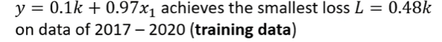

## 3.2. Improve Your Model

### 3.2.1. Linear Model

但是这样,是一个让人满意或值得称道的结果吗,也许不是,因為这三个步骤合起来,叫做**训练**,我们现在是在,我们已经知道答案的资料上,去计算loss,我们其实已经知道2017到2020年,每天的观看次数 所以,其实我们现在其实只是在自high而已,就是假装我们不知道隔天的观看次数,然后拿这一个函式来进行预测,发现误差是0.48k。

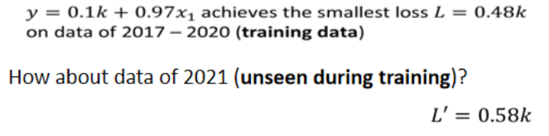

但是我们真正要在意的,我们不知道的,未来的观看的次数是多少,所以我们接下来要做的事情就是拿这个函式,来**真的预测一下未来的观看次数**,那这边,我们只有2017年到2020年的值,我们在2020年的最后一天,跨年夜的时候,找出了这个函式,接下来从2021年开始每一天,我们都拿这个函式,去预测隔天的观看人次,我们就拿2020年的12月31号的,观看人次,去预测2021年元旦的观看人次,用2021年元旦的观看人次,预测一下2021年元旦隔天,1月2号的观看人次,用1月2号的观看人次去预测,1月3号的观看人次,每天都做这件事,一直做到2月14号,就做到情人节,然后得到平均的值,平均的误差值是多少呢,这个是真实的数据的结果,在2021年没有看过的资料上,这个误差值是,我们这边用L prime来表示,它是0.58,所以在有看过的资料上,在训练资料上,误差值是比较小的,在没有看过的资料上,在2021年的资料上,看起来误差值是比较大的,那我们每一天的平均误差,有580人左右,600人左右。

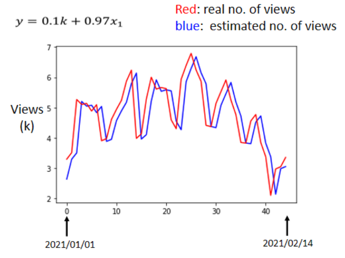

能不能够做得更好呢,在做得更好之前,我们先来分析一下结果。横轴是代表的是时间,所以0这个点 最左边的点,代表的是2021年1月1号,最右边点,代表的是2021年2月14号。纵轴就是观看的人次,这边是用千人当作单位。红色的线是真实的观看人次。蓝色的线是机器用这一个函式,预测出来的观看人次。

你有发现很明显的,这蓝色的线没什麼神奇的地方,它几乎就是,红色的线往右平移一天而已,它其实也没做什麼特别厉害的预测,就把红色的线往右平移一天,因為这很合理,因為我们觉得,x₁也就是前一天的观看人次,跟隔天观看人次的,要怎麼拿前一天的观看人次,去预测隔天的观看人次呢,前一天观看人次乘以0.97,加上0.1k 加上100,就是隔天的观看人次,所以你会发现说,机器几乎就是拿前一天的观看人次来预测,隔天的观看人次,但是如果你仔细观察这个图,你就会发现,这个真实的资料有一个很神奇的现象,它是有週期性的,它每隔七天就会有两天特别低,两天观看的人特别少,那两天是什麼日子呢,那我发现那两天都固定,**是礼拜五跟礼拜六**,礼拜五跟礼拜六我可以了解,就礼拜五週末 大家出去玩,谁还要学机器学习,礼拜六谁还要学机器学习,那不知道為什麼,礼拜天大家去学机器学习,这个我还没有参透為什麼是这个样子,也许跟youtube背后,神奇的演算法有关係,比如说youtube都会推频道的影片,也许youtube在推频道的影片的时候,它都选择礼拜五礼拜六不推,只推礼拜天到礼拜四,可是為什麼推礼拜天到礼拜四呢,这个我也不了解,但是反正看出来的结果,我们看真实的数据,就是这个样子,每隔七天一个循环,每个礼拜五礼拜六,看的人就是特别少。所以既然我们已经知道每隔七天,就是一个循环,那这一个式子 这一个model,显然很烂,因為它只能够看前一天。

每隔七天它一个循环,如果我们一个模型,它是参考前七天的资料,把七天前的资料,直接复製到拿来当作预测的结果,也许预测的会更準也说不定,所以我们就要修改一下我们的模型,**通常一个模型的修改,往往来自於你对这个问题的理解,也就是Domain Knowledge**。

所以一开始,我们对问题完全不理解的时候,我们就胡乱写一个
$$
y=b+wx_1
$$
并没有做得特别好,接下来我们观察了真实的数据以后,得到一个结论是,每隔七天有一个循环,所以我们应该要把,前七天的观看人次都列入考虑,所以我们写了一个新的模型,

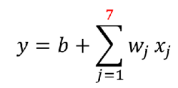

xⱼ代表什麼,这个下标j代表是几天前,然后这个j等於1到7,也就是从一天前两天前,一直考虑到七天前,那七天前的资料,通通乘上不同的weight,乘上不同的wⱼ,加起来,再加上bias,得到预测的结果,

如果这个是我们的model,那我们得到的结果是怎麼样呢,我们在训练资料上的loss是0.38k,那因為这边只考虑一天,这边考虑七天,所以在训练资料上,你会得到比较低的loss,这边考虑了比较多的资讯,在训练资料上你应该要得到更好的,更低的loss,这边算出来是0.38k,但它在没有看过的资料上面,做不做得好呢,在没有看到的资料上,有比较好,是0.49k,所以刚才只考虑一天是0.58k的误差,考虑七天是0.49k的误差。那这边每一个w跟b,我们都会用Gradient Descent,算出它的最佳值,它的最佳值长什麼样子呢,这边show出来,给你看 它的最佳值长这样,当然机器的逻辑我是有点没有办法了解,我本来以為它会选七天前的数据,七天前的观看人数,直接复製过来,我看来它没有这样选就是了。

它的逻辑是前一天,跟你要预测的隔天的数值的关係很大,所以w₁*是0.79,那不知道為什麼 它还考虑前三天,前三天是0.12,然后前六天是0.3,前七天是0.18,不过它知道说,如果是前两天前四天前五天,它的值会跟未来我们要预测的,隔天的值是成反比的,所以w₂ w₄跟w₅它们最佳的值,让Loss可以在训练资料上,是0.38k的值 是负的,但是w₁ w₃ w₆跟w₇是正的,我们考虑前七天的值,那你可能会问说,能不能够考虑更多天呢,可以,那这个轻易的改考虑更多天,本来是考虑前七天

然后考虑28天会怎麼样呢,28天就一个月,考虑前一个月每一天的观看人次,去预测隔天的观看人次,预测出来结果怎样呢,训练资料上是0.33k,那在2021年的资料上,在没有看过的资料上是0.46k,看起来又更好一点 好 28天,好那接下来考虑56天会怎麼样呢,在训练资料上是稍微再好一点,是0.32k,在没看过的资料上还是0.46k,看起来,考虑更多天没有办法再更进步了,看来考虑天数这件事,也许已经到了一个极限。**那这边这些模型,它们都是把输入的这个x,这个x 还记得它叫什麼吗,它叫做feature,把feature乘上一个weight,再加上一个bias就得到预测的结果,这样的模型有一个共同的名字,叫做Linear model**。

那我们接下来会看,怎麼把Linear model做得更好。

### 3.2.2. Piecewise Linear Curves

Linear 的 Model,也许太过简单了,我们可以想像说 x1 跟 y,也许它中间有比较复杂的关係,对 Linear 的 Model 来说,x1 跟 y 的关係就是一条直线,随著 x1 越来越高,y 就应该越来越大,你可以设定不同的 w,改变这条线的斜率,你可以设定不同的 b,改变这一条蓝色的直线,跟 y 轴的交叉点,但是无论你怎麼改 w 跟 b,它永远都是一条直线,永远都是 x1 越大,y 就越大,前一天观看的人数越多,隔天的观看人数就越多。

但也许现实并不是这个样子。也许在 x1 小於某一个数值的时候,前一天的观看人数跟隔天的观看人数是成正比。也许当 x1 大於一个数值的时候,这个物极必反,过了一个假设 x1 太大,前天观看的人数太高,那隔天观看人数就会变少,也说不定。也许 x1 跟 y 中间,有一个比较复杂的,像这个红色线一样的关係。

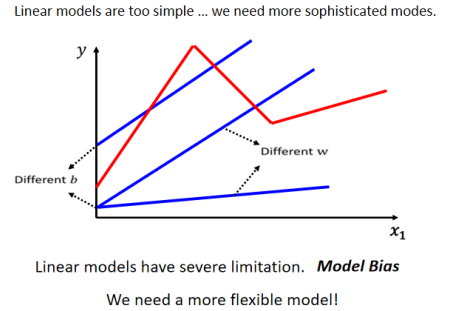

但你不管怎麼摆弄w 跟 b,你永远製造不出红色那一条线,你永远无法用 Linear 的 Model,製造红色这一条线,显然 Linear 的 Model 有很大的限制,**这一种来自於 Model 的限制,叫做 Model 的 Bias**,那其实我们刚才在课堂一开始的时候也叫做,也说 b 叫做 Bias,那这个地方有一点,在用词上有一点 Ambiguous,所以特别强调说,这个东西叫做 Model 的 Bias,跟 b 的这个 Bias 不太一样**,它指的意思是说,没有办法模拟真实的状况

所以我们需要写一个更复杂的,更有弹性的,有未知参数的 Function,我们可以观察一下红色的这一条曲线,它可以看作是一个常数,再加上一群蓝色的这样子的 Function。

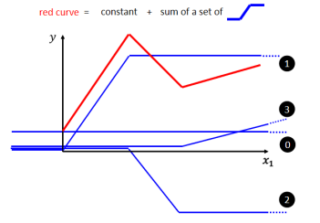

这个蓝色的 Function,它的特性是：当输入的值,当 x 轴的值小於某一个这个 Flash Hold 的时候,它是某一个定值；大於另外一个 Flash Hold 的时候,又是另外一个定值；中间有一个斜坡。所以它是先水平的,然后再斜坡,然后再水平的,那它其实有名字,它的名字我们等一下再讲,这边我们因為它是蓝色的 Function,我们就先叫它蓝fun吧 这样子,好 那所以呢 这个红色的线啊,它可以看作是一个常数项加一大堆的蓝方,好 那这个常数项,它的值应该要有多大呢,你就看这一条红色的线啊,它跟 x 轴的交点在哪裡,好 那这个常数项呢,就设跟 x 轴的交点一样大

那怎麼加上这个蓝色的 Function 以后,变成红色的这一条线? 蓝线“1”Function 斜坡的起点,设在红色 Function 的起始的地方,然后第二个,斜坡的终点设在第一个转角处,你刻意让这边这个蓝色 Function 的斜坡,跟这个红色 Function 的斜坡,它们的斜率是一样的,这个时候如果你把 0 加上 1,你就可以得到红色曲线 。然后接下来,再加第二个蓝色的 Function,你就看红色这个线,第二个转折点出现在哪裡, 所以第二个蓝色Function，它的斜坡就在红色 Function 的第一个转折点,到第二个转折点之间,你刻意让这边的斜率跟这边的斜率一样,这个时候你把 0加 1+2,你就可以得到两个转折点这边的线段,就可以得到红色的这一条线这边的部分。然后接下来第三个部分,第二个转折点之后的部分,你就加第三个蓝色的 Function,第三个蓝色的 Function,它这个坡度的起始点,故意设的跟这个转折点一样,这边的斜率,故意设的跟这边的斜率一样,好 接下来你把 0加 1+2+3 全部加起来,你就得到红色的这个线。所以红色这个线,可以看作是一个常数,再加上一堆蓝色的 Function

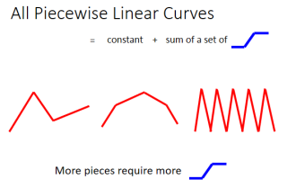

你现在这个 Curves 啊,它是有很多线段所组成的,它是有很多锯齿状的线段所组成的,这个叫做 **Piecewise Linear 的 Curves**,那你会发现说这些 Piecewise Linear 的 Curves,你有办法用常数项,加一大堆的蓝色 Function 组合出来,只是他们用的蓝色 Function 不见得一样,你要有很多不一样的蓝色 Function,加上一个常数以后,你就可以组出这些 Piecewise Linear 的 Curves。那如果你今天 Piecewise Linear 的 Curves 越复杂,也就是这个转折的点越多啊,那你需要的这个蓝色的 Function 就越多。

讲到这边有人可能会说,那也许我们今天要考虑的 x 跟 y 的关係不是 Piecewise Linear 的 Curves ,也许它是这样子的曲线。

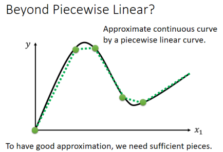

那就算是这样的曲线,也无所谓,我们可以在这样的曲线上面,先取一些点,再把这些点点起来,变成一个 Piecewise Linear 的 Curves,而这个 Piecewise Linear 的 Curves 跟原来的曲线,它会非常接近,如果你今天点取的够多,或你点取的位置适当的话,这个 Piecewise Linear 的 Curves,就可以逼近这一个,连续的这一个曲线,就可以逼近这一个不是 Piecewise Linear,它是有角度的 有弧度的这一条曲线。

所以我们今天知道一件事情,**你可以用 Piecewise Linear 的 Curves,去逼近任何的连续的曲线,而每一个 Piecewise Linear 的 Curves,又都可以用一大堆蓝色的 Function 组合起来,也就是说,我只要有足够的蓝色 Function 把它加起来,我也许就可以变成任何连续的曲线**

所以今天,假设我们的 x 跟 y 的关係,它也许非常地复杂,那也没关係,我们就想办法写一个带有未知数的 Function,这个带有未知数的 Function 它表示的,就是一堆蓝色的 Function,加上一个 Constant。

那我们接下来要问的问题就是,这一个蓝色 Function,它的式子应该要怎麼把它写出来呢？也许你要直接写出它 没有那麼容易,但是你可以用一条曲线来理解它,用一个 Sigmoid 的 Function,来逼近这一个蓝色的 Function,那 **Sigmoid Function**,它的式子长的是这个样子的,
$$
y=c \frac{1}{1+e^{-(b+wx_1)}}
$$
它的横轴输入是 x1,输出是 y,输入的 x1,我们先乘上一个 w,再加上一个 b,再取一个负号,再取 Exponential,再加 1,这一串被放在分放在,放在分母的地方

把 1 除以 1 加上 Exponential -b+wx1,前面 你可以乘上一个 Constant 叫做 c,好 那如果你今天输入的这个 x1 的值,趋近於无穷大的时候,那  $e^{-(b+wx_1)}$这一项就会消失,那当 x1 非常大的时候,这一条这边就会收敛在这个高度是 c 的地方。那如果今天 x1 负的非常大的时候,分母的地方就会非常大,那 y 的值就会趋近於 0.

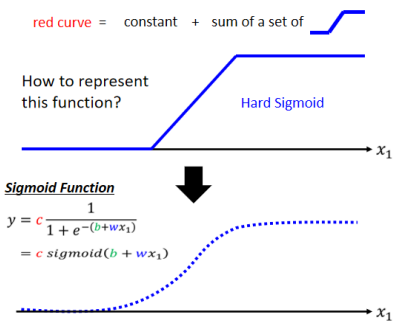

所以你可以用这样子的一个 Function逼近这一个蓝色的 Function,那这个东西它的名字叫做 Sigmoid,Sigmoid,如果你要 硬要翻成中文的话,可以翻成 S 型的,所以 Sigmoid Function 就是 S 型的 Function,因為它长得是 有点像是 S 型的哦,所以叫它 Sigmoid Function,那这边我们之后都懒得把 Exponential 写出来,我们就直接写成这个样子
$$
y=c*sigmoid(b+wx_1 )
$$
就是 y 等於 c 倍的 Sigmoid,然后这个括号裡面放$b+wx_1$,然后这个 $b+wx_1$,实际上做的事情,就是把它放在 Exponential 的指数下,前面加一个负号,然后 1+Exponential 的$-(b+wx_1)$ 放在分母的地方,然后前面乘上 c,就等於 y

所以我们可以用这个 Sigmoid Function,去逼近一个蓝色的 Function,那其实这个蓝色的 Function,比较常见的名字就叫做,Hard 的 Sigmoid 啦。只是我本来是想说一开始,我们是先介绍蓝色的 Function,才介绍 Sigmoid,所以一开始说它叫做 Hard Sigmoid,有一点奇怪,所以我们先告诉你说,有一个 Sigmoid Function,它可以逼近这个蓝色的 Function,那这个蓝色的 Function,其实通常就叫做 **Hard 的 Sigmoid**

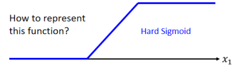

那我们今天我们需要各式各样不同的,蓝色的 Function,还记得吗,我们要**组出各种不同的曲线,那我们就需要各式各样合适的蓝色的 Function**,而这个合适的蓝色的 Function 怎麼製造出来呢

$$
y=c \frac{1}{1+e^{-(b+wx_1)}}
$$
我们就需要调整这裡的 b 跟 w 跟 c,你就可以製造各种不同形状的 Sigmoid Function,用各种不同形状的 Sigmoid Function,去逼近这个蓝色的 Function.如果你今天改 $w$ 你就会改变斜率你就会改变斜坡的坡度。如果你动了  $b $ 你就可以把这一个 Sigmoid Function 左右移动。如果你改 $c$ 你就可以改变它的高度。

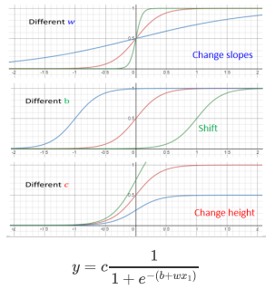

**所以你只要有不同的 w 不同的 b 不同的 c, 你就可以製造出不同的 Sigmoid Function, 把不同的 Sigmoid Function 叠起来以后, 你就可以去逼近各种不同的Piecewise Linear 的 Function, 然后 Piecewise Linear 的 Function可以拿来近似各种不同的 Continuous 的 Function**

所以假设我们要把红色的这条线,它的函数写出来的话,那可能长什麼样子呢?

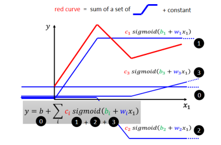

我们知道说红色这条线 就是 0加 1+2+3,而这个 123 啊,它们都是蓝色的 Function,所以它们的函式 就是有一个固定的样子,它们都写做 $(b+wx_1 )$,去做 Sigmoid 再乘上 c1,只是 1 跟 2 跟 3,它们的 w 不一样,它们的 b 不一样,它们的 c 不一样,如果是第一个蓝色 Function,它就是 w1 b1 c1,第二个蓝色 Function,我们就说它的,它用的是 w2 b2 c2,第三个蓝色 Function,我们就说它用的是 w3 b3 c3,好 那我们接下来呢,就是把 0 跟 123 全部加起来以后,我们得到的函式,就长这一个样子
$$
y = b + \sum_i {c_isigmoid(b_i+w_ix_1 )}
$$
我们把 1+2+3 加起来,然后 Summation 裡面呢,就是 ci 乘上 Sigmoid,bi+wi 乘上 x1,所以这边每一个式子,都代表了一个不同蓝色的 Function,Summation 的意思,就是把不同的蓝色的 Function 给它加起来,就是这边 Summation 的意思。别忘了加一个 Constant,这边用 $b$ 来表示这个 Constant

所以我们其实有办法写出一个,这个非常有弹性的,有未知参数的 Function,它长这个样子就是 Summation 一堆 Sigmoid,但它们有不同的 c 不同的 b 不同的 w,好 那所以本来我们是 Linear 的 Model,y 等於 b+w 乘上 x1,它有非常大的限制,这个限制叫做 Model 的 Bias,那我们要如何减少 Model 的 Bias 呢。我们可以写一个更有弹性的,有未知参数的 Function,它叫做  $y=b + \sum_i {c_isigmoid(b_i+w_ix_1 )}$  本来这边是 $b+wx_1$,这边变成$b_i+w_ix_1$,然后我们有很多不同的 bi,有很多不同的 wi,它们都通过 Sigmoid 都乘上 ci,把它统统加起来再加 b 等於 y,我们只要带入不同的 c 不同的 b 不同的 w,我们就可以变出各式各样,就可以组合出各式各样不同的 Function。下图为从单个Future的Linear Model变为单个Future的Piecewise Linear Model的表达式，为多个函数之和，可表示任意由x为自变量的曲线。

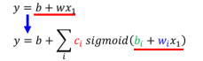

### 3.2.3. More Features

那我们刚才Linear Model的时候其实已经进化到,不是只用一个 Feature,即$X_1$,我们可以用多个 Feature。下图为从多个Feature的Linear Moel变为多个Feature的Piecewise Linear Model的表达式，最终仍为多个sigmoid函数之和，可表示任意由多个x为自变量的曲线。

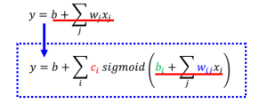

我们这边用 j 来代表 Feature 的编号。举例来说刚才如果要考虑前 28 天的话,j 就是 1 到 28,考虑前 56 天的话,j 就是 1 到 56,那如果把这个 Function,再扩展成我们刚才讲的上面这个,比较有弹性的 Function 的话那也很简单,我们就把 Sigmoid 裡面的东西换掉,本来这边是
$$
y=b + \sum_j {w_ix_j }
$$
那这边呢,就把这一项放到这个括号裡面,改成
$$
y = b + \sum_i {c_isigmoid(b_i+\sum_j w_i{_j} x_j  )}
$$
把本来放在这边的东西放到 Sigmoid 裡面,然后呢这个每一个 Sigmoid 的 Function 裡面呢,都有不同的 bi 不同的 $w_i{_j}$,然后取 Sigmoid 以后乘上 ci 就全部加起来,再加上 b 就得到 y,我们只要这边 ci bi 跟 $w_i{_j}$ 在放不同的值,就可以变成不同的 Function.

那如果讲到这边你还是觉得有点抽象的话,如果你看这个式子觉得有点头痛的话,那我们用比较直观的方式,把这个式子实际上做的事把它画出来,

我们先考虑一下 j 就是 1 2 3 的状况,就是我们只考虑三个 Feature。举例来说 我们只考虑前一天 前两天,跟前三天的 Case。所以 j 等於 1 2 3,那所以输入就是 x1 代表前一天的观看人数,x2 两天前观看人数,x3 三天前的观看人数。每一个 i 就代表了一个蓝色的 Function,只是我们现在每一个蓝色的 Function,都用一个 Sigmoid Function 来比近似它。

那这边呢,这个 1 2 3 就代表我们有三个 Sigmoid Function,那我们先来看一下,这个括号裡面做的事情是什麼

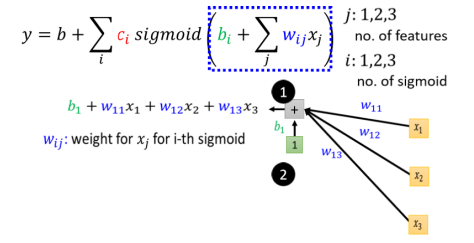

每一个 Sigmoid 都有一个括号,第一个 Sigmoid i 等於 1 的 Case ,就是把。x1 乘上一个 Weight 叫 $w_{11}$。x2 乘上另外一个 Weight 叫  $w_{12}$。x3 再乘上一个 Weight 叫做 $w_{13}$。全部把它加起来,不要忘了再加一个 b

$$
b_1+w_{11} x_1+w_{12} x_2+w_{13} x_3
$$

这个得到的式子就是这个样子,所以这边我们**用 $w_{ij}$ ,来代表在第 i 个 Sigmoid 裡面,乘给第 j 个 Feature 的 Weight**,第一个 Feature 它就是 w11,第二个 Features 就是乘 w12,第三个 Feature 都是乘 w13,所以三个 Features1 2 3,这个 w 的第二个下标就是 123,w 的第一个下标代表是,现在在考虑的是第一个 Sigmoid Function,那我们有三个 Sigmoid Function。

第二个 Sigmoid Function,它在括号裡面做的事情就是把 x1 乘上 w21,把 x2 x2 乘上 w22,把 x3 x3 乘上 w23,统统加起来再加 b2

第三个 Sigmoid 呢,第三个 Sigmoid 在括号裡面做的事情,就是把 x1 x2 x3,分别乘上 w31 w32 跟 w33 再加上 b3

我们现在為了简化起见,我们把括弧裡面的数字,用一个比较简单的符号来表示,所以这一串东西我们当作 r1,这一串东西我们当作 r2,这一串东西我们叫它 r3.

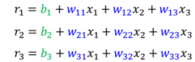

这个 x1 x2 跟 x3 和 r1 r2 r3,中间的关係是什麼呢,你可以用矩阵跟向量相乘的方法,写一个比较简单的 简洁的写法.我们刚才已经知道说 r1 r2 r3,也就是括弧裡面算完的结果啊,三个 Sigmoid 括弧裡面算完的结果,r1 r2 r3 跟输入的三个 Feature x1 x2 x3,它们中间的关係就是这样,把 x1 x2 x3 乘上不同的 Weight,加上不同的 Bias,也就是不同的 b 会得到不同的 r.

如果你熟悉线性代数的话,简化成矩阵跟向量的相乘,把 x1 x2 x3 拼在一起变成一个向量,把这边所有的 w 统统放在一起变成一个矩阵,把 b1 b2 b3 拼起来变成一个向量,把 r1 r2 r3 拼起来变成一个向量,那这是三个式子,你就可以简写成,有一个向量叫做 x,这个 x 乘 1个矩阵叫做 w,这个 w 裡面有 9 个数值就是这边的 9 个 w,就是这边的 9 个 Weight,x 先乘上 w 以后再加上 b 就得到 r 这个向量,那这边做的事情跟上边做的事情是一模一样的,没有半毛钱的不同,只是表示的方式不一样而已,

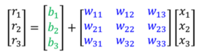

那把它改成线性代数比较常用的表示方式,x 乘上矩阵 w 再加上向量 b,会得到一个向量叫做 r

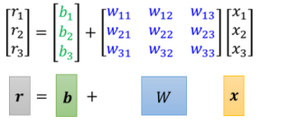

在这个括号裡面做的事情就是这麼一回事,把 x 乘上 w 加上 b 等於 r,r 呢就是这边的 r1 r2 r3,这是 r1 r2 r3,好 那接下来这个 r1 r2 r3 哪,就要分别通过 Sigmoid Function,好 分别通过 Sigmoid Function,因為我们实际上做的值就是,做的事情就是把 r1 取一个负号,再乘 再做 Exponential 再加 1,然后把它放到分母的地方,1 除以 1+Exponential 负 r1 等於 a1,然后同样的方法由 r2 去得到 a2,把 r3 透过 Sigmoid Function 得到 a3,所以这边这个蓝色的虚线框框裡面做的事情,就是从 x1 x2 x3 得到了 a1 a2 a3

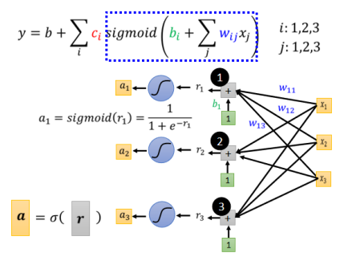

接下来呢,我们这边呢有一个简洁的表示方法,是我们用 r 通过一个,叫做这个 Sigmoid 的 Function,我们用这个东西,我们这边呢用这个符号呢,来代表通过这个 Sigmoid 的 Function,然后呢 所以我们得到了 a 这个向量,就把 r1 r2 r3 分别通过 Sigmoid Function,但我们直接用这个符号来表示它,然后得到 a1 a2 a3

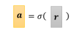

接下来我们这个 Sigmoid 的输出,还要乘上 ci 然后还要再加上 b,如果你要用向量来表示的话,a1 a2 a3 拼起来叫这个向量 a,c1 c2 c3 拼起来叫一个向量 c,那我们可以把这个 c 呢,作 **Transpose**,好 那 a 呢 乘上 c 的 Transpose 再加上 b,好再加上 b 我们就得到了 y

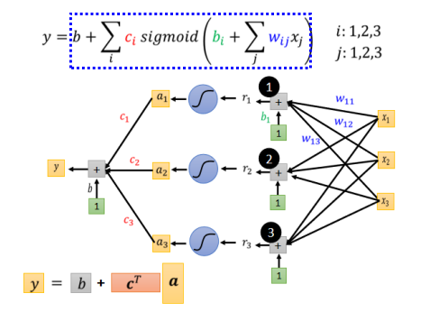

它整体而言做的事情就是 x 输入是 x,我们的 Feature 是 x 这个向量,x 乘上矩阵 w 加上向量 b 得到向量 r,再把向量 r 透过 Sigmoid Function得 到向量 a,再把向量 a 跟乘上 c 的 Transpose 加上 b 就得到 y。

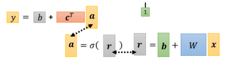

所以这是上面这件事情,如果你想要用线性代数的方法来表示它,用向量矩阵相乘方法来表示它,欸 就长得一副这个样子,那这边的这个 r 就是这边的 r,这边的 a 就这边的 a,所以我们可以把这一串东西,放到这个括号裡面,再把这个 a 呢 放到这裡来,所以把相同的东西併起来以后,整体而言就是长这个样子,上面这一串东西,我们觉得比较这个,比较有弹性的这个 Function,如果你要线性代数来表示它的话,就是下面这个式子啦。x 乘上 w 再加上 b 通过 Sigmoid Function,乘上 c 的 Transpose 加 b 就得到 y

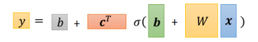

接下来，怎麼把这些未知的参数找出来之前,我们先再稍微重新定义一下我们的符号,

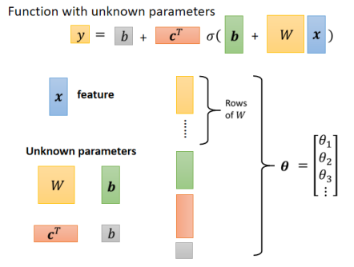

这边的这个x 是 Feature,这边的 $W$ $b$ $c$ 跟 $b$,这边有两个 $b$ 啊,但是这两个 $b$ 是不一样的,绿色这一个是一个向量,灰色这个是一个数值,显示它们是不一样的东西。我们把这个黄色的这个 w,把这个 b 把这个 c 把这个 b 统统拿出来,集合在这边,它们就是我们的 Unknow 的 Parameters,就是我们的未知的参数。那我们把这些东西通通拉直,拼成一个很长的向量,我们把 w 的每一个 Row,或者是每一个 Column 拿出来,今天不管你是拿过 Row 或拿 Column 都可以,你就把 w 的每一个 Column 或每一个 Row 拿出来,拼成一个长的向量,把 b 拼上来 把 c 拼上来 把 b 拼上来,这个长的向量,我们直接用一个符号叫做 $θ$ 来表示它

$θ$ 是一个很长的向量,裡面的第一个数值我们叫 $θ1$,第二个叫 $θ2$ 这个叫 $θ3$,那 $θ $裡面,这个向量裡面有一些数值是来自於这个矩阵,有些数值是来自於 $b$,有些数值来自於 $c$,有些数值来自於这边这个 $b$,那我们就不分了,反正**$ θ $它统称我们所有的未知的参数,我们就一律统称 $θ$**

### Q&A

1. 我试著回答看看,我猜他的问题是说,我们其实要做 Optimization 这件事,找一个可以让 Loss 最小的参数,有一个最**暴力的方法**就是,爆收所有可能的未知参数的值对不对,像我们刚才在只有 w 跟 b 两个参数的前提之下,我根本就可以爆收所有可能的 w 跟 b 的值嘛,所以在**参数很少**的情况下,你不 甚至你有可能不用 Gradient Descent,不需要什麼 Optimization 的技巧,但是我们今天参数很快就会变得非常多,像在这个例子裡面参数有一大把,有 w b 有 c 跟 b 串起来,变成一个很长的向量叫 θ,那这个时候你就不能够用爆收的方法了,你需要 Gradient Descent 这样的方法,来找出可以让 Loss 最低的参数
2. 这位同学的问题是说,刚才的例子裡面有三个 Sigmoid,那為什麼是三个呢,能不能够四个 五个 六个呢,可以 Sigmoid 的数目是你自己决定的,而且 Sigmoid 的数目越多,你可以產生出来的,Piecewise Linear 的 Function 就越复杂,就是假设你只有三个 Sigmoid,意味著你只能產生三个线段,但是假设你有越多 Sigmoid,你就可以產生有越多段线的,Piecewise Linear 的 Function,你就可以逼近越复杂的 Function,但是至於要几个 Sigmoid,这个又是另外一个 Hyper Parameter,这个你要自己决定,我们在刚才例子裡面举三个,那只是一个例子,也许我以后不应该举三个,因為这样会让你误以為说,Input Feature 是三个,Sigmoid也是三个,不是就是说,Sigmoid 几个可以自己决定
3. Hard 的 Sigmoid,首先它的 Function 你写出来可能会比较复杂,你一下子写不出它的 Function,但如果你可以写得出它的 Function 的话,你其实也可以用 Hard Sigmoid,你想要用也可以,所以不是一定只能够用,刚才那个 Sigmoid 去逼近那个 Hard Sigmoid,完全有别的做法,等一下我们就会讲别的做法

### 3.2.4. Better Model

刚才讲的内容为Improve Model的过程，在这个例子中，包括增加更多的features和使用pieces wise Linear Curves代替Linear Model。这个部分，其实又可以理解为机器学习的第一步：设计一个带有未知参数的函数。那么接下来就又回到机器学习的第二步。

### 3.2.5. Back to ML_Step 2 :define loss from training data

那接下来进入第二步了,我们要定 Loss。

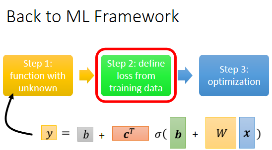

有了新的这个 Model 以后,我们 Loss 没有什麼不同,定义的方法是一样的,只是我们的符号改了一下,之前是 L ( w 跟 b ),因為 w 跟 b 是未知的,那我们现在接下来的未知的参数很多了,你再把它一个一个列出来,太累了,所以我们直接**用 θ 来统设所有的参数**,所以我们现在的 Loss Function 就变成 $L( θ )$

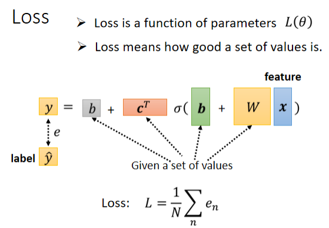

​	这个 Loss Function 要问的就是,这个 θ 如果它是某一组数值的话,会有多不好或有多好,那计算的方法,跟刚才只有两个参数的时候,其实是一模一样的

- 先给定某一组 $W$ $b$  $c^T$ 跟 $b$ 的值,你先给定某一组 $θ $的值,假设你知道 w 的值是多少,把 w 的值写进去 b 的值写进去,c 的值写进去 ,b 的值写进去
- 然后把一组 Feature x 带进去,然后看看你估测出来的 y 是多少
- 再计算一下跟真实的 Label 之间的差距,你得到一个 e
- 把所有的误差通通加起来,你就得到你的 Loss

### 3.2.6. Back to ML_Step 3: Optimization

接下来下一步就是 Optimization,Optimization跟前面讲的没有什麼不同 还是一样的,所以就算我们换了一个新的模型,这个 Optimization 的步骤.

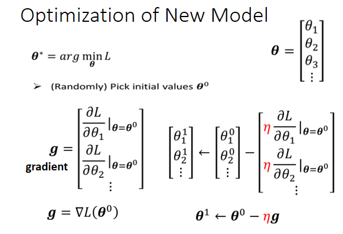

我们现在的 θ 它是一个很长的向量,我们把它表示成 θ1 θ2 θ3 等等等,我们现在就是要找一组 θ,这个 θ 可以让我们的 Loss 越小越好,**可以让 Loss 最小的那一组 θ,我们叫做 θ 的 Start  $θ^*$**

- 我们一开始要**随机选一个初始的数值,这边叫做 $θ_0$** 你可以随机选,那之后也可能会讲,也会讲到更好的找初始值的方法,我们现在先随机选就好
- 接下来呢你要**计算微分**,你要对每一个未知的参数,这边用 θ1 θ2 θ3 来表示,你要為每一个未知的参数,都去计算它对 L 的微分,那把每一个参数都拿去计算对 L 的微分以后,集合起来它就是一个向量,那个向量我们用 g 来表示它,这边假设有 1000 个参数,这个向量的长度就是 1000,这个向量裡面就有 1000 个数字,**这个向量有一个名字叫做 Gradient**,那很多时候你会看到,Gradient 的表示方法是这个样子的,你把 L 前面放了一个**倒三角形**,这个就代表了 Gradient,这是一个 Gradient 的简写的方法,那其实我要表示的就是这个向量,L 前面放一个倒三角形的意思就是,把所有的参数 θ1 θ2 θ3,通通拿去对 L 作微分.那后面放 θ0 的意思是说,我们这个算微分的位置,是在 θ 等於 θ0 的地方,在 θ 等於 θ0 的地方,我们算出这个 Gradient
- 算出这个 g 以后,接下来呢我们 **Update 参数**,更新的方法,跟刚才只有两个参数的状况是一模一样的,只是从更新两个参数,可能换成更新成 1000 个参数,但更新的方法是一样的,本来有一个参数叫 θ1,上标 0 代表它是一个起始的值,它是一个随机选的起始的值,把这个 $θ_1^0$ 减掉 η 乘上微分的值,得到 $θ_1^1$,代表 θ1 更新过一次的结果,$θ_2^0$  减掉微分乘以,减掉 η 乘上微分的值,得到$θ_2^1$,以此类推,你就可以把那 1000 个参数统统都更新了.

把这边所有的 θ 合起来当做一个向量,我们用 $θ^0 $来表示,把 η 提出来,那剩下每一个参数对 L 微分的部分,叫做 Gradient 叫做 g.所以 θ0 减掉 η 乘上 g,就得到 θ^1^, 

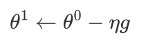

那假设你这边参数有 1000 个,那 θ0 就是 1000 个数值,1000 维的向量,g 是1000 维的向量,θ1 也是 1000 维的向量。

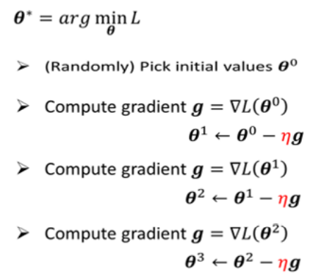

那整个操作就是这样了,就是由 θ0 算 Gradient,根据 Gradient 去把 θ0 更新成 θ1,然后呢再算一次 Gradient,然后呢根据 Gradient 把 θ1 再更新成 θ2,再算一次 Gradient 把 θ2 更新成 θ3,以此类推直到你不想做,或者是你算出来的这个 Gradient,是 0 向量 是 Zero Vector,导致你没有办法再更新参数為止,不过在实作上你几乎不太可能,作出 Gradient 是 0 向量的结果,通常你会停下来就是你不想做了.

### 3.2.7. Batch、Epoch and Update

但是实作上,那这边是一个实作的 Detail 的 Issue,实际上我们在做 Gradient的时候,我们会这麼做：我们这边有大 N 笔资料, 也就是有N个Label，我们会把这大 N 笔资料（即输入和输出共同组成的资料）分成很多组，即很多个Batch。假设每个 Batch 裡面有大 B 笔资料,所以本来全部有大 N 笔资料,现在大 B 笔资料一组,一组叫做 Batch

那本来我们是把所有的 Data 拿出来算一个 Loss, 然后取一个平均值。那现在我们不这麼做,我们只拿一个 Batch 裡面的 Data出来算一个 Loss,我们这边把它叫 L1,那跟这个 L 呢以示区别,因為你把全部的资料拿出来算 Loss,跟只拿一个 Batch 拿出来,的资料拿出来算 Loss,它不会一样嘛,所以这边用 L1 来表示它

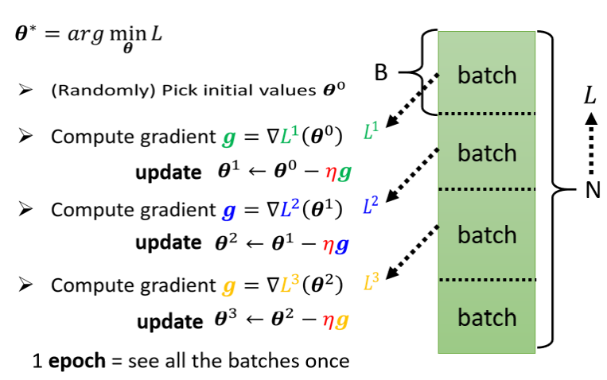

但是你可以想像说假设这个 B 够大,也许 L 跟 L1 会很接近 也说不定,所以实作上的时候,每次我们会先选一个 Batch,用这个 Batch 来算 L,根据这个 L1 来算 Gradient,用这个 Gradient 来更新参数,接下来再选下一个 Batch 算出 L2,根据 L2 算出 Gradient,然后再更新参数,再取下一个 Batch 算出 L3,根据 L3 算出 Gradient,再用 L3 算出来的 Gradient 来更新参数

所以我们并不是拿大 L 来算 Gradient,实际上我们是拿一个 Batch 算出来的 L1 L2 L3,来计算 Gradient。把所有的 Batch 都看过一次,叫做一个 Epoch，每一次更新参数叫做一次 Update, Update 跟 Epoch 是不一样的东西。**每次处理一个Batch，更新一次参数叫做一次 Update；把所有的 Batch 都看过一遍,即看完了所有的资料，叫做一个 Epoch**

那至於為什麼要分一个一个 Batch,那这个我们下週再讲,但是為了让大家更清楚认识,Update 跟 Epoch 的差别,这边就举一个例子

假设我们有 10000 笔 Data,也就是大 N 等於 10000,假设我们的 Batch 的大小是设 10,也就大 B 等於10。接下来问,我们在一个 Epoch 中,总共 Update 了几次参数?

那你就算一下这个大 N 个 Example,10000 笔 Example,总共形成了 10000 除以 10,也就是 1000 个 Batch,所以在一个 Epoch 裡面,你其实已经更新了参数 1000 次,所以一个 Epoch 并不是更新参数一次,在这个例子裡面一个 Epoch,已经更新了参数 1000 次了

那第二个例子,就是假设有 1000 个资料,Batch Size设 100,那其实 **Batch Size 的大小也是你自己决定的,所以这边我们又多了一个 HyperParameter**,所谓 HyperParameter 就是你自己决定的东西。我们今天已经听到了, 设计多少个 Sigmoid 函数也是一个 HyperParameters, Batch Size 也是一个 HyperParameter。1000 个 Example,Batch Size 设 100,那1个 Epoch 总共更新几次参数呢,是 10 次

所以做了一个 Epoch 的训练,你其实不知道它更新了几次参数,有可能 1000 次,也有可能 10 次,取决於它的 Batch Size和资料量 有多大

### 3.2.8. Activation Function

那我们其实还可以对模型做更多的变形,刚才有同学问到说,这个 Hard Sigmoid 不好吗,為什麼我们一定要把它换成 Soft 的 Sigmoid

你确实可以不一定要换成 Soft 的 Sigmoid,有其他的做法,举例来说这个 Hard 的 Sigmoid,我刚才说它的函式有点难写出来,其实也没有那麼难写出来,它可以看作是两个 Rectified Linear Unit 的加总,所谓 Rectified Linear Unit 它就是长这个样

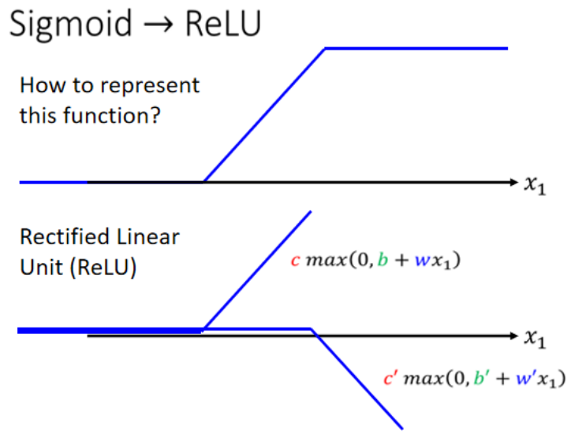

它有一个水平的线,走到某个地方有一个转折的点,然后变成一个斜坡,那这种 Function 它的式子,写成 
$$
c* max(0, b + wx_1)
$$
这个$max(0, b + wx_1)$的意思就是,看 0 跟 $b + wx_1$ 谁比较大,比较大的那一个就会被当做输出,所以如果 b + wx1 小於 0,那输出就是0,如果 $b + wx_1$ 大於 0,输出就是  $b + wx_1$。那总之这一条线,可以写成$c* max(0, b + wx_1)$,每条不同的 w 不同的 b 不同的 c,你就可以挪动它的位置,你就可以改变这条线的斜率,那这种线呢在机器学习裡面,**我们叫做 Rectified Linear Unit,它的缩写叫做 ReLU**,名字念起来蛮有趣的,它真的就唸ReLU

那你把两个 ReLU 叠起来,就可以变成 Hard 的 Sigmoid,你想要用 ReLU 的话,就把 Sigmoid 的地方,换成$ max(0, b_i + w_i{_j}x_j)$.

那本来这边只有 i 个 Sigmoid,你要 2 个 ReLU,才能够合成一个 Hard Sigmoid ,所以这边有 i 个 Sigmoid,那如果 ReLU 要做到一样的事情,那你可能需要 2 倍的 ReLU,因為 2 个 ReLU 合起来,才是一个 Hard Sigmoid,所以要 2 倍的 ReLU,所以我们把 Sigmoid 换成 ReLU,这边就是把一个式子换了,因為要表示一个 Hard 的 Sigmoid,表示那个蓝色的 Function 不是只有一种做法,你完全可以用其他的做法。**那这个 Sigmoid 或是 ReLU,他们在机器学习裡面,我们就叫它 Activation Function,他们是有名字的,他们统称為 Activation Function.**

当然还有其他常见的,还有其他的 Activation Function,但 Sigmoid 跟 ReLU,应该是今天最常见的 Activation Function,那哪一种比较好呢,这个我们下次再讲,哪一种比较好呢,我接下来的实验都选择用了 ReLU,显然 ReLU 比较好,至於它為什麼比较好,那就是下週的事情了.

接下来就真的做了这个实验,这个都是真实的数据.

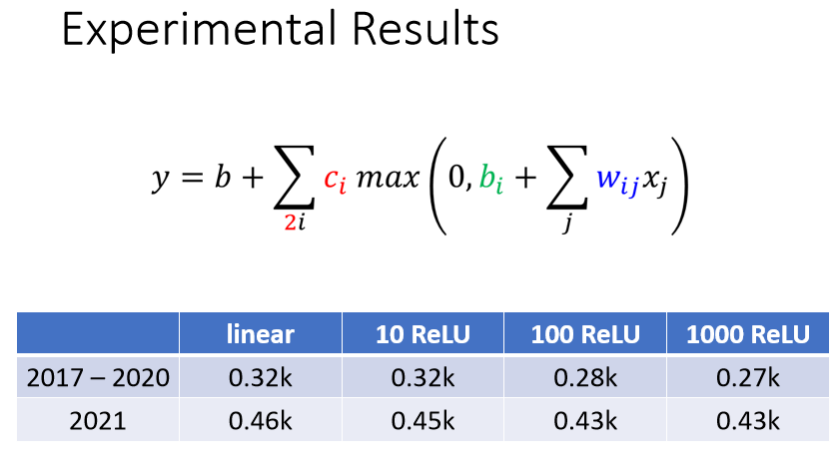

- 如果是 Linear 的 Model,我们现在考虑 56 天,训练资料上面的 Loss 是 0.32k,没看过的资料 2021 年资料是 0.46k
- 如果用 10 个 ReLU,好像没有进步太多,这边跟用 Linear 是差不多的,所以看起来 10 个 ReLU 不太够
- 100 个 ReLU 就有显著的差别了,100 个 ReLU 在训练资料上的 Loss,就可以从 0.32k 降到 0.28k,有 100 个 ReLU,我们就可以製造比较复杂的曲线,本来 Linear 就是一直线,但是 100 个 ReLU 我们就可以產生 100 个,有 100 个折线的Function,在测试资料上也好了一些.
- 接下来换 1000 个 ReLU,1000 个 ReLU,在训练资料上 Loss 更低了一些,但是在没看过的资料上,看起来也没有太大的进步

### 3.2.9. Deeper Model

接下来还可以做什麼呢,我们还可以继续改我们的模型,

举例来说,刚才我们说从 x 到 a 做的事情,是把 x 乘上 w 加 b,再通过 Sigmoid Function,不过我们现在已经知道说,不一定要通过 Sigmoid Function,通过 ReLU 也可以,然后得到 a。**我们可以把这个同样的事情,再反覆地多做几次,**刚才我们把 w x 乘上 w 加 b,通过 Sigmoid Function 得到 a,我们可以把 a 再乘上另外一个 w’,再加上另外一个 b’,再通过 Sigmoid Function,或 RuLU Function,得到 a’。

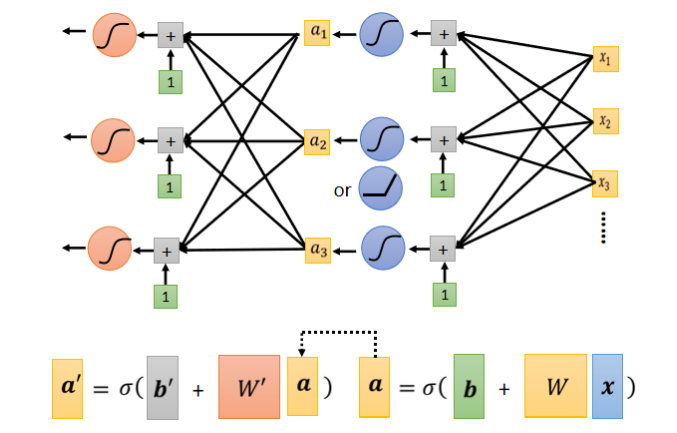

所以我们可以把 x,做这一连串的运算產生 a,接下来把 a 做这一连串的运算產生 a’,那我们可以反覆地多做几次,**要做几次,这个又是另外一个 Hyper Parameter**,这是另外一个你要自己决定的事情,你要做两次吗 三次吗 四次吗 一百次吗,这个你自己决定,不过这边的 w 跟这边的 w’,它们不是同一个参数喔,这个 b 跟这边的 b’,它们不是同一个参数喔,是增加了更多的未知的参数

那就是接下来就真的做了实验了,我们就是每次都加 100 个 ReLU,那我们就是 Imput Features,就是 56 天前的资料

- 如果是只做一次 只做一次,就那个乘上 w 再加 b,再通过 ReLU 或 Sigmoid,这件事只做一次的话,这是我们刚才看到的结果
- 两次，这个 Loss 降低很多,0.28k 降到 0.18k,没看过的资料上也好了一些
- 三层，又有进步,从 0.18k 降到 0.14k,所以从一层到 从就是乘一次 w,到通过一次 ReLU,到通过三次 ReLU,我们可以从 0.28k 到 0.14k,在训练资料上,在没看过的资料上,从 0.43k 降到了 0.38k,看起来也是有一点进步的。那这个是那个真实的实验结果啦,就我们来看一下,今天有做通过三次 ReLU 的时候,做出来的结果怎麼样

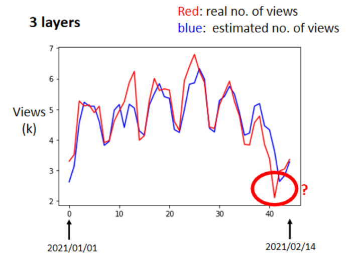

横轴就是时间,纵轴是观看的人次 是千人,红色的线代表的是真实的数据,蓝色的线是预测出来的数据。那你会发现说,在这种低点的地方啊,你看红色的数据是每隔一段时间,就会有两天的低点,在低点的地方,机器的预测还算是蛮準确的。那这边有一个神奇的事情,这个机器高估了真实的观看人次,尤其是在这一天,这一天有一个很明显的低谷,但是机器没有预测到这一天有明显的低谷,它是晚一天才预测出低谷。这天最低点就是除夕啊,谁除夕还学机器学习 对不对,好 所以当然对机器来说,你不能怪它,它根本不知道除夕是什麼,它只知道看前 56 天的值,来预测下一天会发生什麼事,所以它不知道那一天是除夕,所以你不能怪它预测地不準,这一天就是除夕

# 4. Deep Learning

到目前為止,我们讲了很多各式各样的模型,那我们现在还缺了一个东西,缺一个好名字,你知道这个外表啊是很重要的,一个死臭酸宅穿上西装以后就潮了起来,或者是隻鞋半缕的,说他是汉左将军宜城亭侯中山靖王之后,也就潮了起来 ,所以我们的模型也需要一个好名字,所以它叫做什麼名字呢,这些 Sigmoid 或 ReLU 啊,它们叫做 Neuron,我们这边有很多的 Neuron,很多的 Neuron 就叫做 Neural Network,Neuron 就是神经元,人脑中就是有很多神经元,很多神经元串起来就是一个神经网路,跟你的脑是一样的,接下来你就可以到处骗麻瓜说,看到没有 这个模型就是在模拟人们脑 知道吗,这个就是在模拟人脑,这个就是人工智慧,然后麻瓜就会吓得把钱掏出来。

但是啊 这个把戏在 80 90 年代的时候,已经玩过了这样,Neural Network 不是什麼新的技术,80 90 年代就已经用过了,当时已经把这个技术的名字搞到臭掉了,Neural Network 因為之前吹捧得太过浮夸,所以后来大家对 Neural Network 这个名字,都非常地感冒,它就像是个脏话一样,写在 Paper 上面都註定会被,就会註定害你的 Paper 被拒绝,	所以后来為了要重振 Neural Network 的雄风,所以怎麼办呢,需要新的名字,怎麼样新的名字呢,这边有很多的 Neural,每一排 Neural 我们就叫它一个 Layer,它们叫 Hidden Layer,有很多的 Hidden Layer 就叫做 Deep,这整套技术就叫做 Deep Learning,好 我们就把 Deep Learning 讲完了,就是这麼回事。

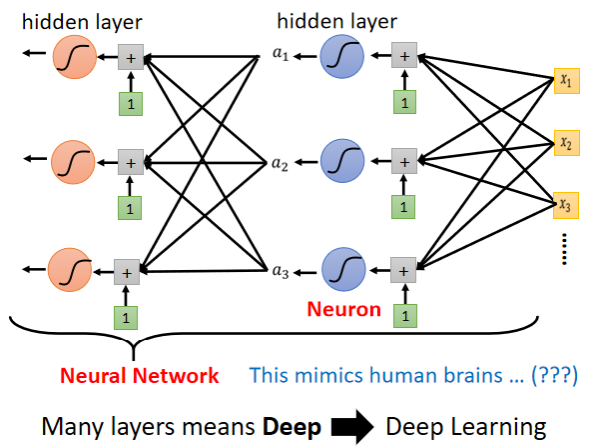

就是这样来的,好 所以人们就开始,把类神经网路越叠越多 越叠越深,12 年的时候有一个 AlexNet,它有 8 层 它的错误率是 16.4%,两年之后 VGG 19层,错误率在影像辨识上进步到 7.3 %,这个都是在影像辨识上一个,这个基準的资料库上面的结果,后来 GoogleNet 有错误率降到 6.7%,有 22 层,但这些都不算是什麼

Residual Net 有 152 层啊,它比 101 还要高啊,但是这个 Residual Net 啊,其实要训练这麼深的 Network 是有诀窍的,这个我们之后再讲。

如果你仔细思考一下,我们一路的讲法的话,你有没有发现一个奇妙的违和的地方,我们一开始说,我们想要用 ReLU 或者是 Sigmoid,去逼近一个复杂的 Function,实际上只要够多的 ReLU 够多的 Sigmoid,就可以逼近任何的 连续的 Function ,我们只要有够多的 Sigmoid,就可以知道够复杂的线段,就可以逼近任何的 Continuous 的 Function,所以我们只要一排 ReLU 一排 Sigmoid,够多就足够了,**那深的意义到底何在呢**

把 ReLU Sigmoid Function 反覆用,到底有什麼好处呢,為什麼不把它们直接排一排呢,直接排一排也可以表示任何 Function 啊,所以把它反覆用没什麼道理啊,所以有人就说把 Deep Learning,把 ReLU Sigmoid 反覆用,不过是个噱头,你之所以喜欢 Deep Learning,只是因為 Deep 这个它名字好听啦,ReLU Sigmoid 排成一排,你只可以製造一个肥胖的 Network,Fat Neural Network,跟 Deep Neural Network 听起来,量级就不太一样,Deep 听起来就比较厉害啦,Fat Neural Network 还以為是死肥宅 Network,就不厉害这样子,那到底 Deep 的理由,為什麼我们不把 Network 变胖,只把 Network 变深呢,这个是我们日后要再讲的话题

那有人就说,那**怎麼不变得更深呢**,刚才只做到 3 层,应该要做得更深嘛,现在 Network 都是叠几百层的啊,没几百层都不好意思说,你在叫做 Deep Learning  所以要做更深。所以确实做得更深 做 4 层,4 层在训练资料上,它的 Loss 是 0.1k,在没有看过 2021 年的资料上,是如何呢 是 0.44k,惨掉了。在训练资料上,3 层比 4 层差,4 层比 3 层好,但是在没看过的资料上,4 层比较差,3 层比较好,在有看过的资料上,在训练资料上,跟没看过的资料上,它的结果是不一致的,这种训练资料跟测试,这种训练资料跟没看过的资料,它的结果是不一致的状况,这个状况叫做 Overfitting。**机器学习会发生 Overfitting 的问题,指的就是在训练资料上有变好,但是在没看过的资料上没有变好这件事情**

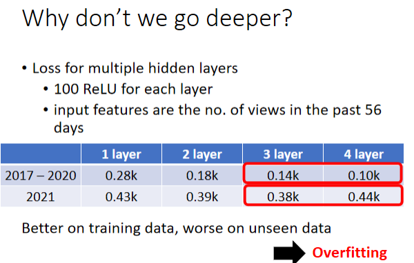

但是做到目前為止,我们都还没有真的发挥这个模型的力量,你知道我们要发挥这个模型的力量,和 2021 的资料到 2 月 14 号之前的资料,我们也都已经手上有了。所以我们要真正做的事情是什麼,我们要做的事情就是预测未知的资料,但是如果我们要预测未知的资料,我们应该选 3 层的 Network,还是 4 层的 Network 呢,举例来说 今天是 2 月 26 号,今天的观看人数我们还不知道,如果我们要用一个 Neural Network,用我们已经训练出来的 Neural Network,去预测今天的观看人数,

至於怎麼选模型,这个是下週会讲的问题,大家 但是大家都非常有 Sense,知道我们要选 3 层的,多数人都决定要选 3 层的,你可能会说 我怎麼不选 4 层呢,4 层在训练资料上的结果比较好啊,可是我们并不在意训练资料的结果啊,我们在意的是没有看过的资料,而 2 月 26 号是没有看过的资料,我们应该选一个在训练的时候,没有看过的资料上表现会好的模型,所以我们应该选 3 层的 Network。

那你可能以為这门课就到这边结束了,其实不是 我们真的来预测一下,2 月 26 号应该要有的观看次数是多少,但是因為其实 YouTube 的统计,它没有那麼及时,所以它现在只统计到 2 月 24 号,没关係 我们先计算一下 2 月 25 号的,观看人数是多少,这个 3 层的 Network 告诉我说,2 月 25 号这个频道的总观看人次,应该是 5250 人,那我们先假设 2 月 25 号是对的,但实际上我还不知道 2 月 25 号对不对,因為 YouTube 后台统计的数据还没有出来啊,但我们先假设这一天都是对的,然后再给我们的模型去预测 2 月 26 号的数字,得到的结果是 3.96k 有 3960 次,那它為什麼这边特别低,因為模型知道说,这个礼拜五观看的人数,就是比较少啊,所以它预测特别低,听起来也是合理的。

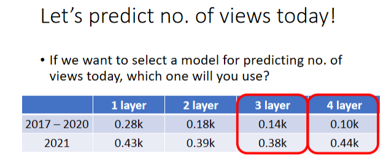

好 那今天其实就讲了深度学习,那今天讲的不是一般的介绍方式,如果你想要听一般的介绍方式,过去的课程影片也是有的,我就把连结附在这边,然后深度学习的训练,会用到一个东西叫 Backpropagation,其实它就是比较有效率,算 Gradients 的方法,跟我们今天讲的东西没有什麼不同,但如果你真的很想知道,Backpropagation 是什麼的话,影片连结也附在这边.

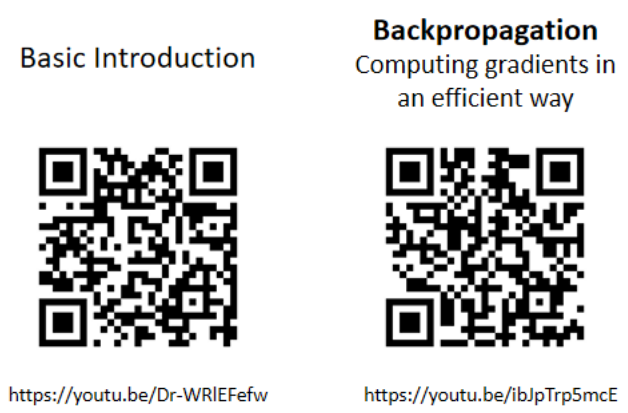