# Classification

## To learn more

接下来讲有关分类怎麼做这件事情,这边讲的是一个短的版本,因為时间有限的关係,如果你想要看长的版本的话,可以看一下[过去上课的录影](https://www.bilibili.com/video/BV13x411v7US?p=10)

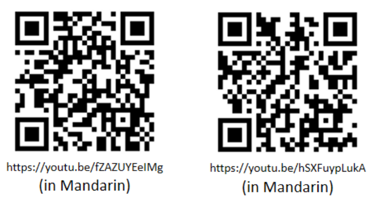

过去可能是花两个小时,到三个小时的时间才讲完,分类这件事情,我们这边用一个最快的方法,直接跟你讲分类是怎麼做的

## Classification as Regression？

分类是怎麼做的呢 我们已经讲了,Regression就是输入一个向量,然后输出一个数值,我们希望输出的数值跟某一个label,也就是我们要学习的目标,越接近越好，这门课里面，如果是正确的答案就有加Hat,Model的输出没有加Hat

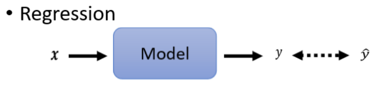

有一个可能,假设你会用Regression的话,我们其实可以**把Classification,当作是Regression来看**

这个方法不一定是个好方法,这是一个比较奇妙的方法,输入一个东西以后,我们的输出仍然是一个scaler,它叫做y 然后这一个y,我们要让它跟正确答案,那个Class越接近越好,但是y是一个数字,我们怎麼让它跟Class越接近越好呢,我们必须把Class也变成数字

举例来说 Class1就是编号1,Class2就是编号2,Class3就是编号3,接下来呢 我们要做的事情,就是希望y可以跟Class的编号,越接近越好

但是这会是一个好方法吗,如果你仔细想想的话,这个方法也许在某些状况下,是会有瑕疵的

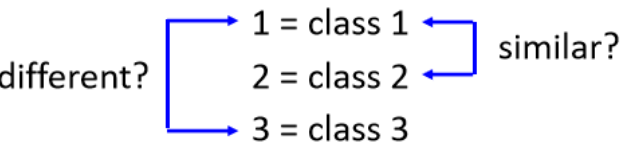

因為如果你假设说Class one就是编号1,Class two就是编号2,Class3就是编号3,意味著说你觉得**Class1跟Class2是比较像**,然后**Class1跟Class3 它是比较不像**,像这样子的表示Class的方式,有时候可行 有时候不可行

- 假设你的Class one two three真的有某种关係举例来说,你想要根据一个人的身高跟体重,然后预测他是几年级的小学生,一年级 二年级 还是三年级,那可能一年级真的跟二年级比较接近,一年级真的跟三年级比较没有关係

- 但是假设你的三个Class本身,并没有什麼特定的关係的话,你说Class one是1,Class two是2 Class two是3,那就很奇怪了,因為你这样是预设说,一二有比较近的关係,一三有比较远的关係,所以怎麼办呢

## Class as one-hot vector

当你在做分类的问题的时候,比较常见的做法是把你的Class,用 One-hot vector来表示

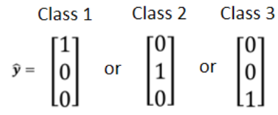

如果有三个Class,我们的 label 这个ŷ,就是一个三维的向量,然后呢 如果是Class1就是$\begin{bmatrix}{1} \\\ {0}\\\ {0}\end{bmatrix}$,如果是Class2就是$\begin{bmatrix} {0}\\\ {1}\\\ {0}\end{bmatrix}$,如果是Class3就是$\begin{bmatrix} {0}\\\ {0}\\\ {1}\end{bmatrix}$,所以每一个Class,你都用一个One-hot vector来表示

而且你用One-hot vector来表示的话,就没有说Class1跟Class2比较接近,Class1跟Class3比较远这样子的问题,如果你把这个One-hot vector,用算距离的话,Class之间 两两它们的距离都是一样

如果我们今天的目标y hat是一个向量 比如说,ŷ是有三个element的向量，那我们的network,也应该要Output的维度也是三个数字才行

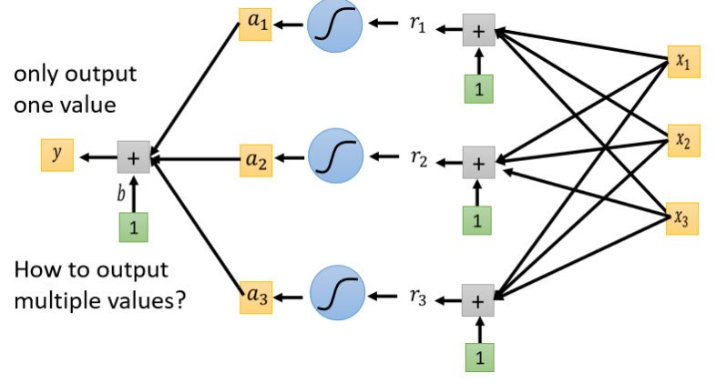

到目前為止我们讲的network,其实都只Output一个数值,因為我们过去做的都是Regression的问题,所以只Output一个数字

其实从一个数值改到三个数值,它是没有什麼不同的

你可以Output一个数值,你就可以Output三个数值,所以把本来Output一个数值的方法,重复三次

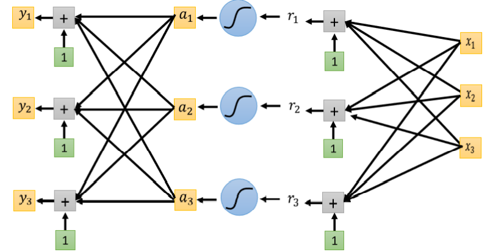

- 把a₁ a₂ a₃,乘上三个不同的Weight 加上bias,得到y₁

- 再把a₁ a₂ a₃乘上另外三个Weight,再加上另外一个bias得到y₂

- 再把a₁ a₂ a₃再乘上另外一组Weight,再加上另外一个bias得到y₃

你就可以產生三组数字,所以你就可以Input一个feature的Vector,然后產生y₁ y₂ y₃,然后希望y₁ y₂ y₃,跟我们的目标越接近越好,

## Classification with softmax

好 那所以我们现在,知道了Regression是怎麼做的,Input x Output y 要跟 label ŷ,越接近越好

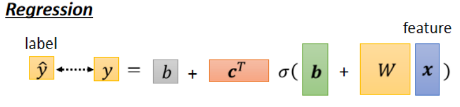

如果是Classification,input x可能乘上一个W,再加上b 再通过activation function,再乘上W'再加上b' 得到y,我们现在的**y它不是一个数值,它是一个向量**

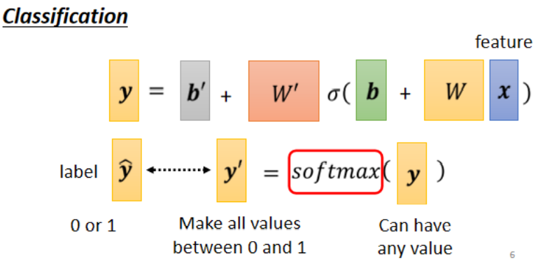

但是在做Classification的时候,我们往往会**把y再通过一个叫做Soft-max的function得到y'**,然后我们才去计算,y'跟y hat之间的距离

為什麼要加上Soft-max呢,一个比较简单的解释（如果是在过去的课程裡面,我们会先从generative的Model开始讲起,然后一路讲到Logistic Regression）

这边有一个骗小孩的解释就是,这个ŷ 它裡面的值,都是0跟1,它是One-hot vector,所以裡面的值只有0跟1，但是y裡面有任何值

既然我们的目标只有0跟1,但是y有任何值,我们就先把它Normalize到0到1之间,这样才好跟 label 的计算相似度,这是一个比较简单的讲法

如果你真的想要知道,為什麼要用Soft-max的话,你可以参考过去的上课录影,如果你不想知道的话,你就记得这个Soft-max要做的事情,就是把本来y裡面可以放任何值,改成挪到0到1之间

### Softmax

这个是Soft-max的block,输入y₁ y₂ y₃,它会產生y₁' y₂' y₃'

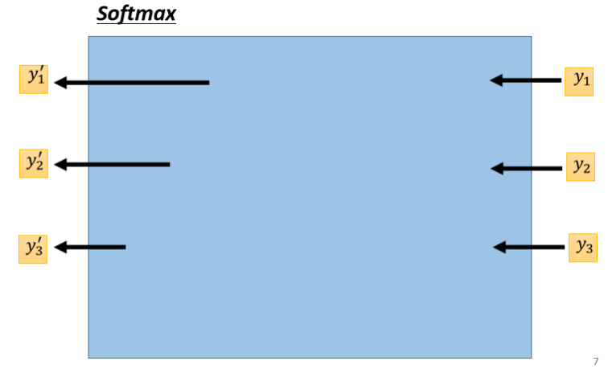

它裡面运作的模式是这个样子的
$$
y_i'=\frac{exp(y_i)}{\sum_j exp(y_i)}
$$
我们会先把所有的y取一个exponential,就算是负数,取exponential以后也变成正的,然后你再对它做Normalize,除掉所有y的exponential值的和,然后你就得到y'

或者是用图示化的方法是这个样子

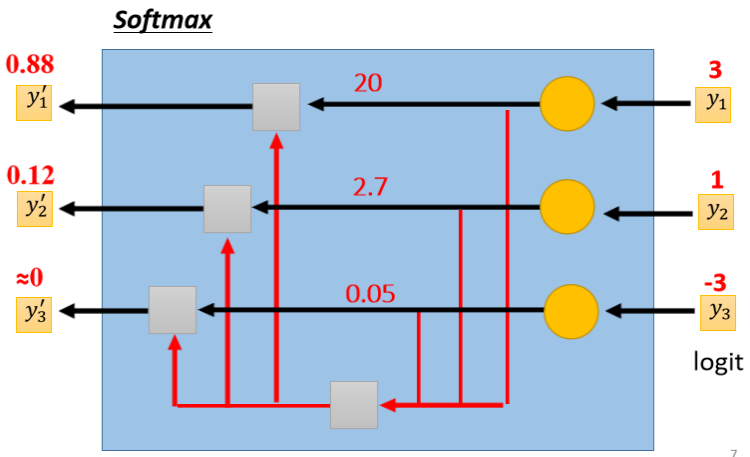

y₁取exp y₂取exp y₃取exp,把它全部加起来,得到一个Summation,接下来再把exp y₁'除掉Summation,exp y₂'除掉Summation,exp y₃'除掉Summation,就得到y₁' y₂' y₃'

有了这个式子以后,你就会发现

- y₁' y₂' y₃',它们都是介於0到1之间
- y₁' y₂' y₃',它们的和是1

如果举一个例子的话,本来 y₁等於3y₂等於1,y₃等於负3,取完exponential的时候呢,就变成exp3 就是20,exp1就是2.7,exp-3就是0.05,做完Normalization以后,这边就变成0.88  0.12 跟0

**所以这个Soft-max它要做的事情,除了Normalized,让 y₁' y₂' y₃',变成0到1之间,还有和為1以外,它还有一个附带的效果是,它会让大的值跟小的值的差距更大**

本来-3 然后通过exponential,再做Normalized以后,会变成趋近於0的值,然后这个Soft-max的输入,往往就叫它logit

这边考虑了3个class的状况,那如果两个class会是怎麼样

如果是两个class你当然可以直接套soft-max这个function没有问题,但是也许你更常听到的是,当有两个class的时候,我们就不套soft-max,我们直接取sigmoid

那当两个class用sigmoid,跟soft-max两个class,你如果推一下的话,会发现说这两件事情是等价的

## Loss of Classification

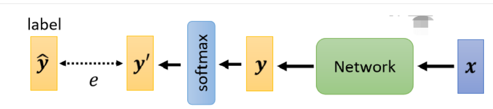

我们把x,丢到一个Network裡面產生y以后,我们会通过soft-max得到y',再去计算y'跟ŷ之间的距离,这个写作е

计算y'跟ŷ之间的距离不只一种做法,举例来说,如果我喜欢的话,我要让这个距离是Mean Square Error
$$
e=\sum_i(\hat{y_i}-y_i')^2
$$
就是把ŷ裡面每一个element拿出来,然后计算它们的平方和,当作我们的error,这样也是计算两个向量之间的距离,你也可以说,你也可以做到说当minimize,Mean Square Error的时候,我们可以让ŷ等於y'

但是有另外一个更常用的做法,叫做Cross-entropy
$$
e=-\sum_i\hat{y_i}\ln{y_i'}
$$
这个Cross-entropy它的式子乍看之下,会让你觉得有点匪夷所思,怎麼是这个样子呢

- Cross-entropy是summation over所有的i
- 然后把ŷ的第i位拿出来,乘上y'的第i位取Natural log
- 然后再全部加起来

这个是Cross-entropy,那当ŷ跟y'一模一样的时候,你也可以Minimize Cross-entropy的值,此时,MSE会是最小的,Cross-entropy也会是最小的

但是為什麼会有Cross-entropy,这麼奇怪的式子出现呢？

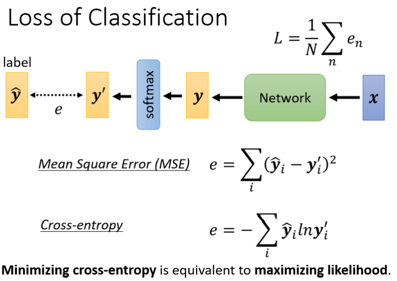

那如果要讲得长一点的话,这整个故事我们可以把它讲成,**Make Minimize Cross-entropy其实就是maximize likelihood**,你很可能在很多地方,都听过likelihood这个词汇,详见[过去上课影片](https://www.bilibili.com/video/BV13x411v7US?p=10)

所以如果有一天有人问你说,如果我们今天在做分类问题的时候,maximize likelihood,跟Minimize Cross-entropy,有什麼关係的时候,不要回答说它们其实很像,但是其实又有很微妙的不同这样,不是这样,它们两个就是一模一样的东西,只是同一件事不同的讲法而已

所以假设你可以接受说,我们在训练一个classifier的时候,应该要maximize likelihood就可以接受,应该要Minimizing Cross-entropy

在pytorch裡面,Cross-entropy跟Soft-max,他们是被绑在一起的,他们是一个Set,你只要Copy Cross-entropy,裡面就自动内建了Soft-max

那接下来**从optimization的角度,来说明相较於Mean Square Error,Cross-entropy是被更常用在分类上,**

那这个部分,你完全可以在数学上面做证明,但是我这边,是直接用举例的方式来跟你说明,如果你真的非常想看数学证明的话,我把连结放在这边http://speech.ee.ntu.edu.tw/~tlkagk/courses/MLDS_2015_2/Lecture/Deep%20More%20(v2).ecm.mp4/index.html你可以一下过去上课的录影

如果你不想知道的话,那我们就是举一个例子来告诉你说,為什麼是Cross-entropy比较好

那现在我们要做一个3个Class的分类

Network先输出y₁ y₂ y₃,在通过soft-max以后,產生y₁' y₂'跟y₃'

那接下来假设我们的正确答案就是100,我们要去计算100这个向量,跟y₁' y₂'跟y₃'他们之间的距离,那这个距离我们用е来表示,е可以是Mean square error,也可以是Cross-entropy,

我们现在假设y₁的变化是从-10到10,y₂的变化也是从-10到10,y₃我们就固定设成-1000

因為y₃设很小,所以过soft-max以后y₃'就非常趋近於0,它跟正确答案非常接近,且它对我们的结果影响很少

总之我们y₃设一个定值,我们只看$y_1$跟$y_2$有变化的时候,对我们的e对我们的Loss对我们loss有什麼样的影响

 那我们看一下 如果我们这个e,设定為Mean Square Error,跟Cross-entropy的时候,算出来的Error surface会有什麼样,不一样的地方.底下这两个图,就分别在我们e是Mean square error,跟Cross-entropy的时候,y₁ y₂的变化对loss的影响,对Error surface的影响,

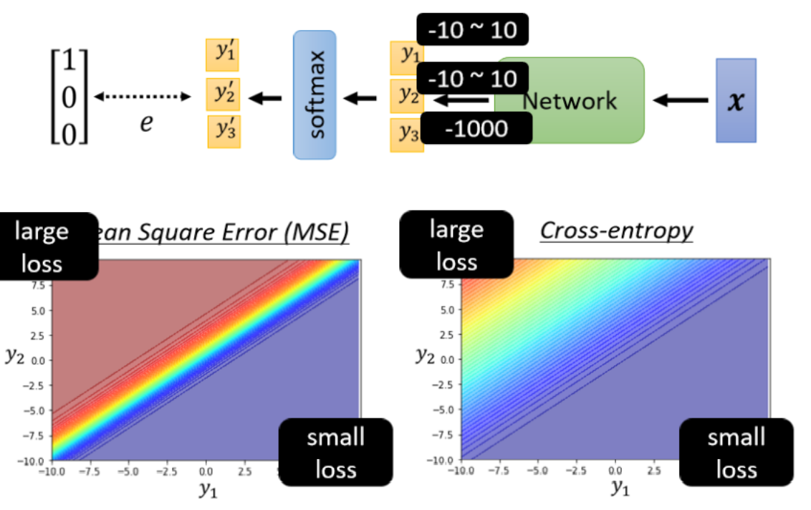

我们这边是用红色代表Loss大,蓝色代表Loss小

- 那如果今天y₁很大 y₂很小,就代表y₁'会很接近1,y₂'会很接近0,所以不管是对Mean Square Error,或是Cross-entropy而言,**y₁大 y₂**小的时候** Loss都是小的**

- 如果y₁小 y₂大的话,这边y₁'就是0 y₂'就是**1**,所以这个时候Loss会比较大

所以这两个图都是左上角Loss大,右下角Loss小,所以我们就期待说,我们最后在Training的时候,我们的参数可以走到右下角**的地方

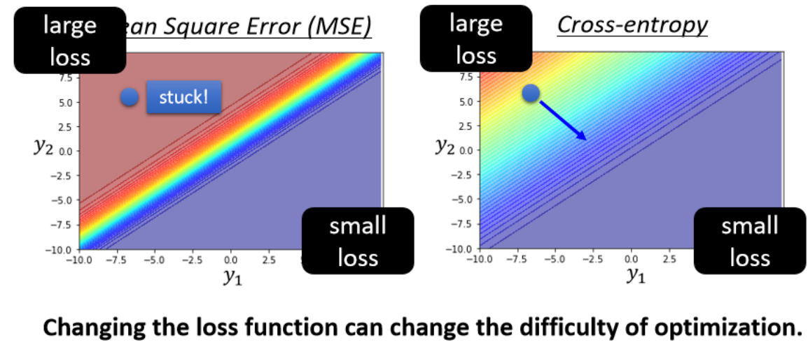

那假设我们开始的地方,都是左上角

- 如果我们选择Cross-Entropy,左上角这个地方,它是有斜率的,所以你有办法透过gradient,一路往右下的地方走,
- 如果你选Mean square error的话,你就卡住了,Mean square error在这种Loss很大的地方,它是非常平坦的,它的gradient是非常小趋近於0的,如果你初始的时候在这个地方,离你的目标非常远,那它gradient又很小,你就会没有办法用gradient descent,顺利的走到右下角的地方去,

所以你如果你今天自己在做classification,你选Mean square error的时候,你有非常大的可能性会train不起来,当然这个是在你没有好的optimizer的情况下,今天如果你用Adam,这个地方gradient很小,那gradient很小之后,它learning rate之后会自动帮你调大,也许你还是有机会走到右下角,不过这会让你的training,比较困难一点,让你training的起步呢,比较慢一点

所以这边有一个很好的例子,是告诉我们说,就算是Loss function的定义,都可能影响Training是不是容易这件事情,刚才说要用神罗天征,直接把error surface炸平,这边就是一个好的例子告诉我们说,你可以改Loss function,居然可以改变optimization的难度,

# CNN

我们开始探讨 Network 的架构设计,第一个Network 架构的变形是 Convolutional 的 Neural Network,它的缩写是 CNN,它是专门被用在影像上的,我希望透过 CNN 这个例子,来让大家知道Network 的架构,它的设计有什麼样的想法,那為什麼设计 Network 的架构,可以让我们的 Network 结果做得更好。

## Image Classification

接下来要讲的例子是跟影像有关的,我们要做影像的分类,也就是给机器一张图片,它要去决定说这张图片裡面有什麼样的东西,那怎麼做呢

我们已经跟大家讲过怎麼做分类这件事情,在以下的讨论裡面,我们都假设我们的模型输入的图片大小是固定的,举例来说 它固定输入的图片大小,都是 100 × 100 的解析度,就算是今天 Deep Learning 已经这麼的 Popular,我们往往都还是需要假设说,一个模型输入的影像大小都是一样的

图片可能有大有小,而且不是所有图片都是正方形的啊,有长方形的怎麼办？今天常见的处理方式,丢进影像辨识系统处理方式就是,把所有图片都先 Rescale 成大小一样,再丢到影像的辨识系统裡面,

我们的模型的输出应该是什麼呢,我们模型的目标是分类,所以我们会把每一个类别,表示成一个 One-Hot 的 Vector,我的目标就叫做 $\hat{y}$

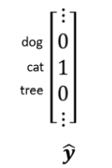

在这个 One-Hot 的 Vector 裡面,假设我们现在类别是一个猫的话,那猫所对应的 Dimension,它的数值就是 1,其他的东西所对的 Dimension 的数值就是 0

那这个 Dimension 的长度就决定了,你现在的模型可以辨识出多少不同种类的东西,如果你向量的长度是 2000,就代表说你这个模型,可以辨识出 2000 种不同的东西,那今天比较强的影像辨识系统,往往可以辨识出 1000 种以上的东西,甚至到上万种不同的 Object,那如果你今天希望你的影像辨识系统,它可以辨识上万种 Object,那你的 Label 就会是一个上万维,维度是上万的 One-Hot Vector

我的模型的输出通过 Softmax 以后,输出是 $y'$,然后我们希望 $y'$ 和$\hat{y}$的 Cross Entropy 越小越好,接下来的问题是怎麼把一张影像当做一个模型的输入。

其实对於一个 Machine 来说,一张图片其实是一个三维的 Tensor

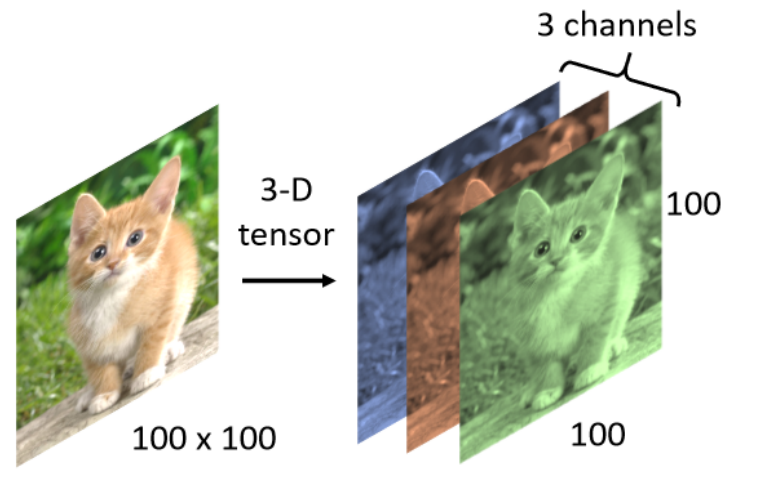

如果不知道 Tensor 是什麼的话,你就想成它是**维度大於 2 的矩阵就是 Tensor**,矩阵是二维,那二维以上的 超过二维的矩阵,你就叫它 Tensor

一张图片它是一个三维的 Tensor,其中一维代表图片的宽,另外一维代表图片的高,还有一维代表图片的 Channel 的数目

一张彩色的图片,今天它每一个 Pixel,都是由 R G B 三个顏色所组成的,所以这三个 Channel 就代表了 R G B 三个顏色,那长跟宽就代表了今天这张图片的解析度,代表这张图片裡面有的 Pixel,有的像素的数目

那接下来我们就要把这一个三维的 Tensor拉直,就可以丢到一个 Network 裡面去了

到目前為止我们所讲的 Network,它的输入其实都是一个向量,所以我们只要能够把一张图片变成一个向量,我们就可以把它当做是 Network 的输入,但是怎麼把这个三维的 Tensor 变成一个向量呢,那最直觉的方法就是直接拉直它

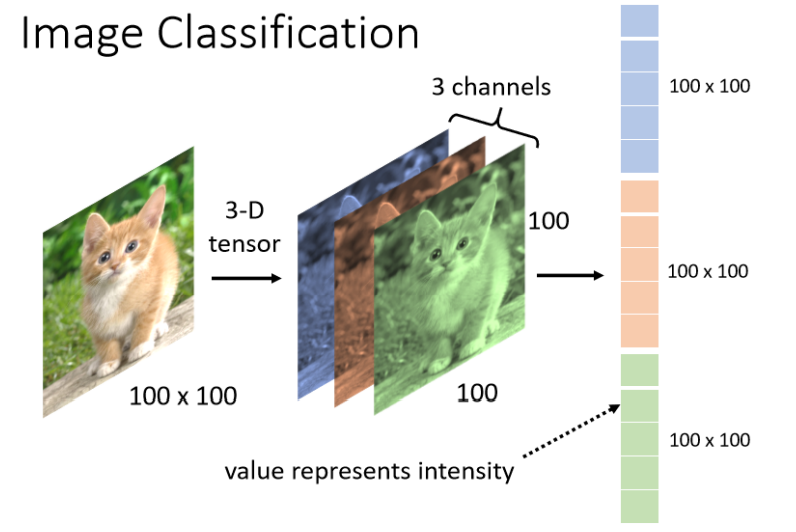

一个三维的 Tensor 裡面有几个数字呢

在这个例子裡面有 100 × 100×3 个数字,把这些数字通通拿出来排成一排,就是一个巨大的向量,这个向量可以作為 Network 的输入

而这个向量裡面,每一维它裡面存的数值,其实就是某一个 Pixel某一个顏色的强度,每一个 Pixel 有 R G B 三个顏色所组成

这个向量啊,我们可以把它当做是一个 Network 的输入,那我们到目前為止,只讲过了 Fully Connected Network,好 如果我们把向量当做 Network 的输入,我们 Input 这边 Feature Vector,它的长度就是 100 × 100×3

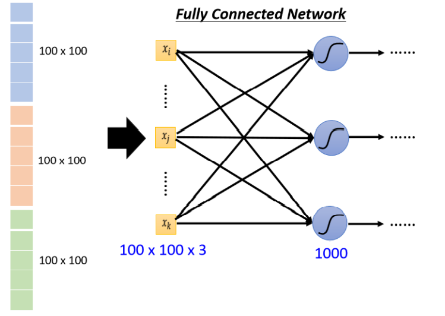

非常长的一个 Vector,那假设我们现在的,第一层的 Neuron 的数目有 1000 个,那你能计算一下这边第一层,总共有多少个 Weight 吗

我们每一个 Neuron,它跟输入的向量的每一个数值,都会有一个 Weight,所以如果输入的向量长度是 100 × 100×3,有 1000 个 Neuron,那我们现在第一层的 Weight,就有 1000×100 × 100×3,也就是 3×10 的 7 次方

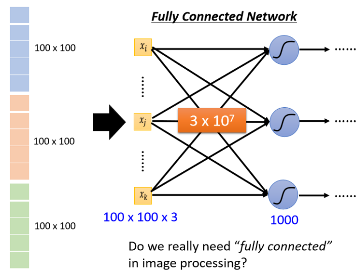

是一个非常巨大的数目,那如果参数越多会有什麼样的问题呢

**虽然随著参数的增加,我们可以增加模型的弹性,我们可以增加它的能力,但是我们也增加了 Overfitting 的风险,**有关什麼叫模型的弹性,到底 Overfitting 怎麼產生的,下週吴培元老师https://speech.ee.ntu.edu.tw/~hylee/ml/ml2021-course-data/W14_PAC-introduction.pdf会从数学上,给大家非常清楚的证明,那我们这边就讲概念上,如果模型的弹性越大,就越容易 Overfitting

那我们怎麼减少在做影像辨识的时候,怎麼避免使用这麼多的参数呢

那考虑到影像辨识这个问题本身的特性,其实我们并不一定需要 Fully Connected 这件事,我们其实不需要每一个 Neuron,跟 Input的每一个 Dimension 都有一个 Weight

怎麼说呢,接下来就是对影像辨识这个问题,对影像本身的特性的一些观察

## Observation 1

第一个观察是,对影像辨识这个问题而言,假设我们想要知道这张图片裡面有一隻动物,这个动物是一个鸟 要怎麼做呢

也许对一个影像辨识的系统而言,对一个影像辨识的 Neuron,对一个影像辨识的类神经网路裡面的神经而言,它要做的就是侦测说现在这张图片裡面,有没有出现一些特别重要的 Pattern

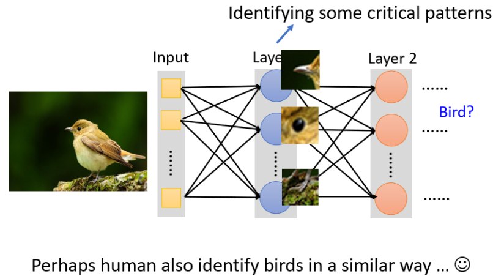

举例来说 如果现在

- 有某一个 Neuron ,它看到鸟嘴这个 Pattern
- 有某个 Neuron 又说,它看到眼睛这个 Pattern
- 又有某个 Neuron 说,它看到鸟爪这个 Pattern

也许看到这些 Pattern 综合起来就代表说,我们看到了一隻鸟,类神经网路就可以告诉你说,因為看到了这些 Pattern,所以它看到了一隻鸟

那也许你会觉得说,看 Pattern 然后决定它是什麼,这件事情好像没有很聪明,但你仔细想想,人是不是也是用同样的方法,来看一张图片中有没有一隻鸟呢,

举例来说这一个例子,不知道你有没有看到,这裡面有什麼样的动物?

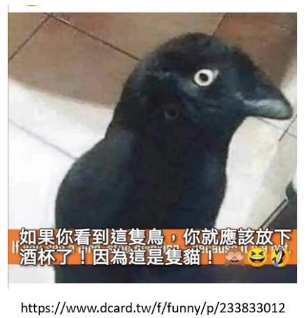

你看这边有一个鸟嘴,这边有一个眼睛,看起来牠是一个乌鸦，但是牠其实是一隻猫，如果你看到牠是一隻鸟的话,那你就应该放下酒杯了,因為这是一隻猫

所以其实就算是人,我们在判断一个物件的时候,往往也是抓最重要的特徵,然后看到这些特徵以后,你很直觉的就会觉得说,你看到了某种物件,对机器来说,也许这也是一个有效的,判断影像中有什麼物件的方法

但是假设我们现在用 Neuron 做的事情,其实就是判断说现在有没有某种 Pattern 出现,那也许**我们并不需要每一个 Neuron都去看一张完整的图片**

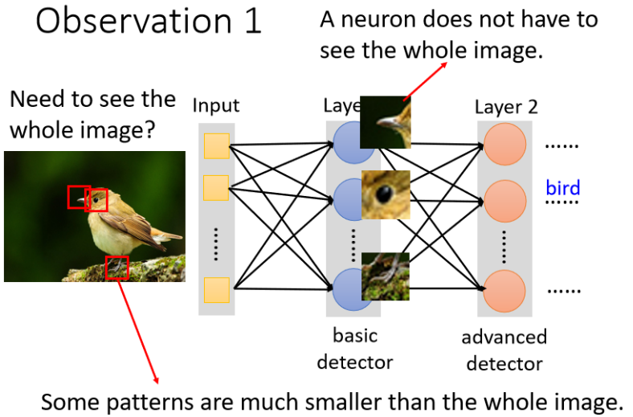

因為这一些重要的 Pattern,比如说鸟嘴 比如说眼睛 比如说鸟爪,并不需要看整张完整的图片,才能够得到这些资讯,

所以这些 Neuron 也许根本就不需要,把整张图片当作输入,它们只需要把图片的一小部分当作输入,就足以让它们侦测某些特别关键的 Pattern有没有出现了

这是第一个观察,根据这个观察,我们就可以做第一个简化 怎麼简化呢

## Simplification 1 —— Receptive Field

在 CNN 裡面有一个这样的做法,我们会设定一个区域叫做 Receptive Field,**每一个 Neuron 都只关心自己的 Receptive Field 裡面发生的事情就好了**

举例来说 你会先定义说这个蓝色的 Neuron,它的守备范围就是这一个 Receptive Field,那这个 Receptive Field 裡面有 3×3×3 个数值,那对蓝色的 Neuron 来说,它只需要关心这一个小范围就好了,不需要在意整张图片裡面有什麼东西

那这个 Neuron,怎麼考虑这个 Receptive Field 裡,有没有发生什麼样的事情呢

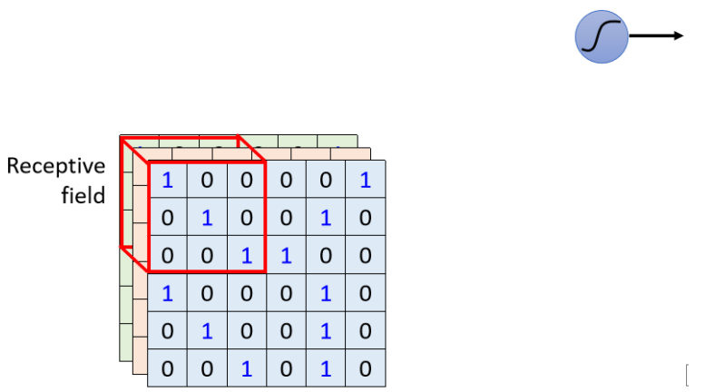

它要做的事情就是

- 把这 3×3×3 的数值拉直,变成一个长度是 3×3×3 也就是 27 维的向量,再把这 27 维的向量作為这个 Neuron 的输入
- 这个 Neuron 会给 27 维的向量的,每一个 Dimension 一个 Weight,所以这个 Neuron 有 3×3×3  27个 Weight,
- 再加上 Bias 得到的输出,这个输出再送给下一层的 Neuron 当作输入,

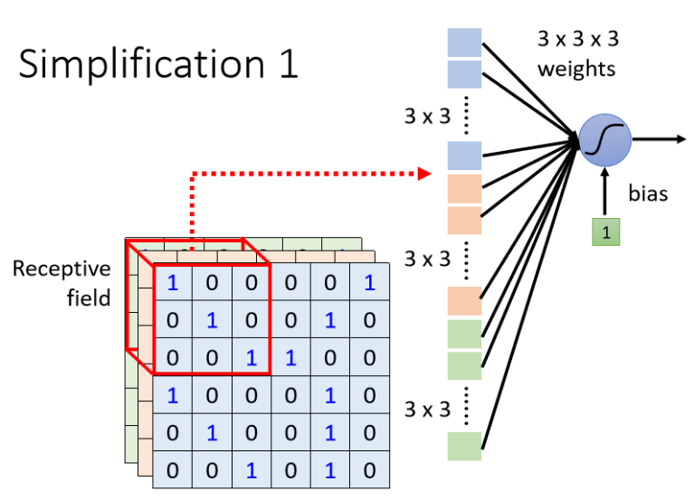

所以每一个 Neuron,它只考虑自己的 Receptive Field,那这个 Receptive Field 要怎麼决定出来呢,那这个就要问你自己了

- 你可以说这边有个蓝色的 Neuron,它就看左上角这个范围,这是它的 Receptive Field
- 另外又有另外一个黄色的 Neuron,它是看右下角这个 3×3×3 的范围
- 那 Receptive Field 彼此之间也可以是重叠的,比如说我现在画一个 Receptive Field,那这个地方它是绿色的 Neuron 的守备范围,它跟蓝色的跟黄色的都有一些重叠的空间
- 那你甚至可以两个不同的 Neuron,它们守备看到的范围是一样的,也许一个范围使用一个 Neuron 来守备,你没有办法侦测所有的 Pattern,所以同个范围可以有多个不同的 Neuron,所以同个 Receptive Field,它们可以有多个

那接下来你就会浮想联翩有各式各样的想法,举例来说,

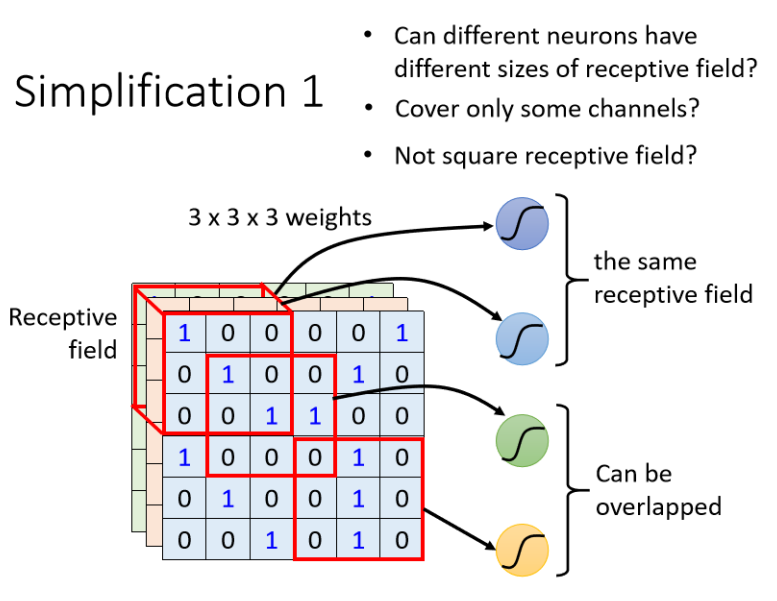

- 那我可不可以 Receptive Field 有大有小呢?因為毕竟 Pattern 有的比较小 有的比较大,有的 Pattern 也许在 3×3 的范围内,就可以被侦测出来,有的 Pattern 也许要 11×11 的范围,才能被侦测出来,可以,这个算是常见的招式了
- 我可不可以 Receptive Field,只考虑某些 Channel呢,我们这边看起来我们的 Receptive Field,是 R G B 三个 Channel 都考虑,但也许有些 Pattern,只在红色的 Channel 会出现,也许有些 Pattern,只在蓝色的 Channel 会出现啊,我可不可以有的 Neuron 只考虑一个 Channel 呢？可以,其实之后在讲到 Network Compression的时候,会讲到这种 Network 的架构,在一般 CNN 裡面你不常这样子的考虑,但是有这样子的做法
- 那有人会问说这边的 Receptive Field,通通都是正方形的,你刚才举的例子裡面,3×3  11×11 也都是正方形的,可不可以是长方形？可以！可以是长方形的,这完全都是你自己设计的,Receptive Field 是你自己定义的,你完全可以根据你对这个问题的理解,决定你觉得 Receptive Field 应该要长什麼样子
- 你可能会说 Receptive Field 一定要相连吗？我们可不可以说有一个 Neuron,它的 Receptive Field 就是影像的左上角,跟右上角。理论上可以,但是你就要想看為什麼你要这麼做嘛,会不会有什麼 Pattern 是会,也要看一个图片的左上角,跟右下角才能够找到的,也许没有 如果没有的话,这种 Receptive Field 就没什麼用,我们之所以 Receptive Field 都是,一个相连的领地,就是我们觉得要侦测一个 Pattern,那这个 Pattern,它就出现在整个图片裡面的某一个位置,而不是出现,而不是分成好几部分,出现在图片裡面的不同的位置,所以 Receptive Field 呢 它都是相,通常见到的都是相连的领地

如果你说你要设计很奇怪的 Receptive Field,去解决很特别的问题,那完全是可以的,这都是你自己决定的

## Simplification 1 – Typical Setting  

虽然 Receptive Field 你可以任意设计,但也有**最经典的 Receptive Field 的安排方式**

1. **看所有的 Channel**

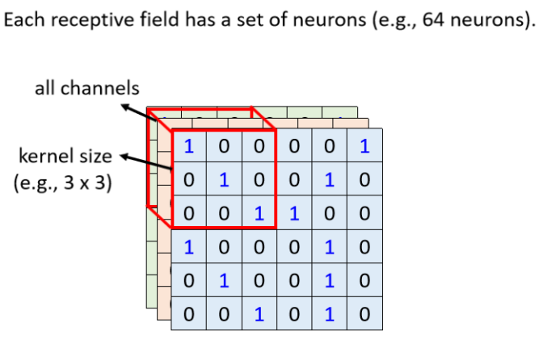

一般在做影像辨识的时候我们可能,你可能不会觉得有些 Pattern 只出现某一个 Channel 裡面,所以会看全部的 Channel,所以既然会看全部的 Channel

我们在描述一个 Receptive Field 的时候,只要讲它的高跟宽就好了,就不用讲它的深度,反正深度一定是考虑全部的 Channel,而**这个高跟宽合起来叫做 Kernel Size**

举例来说在这个例子裡面,我们的 Kernel Size 就是 3×3,那一般我们 Kernel Size 其实不会设太大,你在影像辨识裡面,往往做个 3×3 的 Kernel Size 就足够了,如果你说你设个 7×7  9×9,那这算是蛮大的 Kernel Size,一般往往都做 3×3

可能会有人疑问那如果 Kernel Size 都是 3×3,意味著说我们觉得在做影像辨识的时候,重要的 Pattern 都只在 3×3 这麼小的范围内,就可以被侦测出来了,听起来好像怪怪的,有些 Pattern 也许很大啊,也许 3×3 的范围没办法侦测出来啊

等一下我们会再回答这个问题,那我现在先告诉你说,常见的 Receptive Field 设定方式,就是 Kernel Size 3×3,然后一般同一个 Receptive Field,不会只有一个 Neuron 去关照它,往往会有一组 一排 Neuron 去守备它,比如说 64 个 或者是 128 个 Neuron 去守备一个 Receptive Field 的范围,

2. 到目前為止我们讲的都是一个 Receptive Field,那各个不同 Receptive Field 之间的关係,是怎麼样呢,你会把你在最左上角的这个 Receptive Field,往右移一点,然后製造一个另外一个 Receptive Field,**这个移动的量叫做 Stride**

像在这个例子裡面 Stride 就等於 2,那 **Stride 是一个你自己决定的 Hyperparameter**,但这个 Stride 你往往不会设太大,往往设 1 或 2 就可以了

因為你希望这些 Receptive Field,跟 Receptive Field 之间是有重叠的,因為假设 Receptive Field 完全没有重叠,那有一个 Pattern 就正好出现,在两个 Receptive Field 的交界上面,那就会变成没有任何 Neuron 去侦测它,那你也可能就会 Miss 掉这个 Pattern,所以我们希望 Receptive Field 彼此之间,有高度的重叠

那假设我们设 Stride = 2,那第一个 Receptive Field 就在这边,那第二个就会在这边

3. 再往右移两格就放在这边,那这边就遇到一个问题了,它超出了影像的范围怎麼办呢

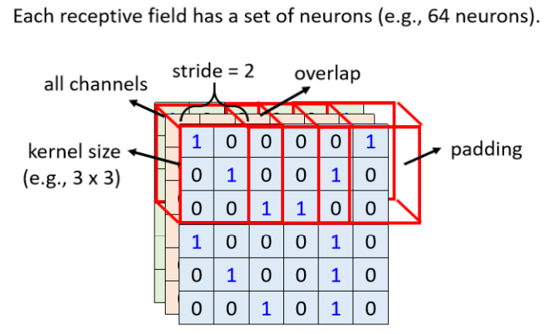

那有人可能会说,那就不要在这边摆 Receptive Field,但你这样就漏掉了影像的边边的地方啊,如果有个 Pattern 就在边边的地方,你就没有 Neuron 去关照那些 Pattern啦,没有 Neuron 去侦测出现在边边的 Pattern 了,所以一般边边的地方也会考虑的,但超出范围了怎麼办呢

超出范围你就做 Padding**,**Padding 就是补 0,好 所以如果你今天 Receptive Field 有一部分,超出影像的范围之外了,那就当做那个裡面的值都是 0

其实也有别的补值的方法,Padding 就是补值的意思,比如说有人会说,我这边不要补 0 好不好,我补整张图片裡面所有 Value 的平均,或者你说,我把边边的这些数字拿出来补，有各种不同的 Padding 的方法

4. 那你除了这个横著移动,你也会这个直著移动,你有会有这个垂直方向上的移动,

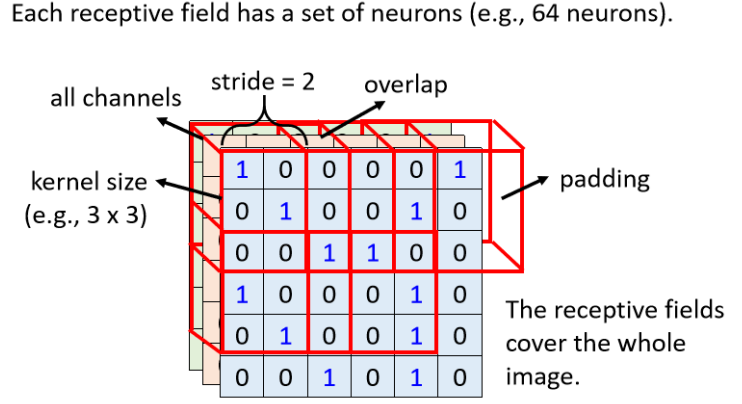

在这边呢 我们一样垂直方向 Stride 也是设 2,所以你有一个 Receptive Field 在这边,垂直方向移动两格,就有一个 Receptive Field 在这个地方,你就按照这个方式,扫过整张图片,所以整张图片裡面,每一吋土地都是有被某一个,Receptive Field 覆盖的,也就是图片裡面每一个位置,都有一群 Neuron 在侦测那个地方,有没有出现某些 Pattern

好 那这个是第一个简化,Fully Connected Network 的方式,好 

## Observation 2 

第二个观察就是,**同样的 Pattern,它可能会出现在图片的不同区域裡面**,

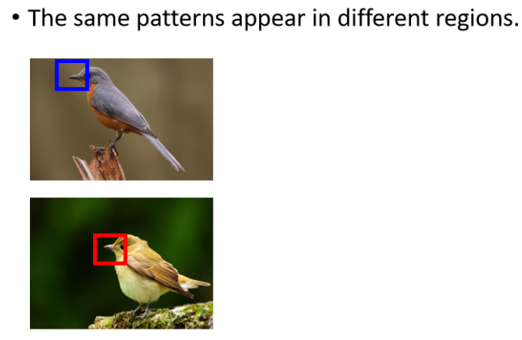

比如说鸟嘴这个 Pattern,它可能出现在图片的左上角,也可能出现在图片的中间,虽然它们的形状都是一样的 都是鸟嘴,但是它们可能出现在,图片裡面的不同的位置

按照我们刚才的讨论,你同样的 Pattern,出现在图片的不同的位置,似乎也不是太大的问题,因為出现在左上角的鸟嘴,它一定落在某一个 Receptive Field 裡面,因為 Receptive Field 是移动完之后会覆盖满整个图片的,所以图片裡面没有任何地方不是在某个 Neuron 的守备范围内

那假设在那个 Receptive Field 裡面,有一个 Neuron 它的工作,就是侦测鸟嘴的话,那鸟嘴就会被侦测出来

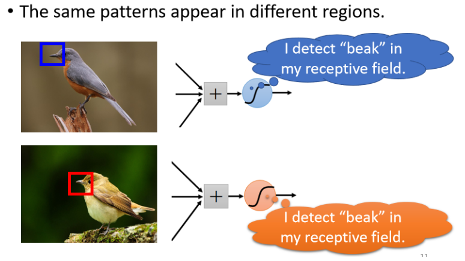

所以就算鸟嘴出现在中间,也没有关係,假设有 这边一定是在某一个,Receptive Field 的范围裡面,那个 Receptive Field,一定有一组 Neuron 在照顾,那假设其中有一个 Neuron,它可以侦测鸟嘴的话,那鸟嘴出现在图片的中间,也会被侦测出来

但这边的问题是,这些侦测鸟嘴的 Neuron,它们做的事情其实是一样的,只是它们守备的范围是不一样,**我们真的需要每一个守备范围,都去放一个侦测鸟嘴的 Neuron 吗？**

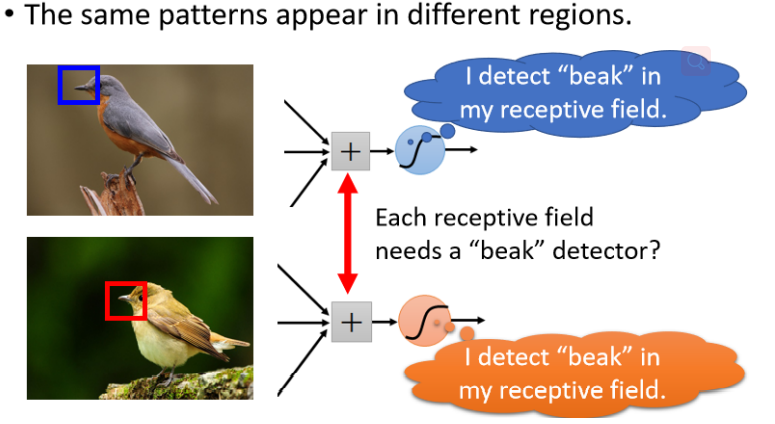

如果不同的守备范围,都要有一个侦测鸟嘴的 Neuron,那你的参数量不会太多了吗？

而这个概念就好像為什麼教务处希望,可以推大型的课程一样,假设说每一个科系,其实都需要程式相关的课程,或每一个科系都需要机器学习相关的课程,那到底需不需要在每一个系所都开机器学习的课程,还是说开一个比较大班的课程,让所有系所的人都可以修课。

## Simplification 2—— Filter

如果放在影像处理上的话,**我们能不能够让,不同 Receptive Field 的 Neuron共享参数,也就是做 Parameter Sharing权值共享,**那共享参数是什麼意思呢

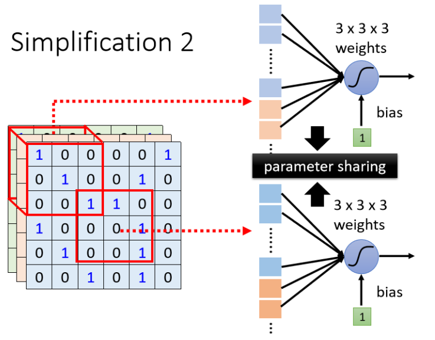

所谓共享参数就是,这**两个 Neuron 它们的 weights完全是一样的**,我这边特别用顏色来告诉你说,它们的 weights 完全是一样的

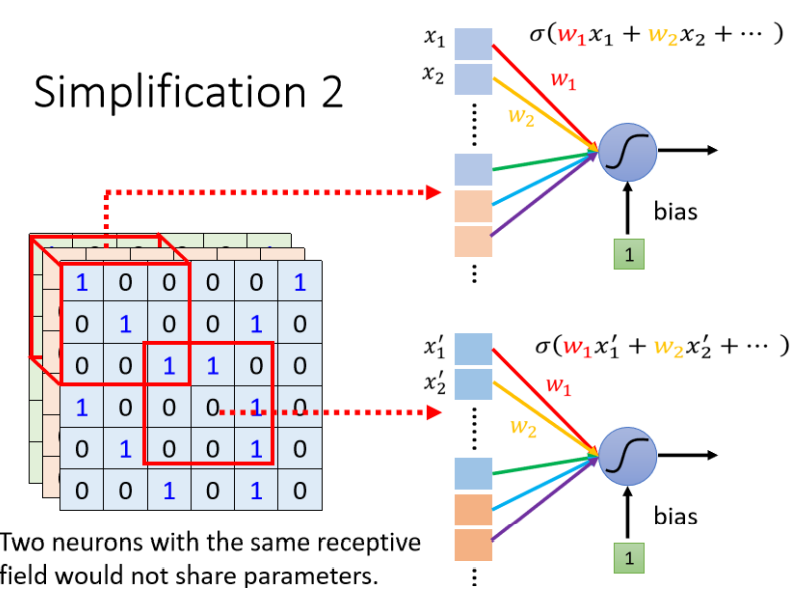

- 上面这个 Neuron 的第一个 weight,叫做 w1,下面这个 Neuron 的第一个 weight 也是 w1,它们是同一个 weight,我用红色来表示

- 上面这个 Neuron 的第二个 weight 是 w2,下面这个 Neuron 的第二个 weight 也是w2,它们都用黄色来表示,以此类推

上面这个 Neuron 跟下面这个 Neuron,它们守备的 Receptive Field 是不一样的,但是它们的参数是一模一样的

那有人可能就会问说,欸 它的参数是一模一样,那它会不会输出永远都是一样？

不会,因為它们的输入是不一样的,这两个 Neuron 的参数一模一样,但是它们照顾的范围是不一样的

- 上面这个 Neuron,我们说它的输入是 $x_1, x_2$,下面这个 Neuron它的输入是$x_1' , x_2'$,

- 上面这个 Neuron 的输出就是,x1 × w1 + x2 × w2,全部加加加 再加 Bias,然后透过 Activation Function 得到输出
  $$
  \sigma(w_1x_1+w_2x_2+……)
  $$

- 下面这个 Neuron 虽然也有 w1 w2,但 w1 跟 w2 是乘以 x1' x2',所以它的输出不会跟上面这个 Neuron 一样
  $$
  \sigma(w_1x_1'+w_2x_2'+……)
  $$

所以两个 Neuron 守备的范围不一样,就算它们的参数一样,它们的输出也不会是一样的,所以这是第二个简化

## Simplification 2 – Typical Setting 

我们让一些 Neuron 可以共享参数,那**至於要怎麼共享,你完全可以自己决定,而这个是你可以自己决定的事情**,但是接下来还是要告诉大家,常见的在影像辨识上面的共享的方法,是怎麼设定的

那我们刚才已经讲说,每一个 Receptive Field,它都有一组 Neuron 在负责守备

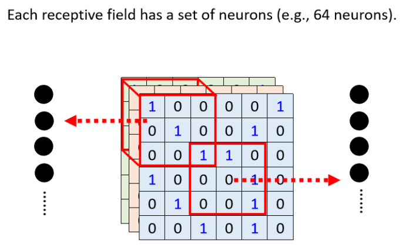

比如说 64 个 Neuron,所以这个 Receptive Field有 64 个 Neuron,这个 Receptive Field 也有 64 个 Neuron,那它们彼此之间会怎麼共享参数呢

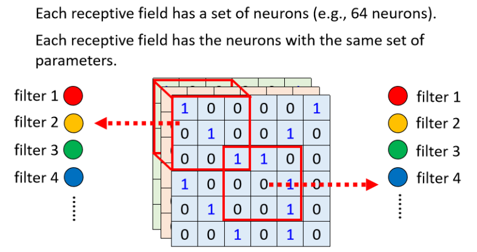

我们这边用一样的顏色,就代表说这两个 Neuron,共享一样的参数

所以其实每一个 Receptive Field都只有一组参数而已,就是

- 左上边这个 Receptive Field 的第一个红色 Neuron,会跟右下边这个 Receptive Field 的第一个 红色Neuron 共用参数
- 它的第二个橙色 Neuron,跟它的第二个 橙色Neuron 共用参数
- 它的第三个绿色Neuron,跟它的第三个绿色 Neuron 共用参数
- 所以每一个 Receptive Field,都只有一组参数而已

**那这些参数有一个名字，叫做 Filter**,所以这两个红色 Neuron,它们共用同一组参数,这组参数就叫 Filter1,橙色这两个 Neuron 它们共同一组参数,这组参数就叫 Filter2 叫 Filter3 叫 Filter4,以此类推

## Benefit of Convolutional Layer 

目前已经讲了两个简化的方法,那我们来整理一下我们学到了什麼,这是 **Fully Connected 的 Network**

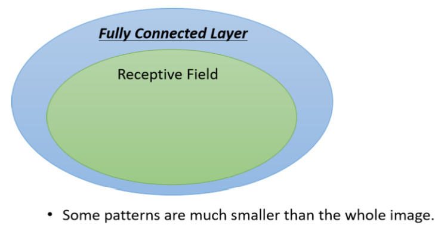

它是弹性最大的,但有时候不需要看整张图片,也许只要看图片的一小部分就可以侦测出重要的 Pattern,所以我们有了 Receptive Field 的概念

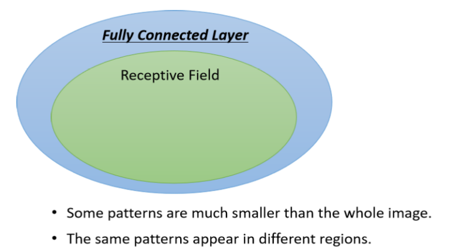

当我们强制一个 Neuron只能看一张图片裡面的一个范围的时候,它的弹性是变小的,如果是 Fully Connected 的 Network,它可以决定看整张图片，还是只看一个范围,就如果它只想看一个范围,就把很多 Weight 设成 0,就只看一个范围，所以加入 Receptive Field 以后,你的 Network 的弹性是变小的

接下来我们还有权值共享,权值共享又更进一步限制了 Network 的弹性

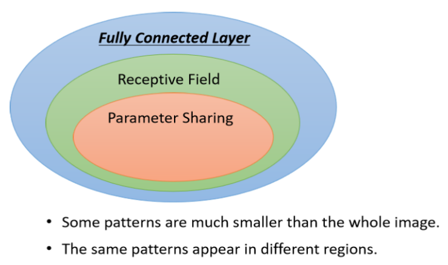

本来在 Learning 的时候,它可以决定这两个 Network 的参数要是什麼,每一个 Neuron 可以各自有不同的参数,它们可以正好学出一模一样的参数,也可以有不一样的参数

但是加入参数共享以后,就意味著说 某一些 Neuron参数要一模一样,所以这又更增加了对 Neuron 的限制,**而 Receptive Field 加上 Parameter Sharing,就是 Convolutional Layer**，每一个receptive field都有一组neuron，这组neuron中的每一个都可以识别一个pattern。不同receptive field的neuron组的参数是相同的，相同的参数代表可以识别相同的pattern。

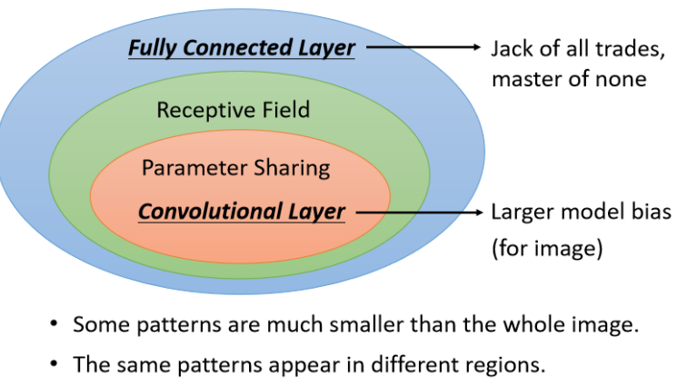

有用到 Convolutional Layer 的 Network,就叫 Convolutional Neural Network,就是 CNN,所以从这个图上啊,你可以很明显地看出,其实 CNN 的 Bias 比较大,它的 Model 的 Bias 比较大

可能有小伙伴会说 Model Bias 比较大 不是一件坏事吗？

Model Bias 大，不一定是坏事

- 因為**当 Model Bias 小,Model 的 Flexibility 很高的时候,它比较容易 Overfitting**,Fully Connected Layer可以做各式各样的事情,它可以有各式各样的变化,但是它可能没有办法在,任何特定的任务上做好
- 而 Convolutional Layer,它是专门為影像设计的,刚才讲的 Receptive Field 参数共享,这些观察 都是為影像设计的,所以它在影像上仍然可以做得好,虽然它的 Model Bias 很大,但这个在影像上不是问题,但是如果它用在影像之外的任务,你就要仔细想想,那些任务有没有我们刚才讲的,影像用的特性

## Convolutional Layer

我们以上讲的,影像用的特性,其实是 CNN 的某一种介绍方式,那现在我们要讲另外一种介绍方式,第二种介绍方式跟刚才讲的介绍方式是一模一样的,只是同一个故事,用不同的版本来说明

第二个版本是,你比较常见的说明 CNN 的方式,假设第一个版本,你听得有点迷迷糊糊的话,那我们来听第二个版本

第二个版本是这样的,**Convolutional 的 Layer 就是裡面有很多的 Filter**

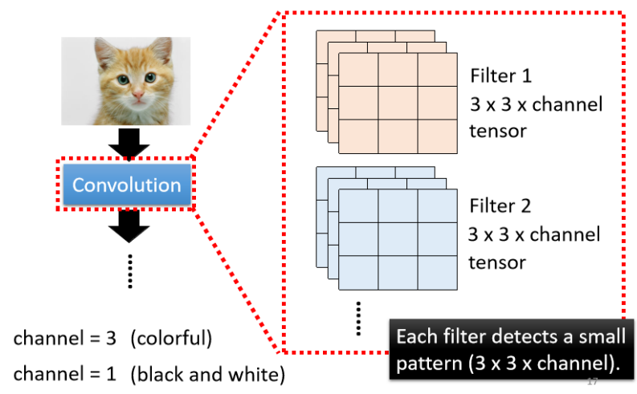

这些 Filter 啊 它们的大小是,3 × 3 × Channel 的 Size,如果今天是彩色图片的话,那就是 RGB 三个 Channel,如果是黑白的图片的话,它的 Channel 就等於 1

一个 Convolutional 的 Layer 裡面就是有一排的 Filter,每一个 Filter ,它都是一个 3 × 3 × Channel,这麼大的 Tensor

每一个 Filter 的作用就是要去图片裡面某一个 Pattern,当然这些 Pattern,要在 3 × 3 × Channel,那麼小的范围内啦,它才能够被这些 Filter 抓出来

那这些 Filter,怎麼去图片裡面抓 Pattern 的呢,我们现在举一个实际的例子

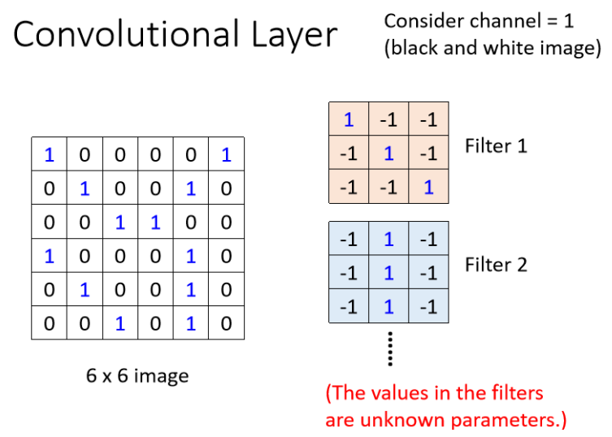

例子裡面,我们假设 Channel 是 1,也就是说我们图片是黑白的图片

那我们假设这些 Filter 的参数是已知的,Filter 就是一个一个的 Tensor,这个 Tensor 裡面的数值,我们都已经知道了,那实际上这些 Tensor 裡面的数值,其实就是 Model 裡面的 Parameter,**这些 Filter 裡面的数值,其实是未知的,它是要透过gradient decent去找出来的**

那我们现在已经假设这些 Filter 裡面的数值已经找出来了,我们来看看说这些 Filter,是怎麼跟一张图片进行运作,怎麼去图片上面把 Pattern 侦测出来的

这是我们的图片,它是一个 6 × 6 的大小的图片,那这些 Filter的做法就是,先把 Filter 放在图片的左上角,然后把 Filter 裡面所有的值,跟左上角这个范围内的 9 个值做相乘,也就是把这个 Filter 裡面的 9 个值,跟这个范围裡面的 9 个值呢,做 Inner Product,做完是 3

**注意！在此处卷集运算中，老师讲的内积，不要理解为线性代数中矩阵的乘法，而是filter跟图片对应位置的数值直接相乘，所有的都乘完以后再相加**

老师用的filter为$\begin{bmatrix}
1&-1&-1\\
-1&1&-1\\
-1&-1&1\\
\end{bmatrix}$  与图片的第一个$3\times3$矩阵$\begin{bmatrix}
1&0&0\\
0&1&0\\
0&0&1\\
\end{bmatrix}$ 做卷积运算的过程为

$(1\times1)+(-1\times0)+(-1\times0)+(-1\times0)+(1\times1)+(-1\times0)+(-1\times0)+(-1\times0)+(1\times1)=3$

在下图中 filter为$\begin{bmatrix}
1&0&1\\
0&1&0\\
1&0&1\\
\end{bmatrix}$  大家可以自行验证

接下来这个 Filter 呢,本来放在左上角,接下来就往右移一点,那这个移动的距离叫做 Stride

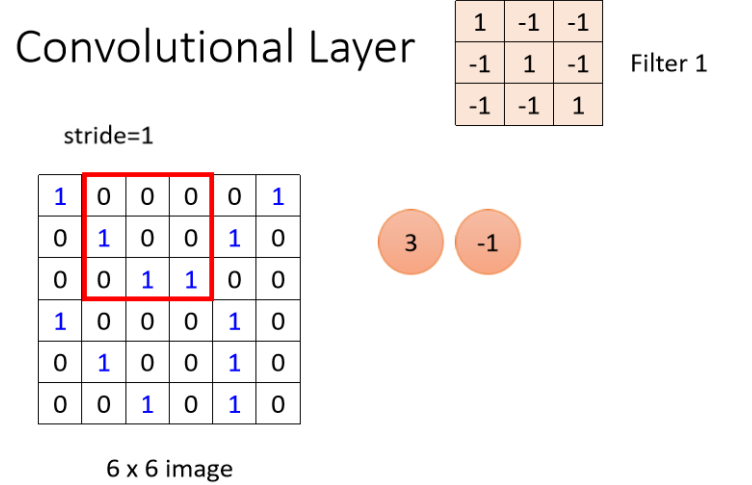

那在刚才讲前一个版本的故事的时候,我们的 Stride 是设 2,那在这个版本的故事裡面,我们 Stride 就设為 1,那往右移一点,然后再把这个 Filter,跟这个范围裡面的数值,算 Inner Product 算出来是 -1 

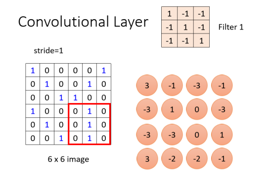

然后就以此类推,再往右移一点 再算一下,然后这边全部扫完以后,就往下移一点 再算一下,以此类推,一直到把这个 Filter 放在右下角,算出一个数值,答案就是 -1 就这样

这个 Filter 怎麼说它在侦测 Pattern 呢

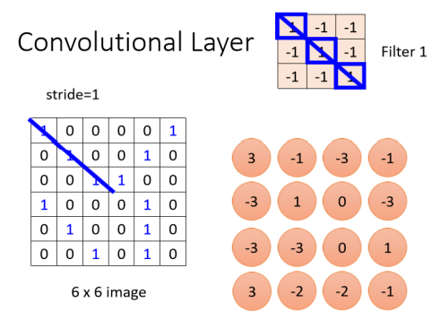

你看这个 Filter 裡面,它对角线的地方都是1,所以它看到 Image 裡面也出现连三个 1 的时候,它的数值会最大

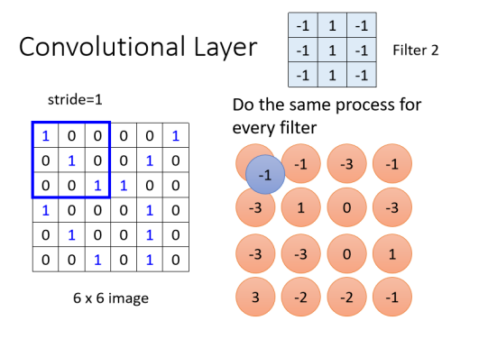

所以你会发现左上角的地方的值最大,左下角的地方的值最大,就告诉我们说,这个图片裡面左上角有出现 3,左上角有出现这个 Pattern,左下角有出现这个,三个 1 连在一起的 Pattern,这个是第一个 Filter

好 那接下来呢,我们把每一个 Filter,都做重复的 Process,比如说这边有第二个 Filter

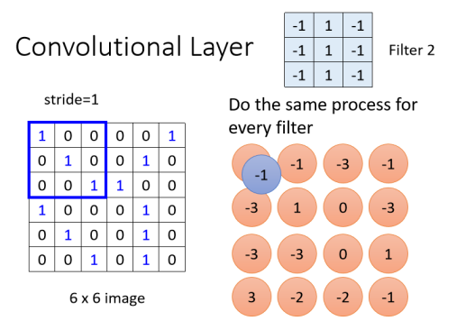

我们就把第二个 Filter,先从左上角开始扫起,得到一个数值,往右移一点 再得到一个数值,再往右移一点 再得到一个数值,反覆同样的 Process,反覆同样的操作,直到把整张图片都扫完,我们又得到另外一群数值

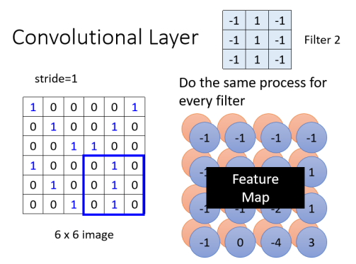

所以每一个 Filter,都会给我们一群数字,红色的 Filter 给我们一群数字,蓝色的 Filter 给我们一群数字,如果我们有 64 个 Filter,我们就得到 64 群的数字了,**那这一群数字啊,它又有一个名字,它叫做 Feature Map**

所以当我们把一张图片,通过一个 Convolutional Layer,裡面有一堆 Filter 的时候,我们產生出来了一个 Feature Map

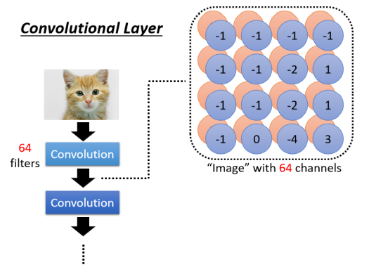

那假设这个 Convolutional Layer裡面,它有 64 个 Filter,那我们產生出来64个 Feature Map,每一组在这个例子裡面是 4 × 4，这个 Feature Map你可以看成是,另外一张新的图片

只是这个图片的 Channel 它有 64 个,而且这并不是 RGB 这个图片的 Channel,在这里每一个 Channel 就对应到一个 Filter,**本来一张图片它三个 Channel,通过一个 Convolution,它变成一张新的图片,有 64 个 Channel**

这个 **Convolutional Layer 是可以叠很多层的**,刚才是叠了第一层,那如果叠第二层会发生什麼事呢

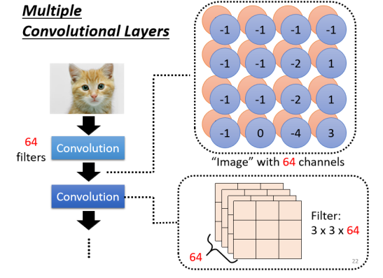

第二层的 Convolution 裡面,也有一堆的 Filter,那每一个 Filter 呢,它的大小我们这边也设 3 × 3,那它的高度必须设為 64

**Filter 的这个高度就是它要处理的影像的 Channel**,所以跟刚才第一层的 Convolution,假设输入的影像是黑白的 Channel是 1,那我们的 Filter 的高度就是 1,输入的影像如果是彩色的 Channel 是 3,那 Filter 的高度就是 3,那在第二层裡面,我们也会得到一张影像,对第二个 Convolutional Layer 来说,它的输入也是一张图片,那这个图片的 Channel 是多少,这个图片的 Channel 是 64

这个 64 是前一个 Convolutional Layer 的,Filter 数目,前一个 Convolutional Layer,它 Filter 数目 64,那输出以后就是 64 个 Channel

如果我们的 Filter 的大小一直设 3 × 3,会不会让我们的 Network,没有办法看比较大范围的 Pattern 呢？

其实不会的,因為你想想看,如果我们在第二层 Convolutional Layer,我们的 Filter 的大小一样设 3 × 3 的话,会发生什麼事情呢

如果我们一样设 3 × 3 的话,当我们看最左上角这个数值的时候,最左上角这个数值在影像上,其实是对应到这个范围,

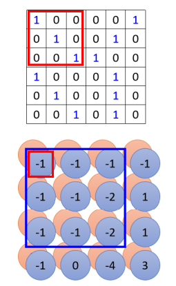

右下角的数值在影像上,其实是对应到这个范围,

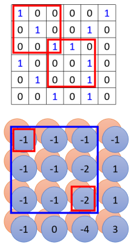

所以当我们看这 3 × 3 的范围的时候,和第一个 Convolutional Layer 的输出的,这个 Feature Map 的,3 × 3 的范围的时候,我们在原来的影像上,其实是考虑了一个 5 × 5 的范围

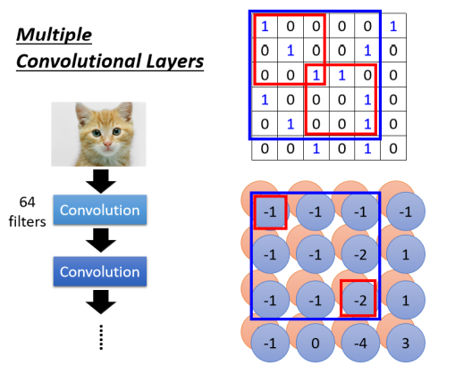

所以虽然我们的 Filter 只有 3 × 3,但它在影像上考虑的范围,是比较大的 是 5 × 5,所以今天你的 Network 叠得越深,同样是 3 × 3 的大小的 Filter,它看的范围就会越来越大,所以 Network 够深,你不用怕你侦测不到比较大的 Pattern,它还是可以侦测到比较大的 Pattern

## Comparision of Two CNN Versions

刚才我们讲了两个版本的故事了,那这两个版本的故事,是一模一样的

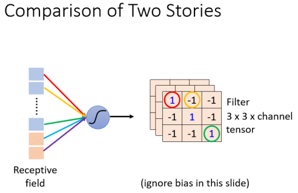

我们在第一个版本的故事裡面,说到了有一些 Neuron,这些 Neuron 会共用参数,这些**共用的参数,就是第二个版本的故事裡面的 Filter**

我们这个 Filter 裡面有 3 × 3 × 3个数字,我这边特别还**用顏色,把这些数字圈起来,告诉你说 这个 Weight 就是这个数字**

以此类推,那这边我把 Bias 去掉了, Neuron 这个是有 Bias 的,这个 Filter 有没有 Bias 呢,其实是有的,只是在刚才的故事裡面没有提到,在一般的这个实作上,你的 CNN 的这些 Filter,其实都还是有那个 Bias 的数值的

在刚才第一个版本的故事裡面,我们说不同的 Neuron,它们可以 Share Weight,然后去守备不同的范围,而 **Share Weight 这件事,其实就是我们把 Filter 扫过一张图片**

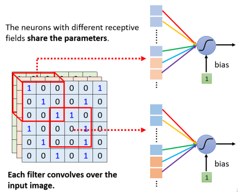

那把 F**ilter 扫过一张图片这件事,其实就是 Convolution**,这就是為什麼 Convolutional Layer,要叫 Convolutional Layer 的关係

那所谓的把 Filter 扫过图片这件事情,其实就是不同的 Receptive Field,Neuron 可以共用参数,而这组共用的参数,就叫做一个 Filter

今天特别从两个不同的面向,讲 CNN 这个东西,希望可以帮助你对 CNN 有更深地了解

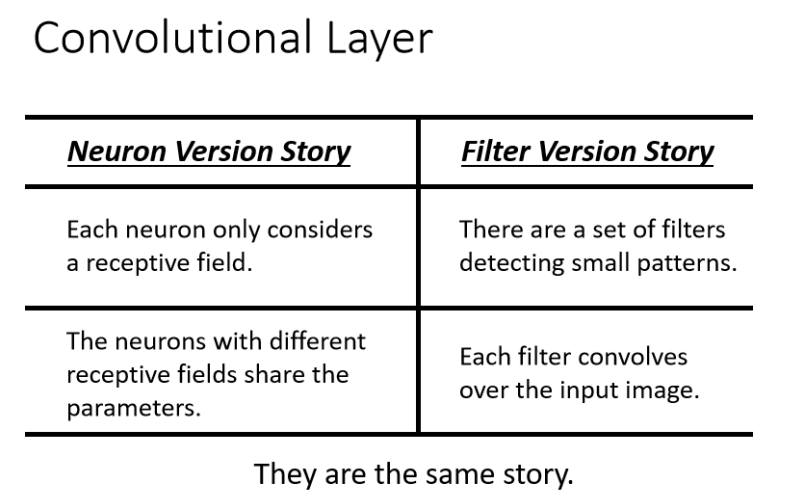

為什麼用 CNN 是基於两个观察

- 第一个观察是 我们不需要看整张图片,那对 Neuron 的故事版本,对於第一个故事而言就是,Neuron 只看图片的一小部分,对 Filter 的故事而言就是,我们有一组 Filter,每个 Filter 只看一个小范围,它只侦测小的 Pattern
- 然后我们说 同样的 Pattern,可能出现在图片的不同的地方,所以 Neuron 间可以共用参数,对 Filter 的故事而言就是,一个 Filter 要扫过整张图片,这个就是 Convolutional Layer

## Observation 3

 Convolutional Layer,在做影像辨识的时候呢,其实还有第三个常用的东西,这个东西呢 叫做 Pooling,那 Pooling 是怎麼来的呢

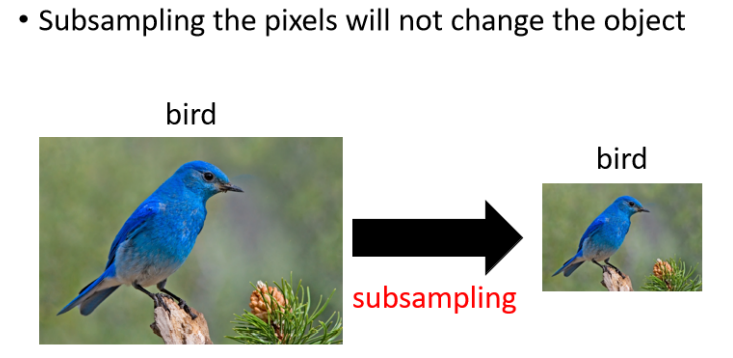

Pooling 来自於另外一个观察

我们把一张比较大的图片做 Subsampling,举例来说你把偶数的 Column 都拿掉,奇数的 Row 都拿掉,图片变成為原来的1/4,但是不会影响裡面是什麼东西,把一张大的图片缩小,这是一隻鸟,这张小的图片看起来还是一隻鸟

那所以呢 有了Pooling 这样的设计,那 Pooling 是怎麼运作的呢

**Pooling 这个东西啊,它本身没有参数,所以它不是一个 Layer,它裡面没有 Weight,它没有要 Learn 的东西,所以有人会告诉你说 Pooling 比较像是一个 Activation Function,比较像是 Sigmoid ， ReLU 那些,因為它裡面是没有要 Learn 的东西的,它就是一个 Operator,它的行為都是固定好的,没有要根据 Data 学任何东西**

那 Pooling 其实也有很多不同的版本,我们这边讲的是 Max Pooling

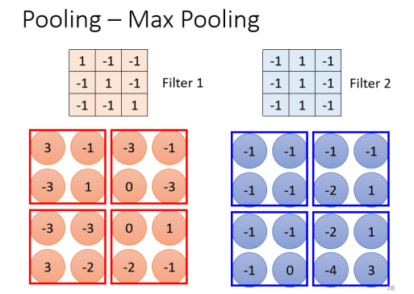

刚才说每一个 Filter 都產生一把数字,要做 Pooling 的时候,我们就把这些数字几个几个一组,比如说在这个例子裡面就是 2×2 个一组,每一组裡面选一个代表,在 Max Pooling 裡面,我们选的代表就是最大的那一个

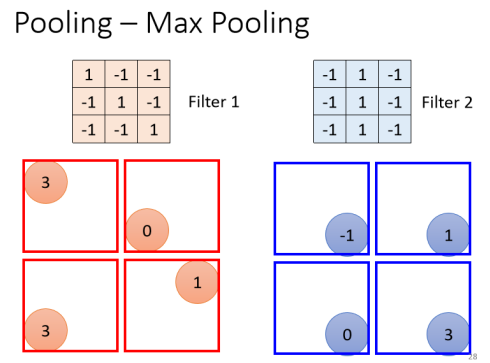

你不一定要选最大的那一个,这个是你自己可以决定的,Max Pooling 这一个方法是选最大的那一个,但是也有 average Pooling ，就是选平均嘛,还有选几何平均的,所以有各式各样的 Pooling 的方法

也一定要 2×2 个一组吗,这个也是你自己决定的,你要 3×3 4×4 也可以

## Convolutional Layers + Pooling 

所以我们做完 Convolution 以后,往往后面还会搭配 Pooling,那 **Pooling 做的事情就是把图片变小**,做完 Convolution 以后我们会得到一张图片,这一张图片裡面有很多的 Channel,那做完 Pooling 以后,我们就是把这张图片的 Channel 不变,本来 64 个 Channel 还是 64 个 Channel,但是我们会把图片变得比较狭长一点

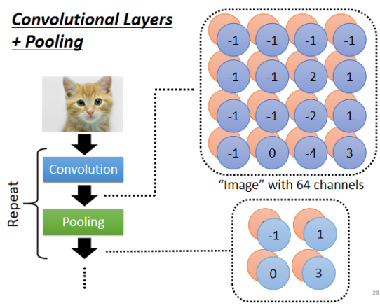

在刚才的例子裡面,本来 4×4 的图片,如果我们把这个 Output 的数值啊,2×2 个一组的话,那 4×4 的图片就会变成 2×2 的图片,这个就是 Pooling 所做的事情

**那一般在实作上啊,往往就是 Convolution 跟 Pooling 交替使用**,就是你可能做几次 Convolution,做一次 Pooling,比如两次 Convolution 一次 Pooling,两次 Convolution 一次 Pooling

不过你可以想见说 **Pooling,对於你的 Performance,还是可能会带来一点伤害的**,因為假设你今天要侦测的是非常微细的东西,那你随便做 Subsampling,Performance 可能会稍微差一点

所以近年来你会发现,很多影像电视的 Network 的设计,往往也开始把 Pooling 丢掉,他会做这种,Full Convolution 的 Neural Network,就整个 Network 裡面统统都是 Convolution,完全都不用 Pooling

那是因為近年来运算能力越来越强,Pooling 最主要的理由是為了减少运算量,做 Subsampling,把影像变少 减少运算量,那如果你今天你的运算资源,足够支撑你不做 Pooling 的话,很多 Network 的架构的设计,往往今天就不做 Pooling,全 Convolution,Convolution 从头到尾,然后看看做不做得起来,看看能不能做得更好

## The whole CNN

那一般以后,你的架构就是 Convolution 加 Pooling,那我刚才讲过说 Pooling 是可有可无啦,今天很多人可能会选择不用 Pooling,好 那如果你做完几次 Convolution 以后,接下来呢,最终怎麼得到最后的结果呢

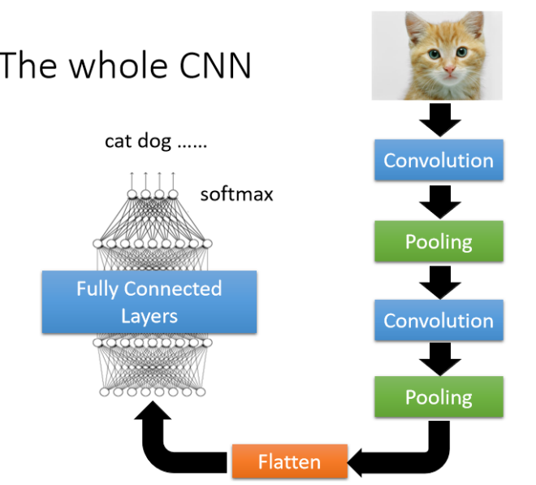

你会把 Pooling 的 Output 做一件事情,叫做 Flatten,Flatten 的意思就是,把这个影像裡面啊,本来排成矩阵的样子的东西拉直,把所有的数值拉直变成一个向量,再把这个向量,丢进 Fully Connected 的 Layer 裡面

最终你可能还要过个 Softmax,然后最终得到影像辨识的结果,这就是一个经典的影像辨识的Network,它可能有的样子就是长这样,裡面有 Convolution,有 Pooling 有 Flatten,最后再通过几个,Fully Connected 的 Layer 或 Softmax,最终得到影像辨识的结果

## Application： Alpha Go

那除了影像辨识以外啊,你可能听过 CNN 另外一个最常见的,最耳熟能详的应用,就是用来下围棋,那今天呢 如果讲个机器学习的课,没有提到 AlphaGo,大家就觉得你什麼都没有讲对不对,所以我们来提一下 AlphaGo,好 怎麼用这个 CNN 来下围棋呢

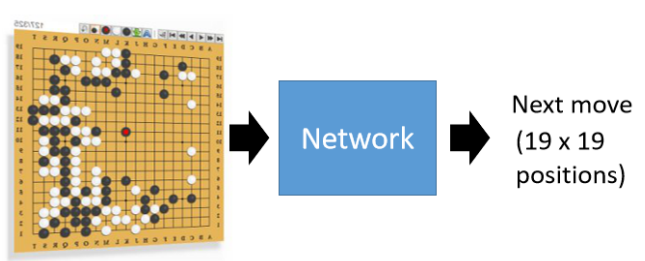

我们说下围棋其实就是一个分类的问题,你的 Network 的输入,是棋盘上黑子跟白子的位置,你的输出就是下一步应该要落子的位置

可是我们今天已经知道说,Network 的输入就是一个向量啊,那怎麼把棋盘表示成一个向量呢,完全没有问题,棋盘上就是有 19 × 19 个位置嘛,那我们就把一个棋盘,表示成一个 19 × 19 维的向量,在这个向量裡面,如果某一个位置有一个黑子,那那个位置我们就填 1,如果白子我们就填 -1,如果没有子我们就填 0

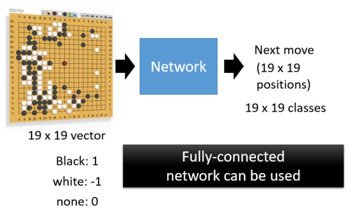

我们就可以告诉 Network 说,现在棋盘上的盘势长什麼样,我们可以用一个 19 × 19 维的向量,来描述一个棋盘,当然这不一定是要这麼做啦,不一定要黑子是 1 白子是 -1,然后没有子就是 0,这只是一个可能的表示方式而已,你们可以想出其他更神奇的表示方式,总之我们有办法把棋盘上的盘势,用一个向量来描述

把这个向量输到一个 Network 裡面,然后呢,你就可以把下围棋当作一个分类的问题,叫这个 Network 去预测,下一步应该落子的位置落在哪裡最好

所以下围棋,就是一个有 19 × 19 个类别的分类的问题,Network 会 Output 说,在这 19 × 19 个类别裡面,哪一个类别是最好的,应该要选择下一步落子的位置应该在哪裡,那这个问题完全可以用一个,Fully Connected 的 Network 来解决,但是用 CNN 的效果更好

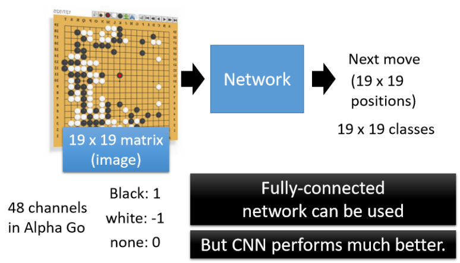

為什麼用 CNN 的效果更好呢,首先你完全可以把一个棋盘,看作是一张图片,一个棋盘,可以看作是一个解析度 19 × 19 的图片,一般图片很大,一般图片可能都 100 × 100 的解析度,都是很小的图片了啊,但是棋盘是一个更小的图片,这个图片它的解析度只有 19 × 19,这个图片裡面每一个像素 每一个 Pixel,就代表棋盘上一个可以落子的位置

那 Channel 呢,一般图片的 Channel 就是 RGB 嘛,RGB 代表一个顏色,那棋盘上每一个 Pixel 的 Channel,应该是什麼呢

在 AlphaGo 的原始论文裡面它告诉你说,每一个棋盘的位置,每一个棋盘上的 Pixel,它是用 48 个 Channel 来描述,也就是说棋盘上的每一个位置,它都用 48 个数字,来描述那个位置发生了什麼事

那至於為什麼是这 48 个,那这个显然是围棋高手设计出来的,那 48 个位置包括,比如说 啊 这个位置是不是要被叫吃了,这个位置旁边有没有顏色不一样的等等,就是这样子描述每一个位置,所以你会用 48 个数字,来描述棋盘上的一个位置,这一个棋盘它就是 19 × 19 的解析度的图片,它的 Channel 就是 48,

但是為什麼 CNN 可以用在下围棋上呢,我们刚才就有强调说 CNN ,其实并不是你随便用都会好的,它是為影像设计的,所以如果一个问题,它跟影像没有什麼共通的特性的话,你其实不该用 CNN,所以今天既然在下围棋可以用 CNN,那意味著什麼,那意味著围棋跟影像有共同的特性,什麼样共同的特性呢

## Why CNN for Go playing?

我们刚才讲说在影像上的**第一个观察**是,很多重要的 Pattern,你只需要看小范围就知道,下围棋是不是也是一样呢

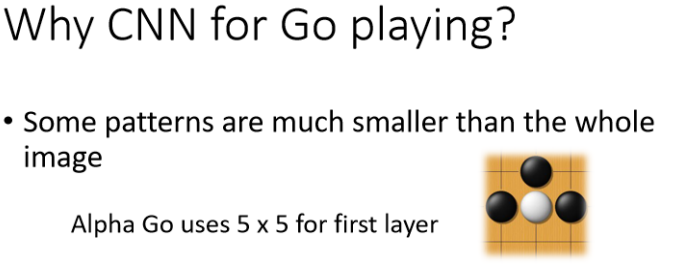

举例来说这一个 Pattern,你就算不用看整个棋盘的盘势,你都知道说这边发生了什麼事,这个就是白子被黑子围住了嘛,那接下来黑子如果放在这边,就可以把白子提走,那白子要放在这边才不会,才可以接这个白子 才不会被提走,那其实在 AlphaGo 裡面啊,它的第一层的 Layer,它的 Filter 的大小就是 5 × 5,所以显然在设计这个 Network 的人觉得说,棋盘上很多重要的 Pattern,也许看 5 × 5 的范围就可以知道了

再来是我们说影像上的第二个观察是,同样的 Pattern 可能会出现在不同的位置,在下围棋裡面是不是也是一样呢,

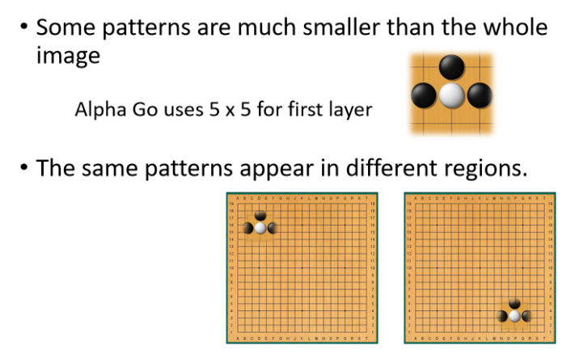

这个叫吃的 Pattern,它可以出现在棋盘上的任何位置,它可以出现在左上角,也可以出现在右下角,所以从这个观点来看,影像跟下围棋有很多共同之处

但是让人想不透的地方是,在做影像的时候我们说我们都会做 Pooling,也就是一张**影像做 Subsampling 以后,并不会影响我们对影像中物件的判读**

但是棋盘是这个样子吗,你可以把棋盘上的奇数行跟偶数列拿掉,还是同一个棋局吗,听起来好像不是对不对,下围棋这麼精细的任务,你随便拿掉一个 Column 拿掉一个 Row,整个棋整个局势就不一样啦,怎麼可能拿掉一个 Row 拿掉一个 Column,还会没有问题呢

所以有人就会说,啊 CNN 裡面就是要有 Pooling,然后影像辨识都是用 Pooling,所以 AlphaGo 也一定有用 Pooling,所以代表 AlphaGo 很烂啊,针对 Pooling 这个弱点去攻击它,一定就可以把它打爆,真的是这样吗

可是 AlphaGo 又这麼强,显然它没有这麼显而易见的弱点,所以这个问题就让我有点困扰,好 但后来我就去仔细读了一下,AlphaGo 那篇 Paper

其实 AlphaGo 在 Nature 上的 Paper,其实没有多长,大概就,我记得就五 六页而已,所以其实你一下子就可以看完了,而且在这个文章的正文裡面,甚至没有提它用的网路架构是什麼样子,它没有讲 Network 架构的细节,这个细节在哪裡呢,这个细节在附件裡面,所以我就仔细读了一下附件,看看说 AlphaGo 的网路结构长什麼样子

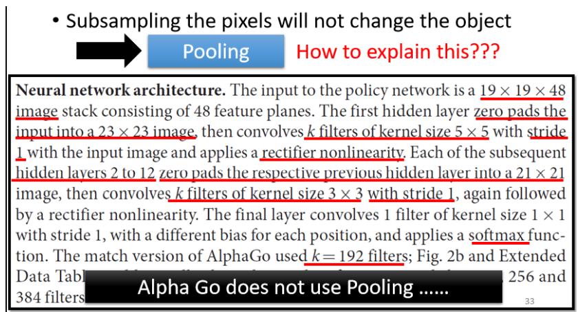

我们就来看一下,这个附件裡面是怎麼描述,AlphaGo 的类神经网路结构的,它先说呢

- 我们把一个棋盘,看作 19 × 19 × 48 那麼大小的 Image
- 接下来它说它有做 Zero Padding,Padding 这件事我们有讲嘛,就是你的 Filter 如果超出影像的范围就补 0,Zero Padding 就是超出范围就补 0 的意思
- 它说它的 Filter 的大小啊,Kernel Size 就是 Filter 的大小是 5 × 5
- 然后有 k 个 Filter,k 是多少,k 是 192,这当然是试出来的啦,它也试了 128 跟 256 发现 192 最好了,好 这是第一层
- 然后 Stride=1,Stride 是什麼 我们刚才也解释过了
- 然后这边有用了 Rectifier Nonlinearity,这是什麼,这个就是 ReLU 啦,这个就是 ReLU
- 然后在第二层呢,到第 12 层都有做 Zero Padding,然后呢 这个 Kernel Size 都是 3 × 3,一样是 k 个 Filter,也就是每一层都是 192 个 Filter,Stride 呢 一样设 1,就这样叠了很多层以后呢,因為是一个分类的问题
- 最后加上了一个 Softmax

**读完以后你有发现什麼玄机吗,发现它没有用 Pooling**

**所以这给我们一个很好的例子就是,类神经网路的设计这个应用之道,存乎一心**

你不要看影像上面都有用 Pooling,就觉得 Pooling 一定是好的,在下围棋的时候就是不适合用 Pooling,所以你要想清楚说,你今天用一个 Network 架构的时候,我这个 Network 的架构到底代表什麼意思,它适不适合用在我现在这个任务上,

## More Applications

而那 CNN 呢,除了下围棋还有影像以外,欸 近年来也用在语音上,也用在文字处理上,这边我们就不再细讲

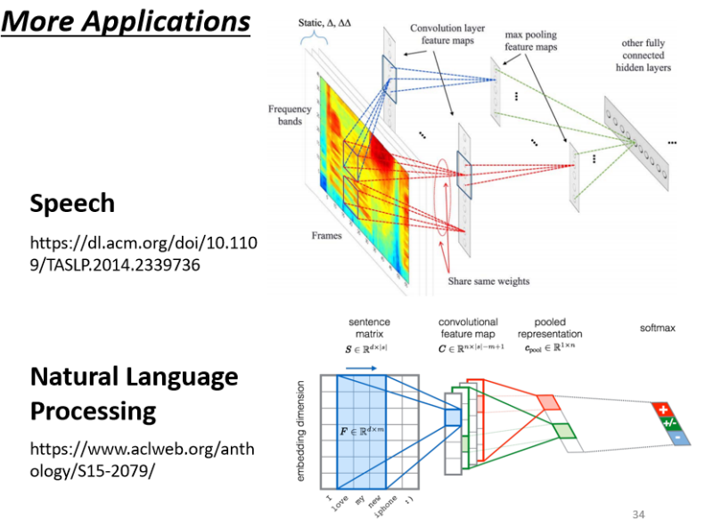

但是呢 你如果你真的想把 CNN 用在语音上,用在这个文字处理上,你要仔细看一下文献上的方法

这个在影像 在语音上,在文字上,那个 Receptive Field 的设计啊,这个参数共享的设计啊,跟影像上不是一样的

所以你要想清楚,那些 Receptive Field 用在语音,用在文字上的设计跟影像上不是一样,是考虑了语音跟文字的特性以后所设计的

所以你不要以為在影像上的 CNN,直接套到语音上它也 Work,可能是不 Work 的,你要想清楚说影像,语音有什麼样的特性,那你要怎麼设计合适的 Receptive Field,

## To learn more

有人会说 CNN,其实 CNN,它没有办法处理影像放大缩小,或者是旋转的问题,怎麼说呢,假设今天你给 CNN 看的狗都是这个大小,它可以辨识说这是一隻狗,当你把这个图片放大的时候,它可以辨识说牠还是一隻狗吗,可能是不行的

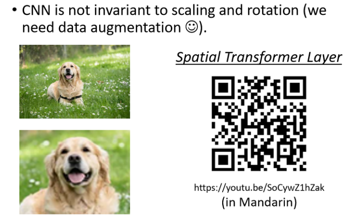

你可能会想说 欸怎麼会不能够辨识呢,这两个形状不是一模一样啊,怎麼放大就不能辨识呢,CNN 这麼笨吗

它就是这麼笨,对它来说这两张图片,虽然这个形状是一模一样的,但是如果你把它拉长成向量的话,它裡面的数值就是不一样的啊,所以对 CNN 来说,虽然你人眼一看觉得它形状很像,但对 CNN 的 Network 来说它是非常不一样

所以事实上,CNN 并不能够处理影像放大缩小,或者是旋转的问题,当它今天在某种大小的影像上,假设你裡面的物件都是比较小的,它在上面学会做影像辨识,你把物件放大它就会整个惨掉

所以 CNN 并没有你想像的那麼强,那就是為什麼在做影像辨识的时候,往往都要做 Data Augmentation,所谓 Data Augmentation 的意思就是说,你把你的训练资料,每张图片都裡面截一小块出来放大,让 CNN 有看过不同大小的 Pattern,然后把图片旋转,让它有看过说,某一个物件旋转以后长什麼样子,CNN 才会做到好的结果

那你说 欸 CNN 这个不能够处理 Scaling,跟 Rotation 的问题啊,**那有没有什麼 Network 架构,是可以处理这个问题呢,其实有的,有一个架构叫 Special Transformer Layer**,我们不会讲它,就把它的这个录影的连结放在这边,给大家参考

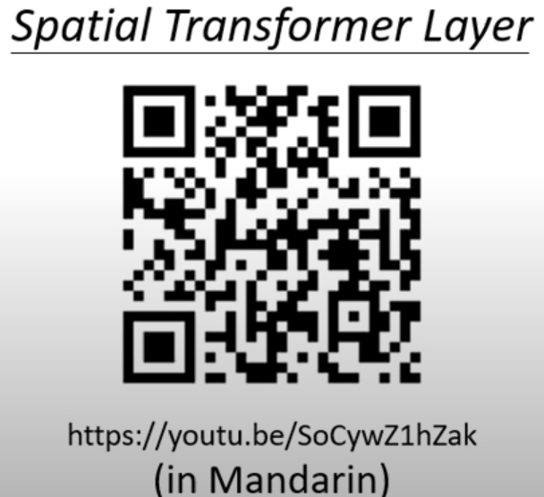