# Basic Idea of Auto-encoder

## **Self-supervised Learning Framework**

在讲 Auto-Encoder 之前,其实 Auto-Encoder 也可以算是,Self-Supervised Learning 的一环,所以再让我们用非常短的时间,来看一下Self-Supervised Learning 的 Framework

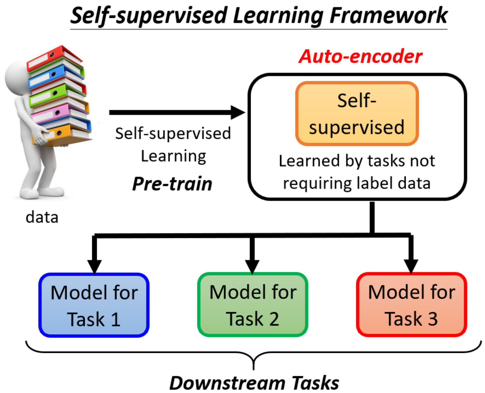

首先你有大量的没有标注的资料,用这些没有标注的资料,你可以去训练一个模型,你必须发明一些不需要标注资料的任务,比如说做填空题,比如说预测下一个 Token

**这个不用标注资料的学习叫做,Self-Supervised Learning,或者是也有人叫 Pre-Training,那用这些不用标注资料的任务,学完一个模型以后,它本身没有什麽用,BERT 只能做填空题,GPT 只能够把一句话补完,但是你可以把它用在其他下游的任务裡面**

你可以把 Self-Supervised Learning 的 Model,做一点点的微微的调整,就可以用在下游的任务裡面

在有 BERT 在有 GPT 之前,其实有一个更古老的任务,更古老的不需要用标注资料的任务,就叫做 Auto-Encoder,所以你也可以把 Auto-Encoder,看作是 Self-Supervised Learning 的,一种 Pre-Train 的方法

当然可能不是所有人都会同意这个观点,有人可能会说这个 Auto-Encoder,不算是 Self-Supervised Learning,这个 Auto-Encoder 很早就有了嘛,2006 年 15 年前就有了嘛,然后 Self-Supervised Learning 是,19 年才有这个词彙嘛,所以 Auto-Encoder,不算 Self-Supervised Learning 的一环

那这个都是见仁见智的问题,这种名词定义的问题,真的我们就不用太纠结在这个地方,从 Self-Supervised Learning,它是不需要用 Label Data 来训练,这个观点来看,Auto-Encoder 我认为它可以算是,Self-Supervised Learning 的其中的一种方法,它就跟填空 预测,接下来的 Token 是很类似的概念,只是用的是另外不一样的想法

## Auto-encoder

Auto-Encoder 是怎麽运作的呢,那现在我们,因为刚才在讲 Self-Supervised Learning 的时候,都是用文字做例子,那现在我们换成用影像来做例子

假设你有非常大量的图片,在 Auto-Encoder 裡面你有两个 Network,一个叫做 Encoder,一个叫做 Decoder,他们就是两个 Network

- Encoder 把一张图片读进来,它把这张图片变成一个向量,就 Encoder 它可能是很多层的 CNN,把一张图片读进来,它的输出是一个向量,接下来这个向量会变成 Decoder 的输入

- Decoder 会产生一张图片,所以 Decoder 的 Network 的架构,可能会像是 GAN 裡面的 Generator,它是 11 个向量输出一张图片

训练的目标是希望,Encoder 的输入跟 Decoder 的输出,越接近越好

假设你把图片看作是一个很长的向量的话,我们就希望这个向量跟 Decoder 的输出,这个向量,这两个向量他们的距离越接近越好,也有人把这件事情叫做 **Reconstruction**,叫做重建

因为我们就是把一张图片,压缩成一个向量,接下来 Decoder 要根据这个向量,重建原来的图片,那我们希望原输入的结果,跟重建后的结果越接近越好

讲到这边你可能会发现说,这个东西 这个概念似曾相似,没错 我们在讲 Cycle GAN 的时候,已经讲过了这个概念

我们说在做 Cycle GAN 的时候,我们会需要两个 Generator,第一个 Generator,把 X Domain 的图片转到 Y Domain,另外一个 Generator,把 Y Domain 的图片转回来,希望最原先的图片,跟转完两次后的图片越接近越好

那这边 Encoder 和 Decoder,这个 Auto-Encoder 的概念,跟 Cycle GAN 其实是一模一样的,都是希望所有的图片经过两次转换以后,要跟原来的输出越接近越好,而这个训练的过程,完全不需要任何的标注资料,你只需要蒐集到大量的图片,你就可以做这个训练

所以它是一个 Unsupervised Learning 的方法,跟 Self-Supervised 那一系列,Pre-Training 的做法一样,你完全不需要任何的标注资料

那像这样子这个 Encoder 的输出,有时候我们叫它 Embedding,我们在讲 BERT 的时候,也提过 Embedding 这个词彙了,那有的人叫它 Representation,有的人叫它 Code,因为 Encoder 是一个编码嘛,所以这个有人把这个 Vector 叫做 Code,那其实指的都是同一件事情

怎麽把 Train 的 Auto-Encoder,用在 Downstream 的任务裡面呢

常见的用法就是,原来的图片,你也可以把它看作是一个很长的向量,但这个向量太长了 不好处理,那怎麽办呢

**你把这个图片丢到 Encoder 以后,输出另外一个向量,这个向量你会让它比较短,比如说只有 10 维 只有 100 维,那你拿这个新的向量来做你接下来的任务,也就是图片不再是一个很高维度的向量,它通过 Encoder 的压缩以后,变成了一个低维度的向量,你再拿这个低维度的向量,来做接下来想做的事情,这就是常见的,Auto-Encoder用在 Downstream 的任务,用在下游任务的方法**

那因为通常 Encoder 的输入,是一个维度非常高的向量,而 Encoder 的输出,也就是我们的 Embedding,Representation 或者 Code,它是一个非常低维度的向量,比如说输入是 100×100 的图片,那 100×100 那就是 1 万维的向量了,如果是 RGB 那就是 3 万维的向量

但是通常 Encoder 的 Output 你会设得很小,比如说 10，100 这样的等级,所以这个这边会有一个特别窄的地方,所以这个部分,这个 Encoder 的输出,有时候又叫做 **Bottleneck**,叫做瓶颈,就本来输入是很宽的,输出也是很宽的 中间特别窄,所以这一段就叫做 Bottleneck

而 Encoder 做的事情,是把本来很高维度的东西,转成低维度的东西,把高维度的东西转成低维度的东西又叫做 **Dimension Reduction**

Dimension Reduction 这个技术,我相信你在 Machine Learning 相关的应用上,应该常常听到这个名词,那有关 Dimension Reduction 的技术,它其实牵涉的非常非常地广,所以我们这边就不再细讲,因为这门课,我们只专注在深度学习相关的技术,你可以把 Auto-Encoder 的 Encoder,当作拿来做 Dimension Reduction,那其他还有很多不是 Deep Learning Base的,不是以深度学习为基础的,Dimension Reduction的技术,我就把录影的连接留在这边

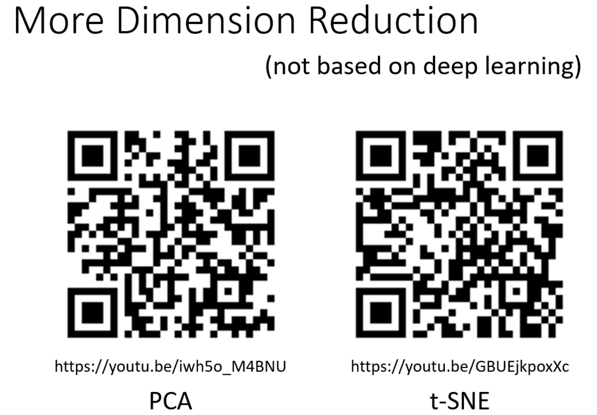

比如说 PCA 比如说 T-SNE,我就把录影的连结留在这边给大家参考

## Why Auto-encoder? 

好 那 Auto-Encoder 到底好在哪裡,当我们把一个高维度的图片,变成一个低维度的向量的时候,到底带来什麽样的帮助,这让我想到神鵰侠侣的其中一段

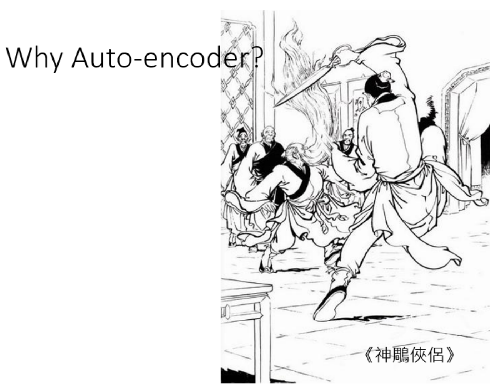

神鵰侠侣裡面有一段,就是杨过进去那个绝情谷,遇到这个绝情谷谷主公孙止的弟子,就是樊一翁,樊一翁就是这个人,那樊一翁的武器是什麽,他的武器除了一根钢杖以外,还有他的鬍子,他可以去甩动他的鬍子当做一个软鞭来使用,他的鬍子甩起来有两丈那麽长,可以是一个很厉害的武器,杨过跟他打了很久都难分上下

突然呢杨过说,我在三招之内一定要剪掉你的鬍子,大家突然都很诧异,想说杨过虽然武功可能比樊一翁还高一点,但是也没有高太多,怎麽有办法三招就剪掉他的鬍子,后来杨过真的在三招内剪掉他的鬍子,为什麽呢,因为杨过发现说,这个鬍子是由头所操控的,虽然鬍子甩开来有两丈那麽长,但是头能够做的变化还是有限的,所以虽然表面鬍子的鞭法非常地厉害,但是只要直接去打他的头,就直接去打他脸,就会逼著他不得不闪避,就会逼著他这个鬍子能够动的路线变得有限,然后就打败了樊一翁,就把他的鬍子剪掉了,故事结束,那这个跟 Auto-Encoder 有什麽关係呢

好 我们来想一下,Auto-Encoder 这件事情它要做的,是把一张图片压缩又还原回来,但是还原这件事情为什麽能成功呢

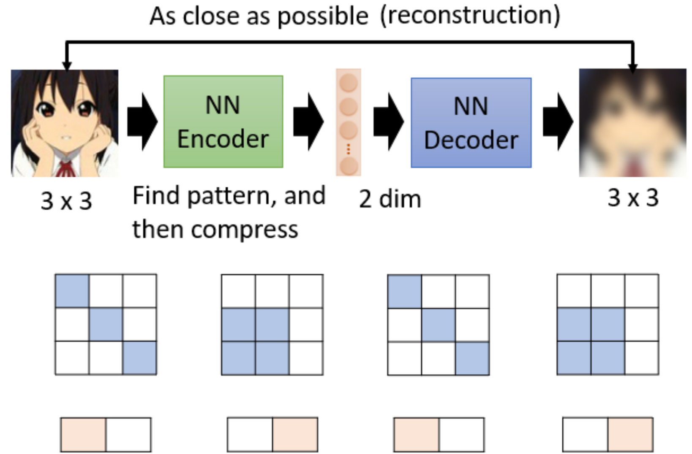

你想想看假设本来图片是 3×3,3×3 很小,但我们就假设 3×3 好了,本来的图片是 3×3,你要用 9 个数值来描述一张 3×3 的图片,假设 Encoder 输出的这个向量是二维的,我们怎麽有可能从二维的向量,去还原 3×3 的图片,还原9个数值呢

我们怎麽有办法把 9 个数值变成 2 个数值,又还原成 3,又还原回 9 个数值呢

能够做到这件事情是因为,对于影像来说,并不是所有 3×3 的矩阵都是图片,图片的变化其实是有限的,你随便 Sample 一个 Random 的 Noise,随便 Sample 一个矩阵,出来它通常都不是你会看到的图片

举例来说,假设图片是 3×3 的,那它的变化,虽然表面上应该要有 3×3 个数值,才能够描述 3×3 的图片,但是也许它的变化实际上是有限的

也许你把图片收集起来发现说

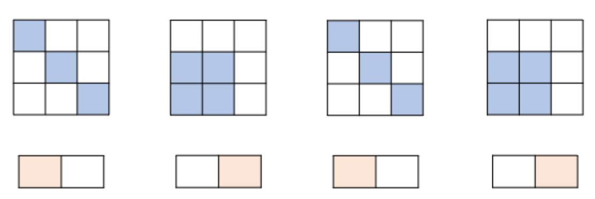

它只有这样子的类型,跟这样子的类型,其他类型根本就不是,你一般在训练的时候会看到的状况,就是因为说图片的变化还是有限的

所以你在做这个 Encoder 的时候,Encoder 可以说,我就只用两个维度就可以描述一张图片,虽然图片是 3×3,应该用 9 个数值才能够储存,但是实际上它的变化也许只有两种类型,那你就可以说看到这种类型,我就左边这个维度是 1 右边是 0,看到这种类型就左边这个维度是 0,右边这个维度是 1

那所以对应到刚才这个樊一翁的例子

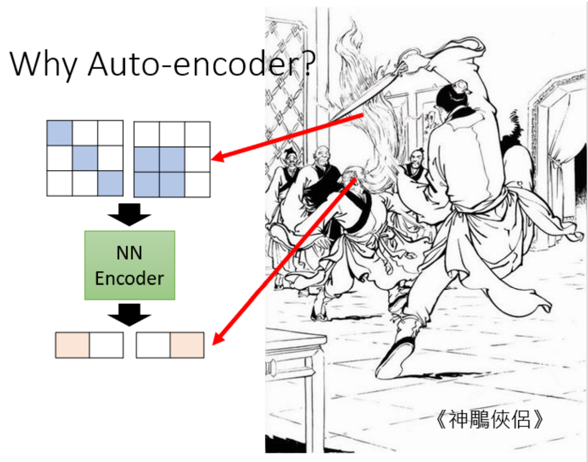

就是这个鬍子是图片複杂的状态,是原来图片的 Pixel,是原来图片的像素

**而 Encoder 做的事情就是化繁为简,本来比较複杂的东西,它只是表面上比较複杂,事实上它的变化其实是有限的,你只要找出它有限的变化,你就可以把本来複杂的东西,把它变得用比较简单的方法来表示它**

如果我们可以把複杂的图片,用比较简单的方法来表示它,那我们就只需要比较少的训练资料,在下游的任务裡面,我们可能就只需要比较少的训练资料,就可以让机器学到,我们本来要它学的事情,这个就是 Auto-Encoder 的概念

## **Auto-encoder is not a new idea**

那 Auto-Encoder,它从来都不是一个新的想法,它真的是非常非常地有历史,举例来说在这个 Hinton,Hinton 就是 Deep Learning 之父

Hinton 在 06 年的 Science 的 Paper 裡面,就有提到 Auto-Encoder 这个概念,只是那个时候用的 Network,跟今天用的 Network,当然还是有很多不一样的地方,我们讲 2006 年是 15 年前,15 年前的 Auto-Encoder 长什麽样子

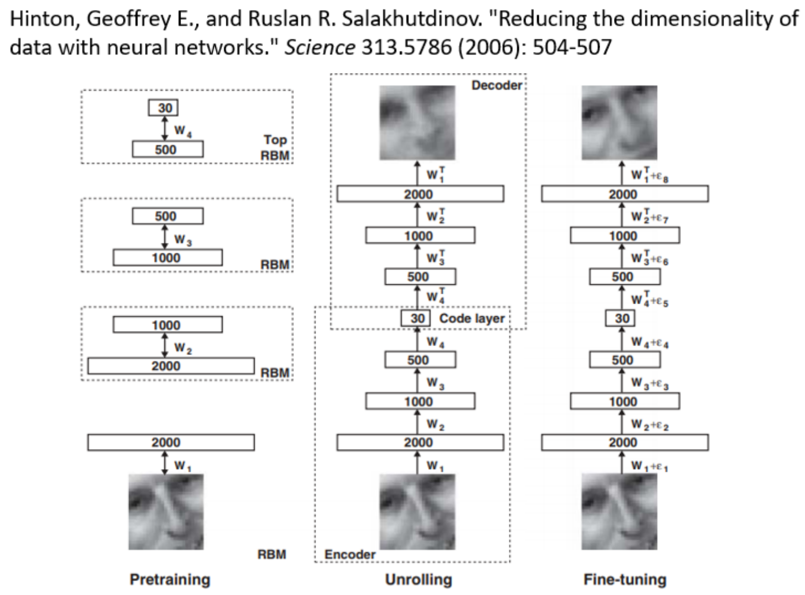

那个时候人们不觉得,Deep 的 Network 是 Train 得起来的,那时候觉得说这个把 Network 叠很多很多层,然后每一层一起 Train 不太可能成功,所以那时候的信念是,每一层应该分开训练,所以 Hinton 用的是一个叫做,Restricted Boltzmann Machine 的技术,缩写是 RBM

我们特别把 Hinton 15 年前的文章,把它的裡面的这个,Paper 裡面的图拿出来给大家看一下,过去 15 年前,人们是怎麽看待深度学习这个问题,那个时候觉得说,要 Train 一个这个很深的 Network 不太可能,每一层分开要 Train,虽然这个说很深也没有很深,只是三层,这个跟你作业 2 做得还要更shallow,但是在15年前这个已经是,哇 很深啊 它有三层太可怕了

那这个三层要分开来训练才可以,那这边说分开来训练这件事情叫做 Pretraining,但它跟 Self-Supervised Learning 的 Pre-Train,又不一样

假设你说 Auto-Encoder 这个东西是 Pre-Train,那现在这个 Pre-Train 是,Pre-Train 的 Pre-Train,它是要 Pre-Train 那个 Auto-Encoder,而且每一层用一个叫做 RBM 的技术,分开来训练

先把每一层都训练好,再全部接起来做微调这件事情,那这边的微调并不是 BERT 的微调,它是微调那个 Pre-Train 的 Model

那这个 Restricted Boltzmann Machine,你会发现今天很少有人在提到它了,它其实不是一个 Deep Learning 的技术,它有点複杂,我们在这门课裡面也没有打算要深入细讲,什麽是 Restricted Boltzmann Machine,那为什麽现在都没有什麽人用它呢,就是因为它没有什麽用

在10年前呢,都相信这个 Deep 的 Network,一定要用 Restricted Boltzmann Machine,然后其实 Hinton 后来在 2012 年的时候,有一篇 Paper 偷偷在结尾下一个结论说,其实 Restricted Boltzmann Machine,也没有什麽必要 ,所以后来就没有什麽人再用Restricted Boltzmann Machine

而且那时候还有一个神奇的信念,是觉得说那个 Encoder Decoder,它必须是对称,所以 Encoder 的第一层,跟 Encoder 的最后,跟 Decoder 的最后一层,他们必须互为 Transfers,不过现在已经没有,比较少有人在使用这样子的限制,好 这张投影片只想告诉你说,Auto-Encoder 不是新的概念,它是一个非常有历史的概念

## De-noising Auto-encoder

那 Auto-Encoder 还有一个常见的变形,叫做 De-Noising 的 Auto-Encoder

De-Noising 的 Auto-Encoder 是说,我们把原来要输进去给 Encoder 的图片,加上一些杂讯,就自己随便找一个杂讯把它加进去,然后一样通过 Encoder,一样再通过 Decoder,试图还原原来的图片

那我们现在还原的,不是 Encoder 的输入,Encoder 的输入的图片是有加杂讯的,我们要还原的不是 Encoder 的输入,我们要还原的是加入杂讯之前的结果

所以你会发现说,现在 Encoder 跟 Decoder,除了还原原来的图片这个任务以外,它还多了一个任务,这个任务是什麽,这个任务就是,它必须要自己学会把杂讯去掉

Encoder 看到的是没有杂讯的图片,但 Decode要还原的目标是,Encoder 看到的是有加杂讯的图片,但 Decoder 要还原的目标是,没有加杂讯的图片,所以 Encoder 加 Decoder,他们合起来必须要联手能够把杂讯去掉,这样你才能够把,De-Noising 的 Auto-Encoder 训练起来

那说到 De-Noising 的 Auto-Encoder,有没有发现这个概念,其实也一点都不陌生呢,De-Noising 的 Auto-Encoder,也不算是太新的技术,至少在 2008 年的时候,就已经有相关的论文了

但是如果你看今天的 BERT 的话,其实你也可以把它看作就是一个,De-Noising 的 Auto-Encoder

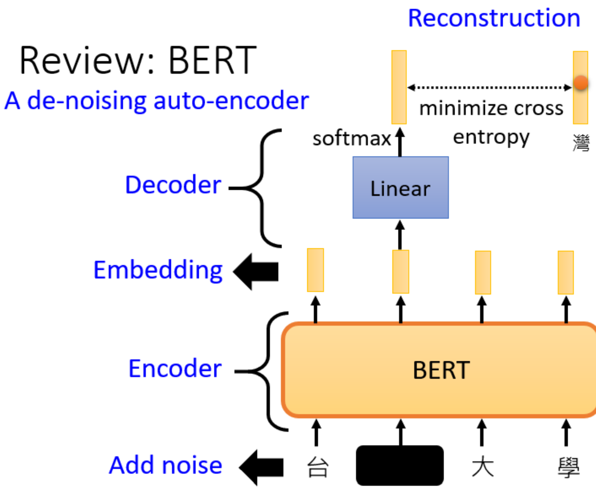

输入我们会加 Masking,那些 Masking 其实就是 Noise,BERT 的模型就是 Encoder,它的输出就是 Embedding

在讲 BERT 的技术的时候,我们就告诉你说这个输出就叫做 Embedding,接下来有一个 Linear 的模型,就是 Decoder,Decoder 要做的事情,就是还原原来的句子,也就是把填空题被盖住的地方,把它还原回来,所以我们可以说,BERT 其实就是一个,De-Noising 的 Auto-Encoder

有同学可能会问说,为什麽这个 Decoder 一定要 Linear 的呢,它不一定要是 Linear,它可以不是 Linear

或者是我们换一个说法,这个 BERT 它有 12 层,最小的那个 BERT 有 12 层,比较大的有 24 层或者是 48 层,好 那最小的 BERT 是 12 层,如果我们说这个 12 层中间,第 6 层的输出是 Embedding,那你其实也可以说剩下的 6 层,就是 Decoder,你可以说 BERT,就假设你在用 BERT 的时候,你用的不是第 12 层的输出,而是第 6 层的输出,那你完全可以说,BERT 的前 6 层就是 Encoder,后面 6 层就是 Decoder,总之这个 Decoder,没有一定要是 Linear

# Feature Disentanglement

接下来啊,除了 Auto-Encoder,可以用来做当 strime 的任务以外,我还想跟大家分享一下,Auto-Encoder 其他有意思的应用： Feature  Disentanglement

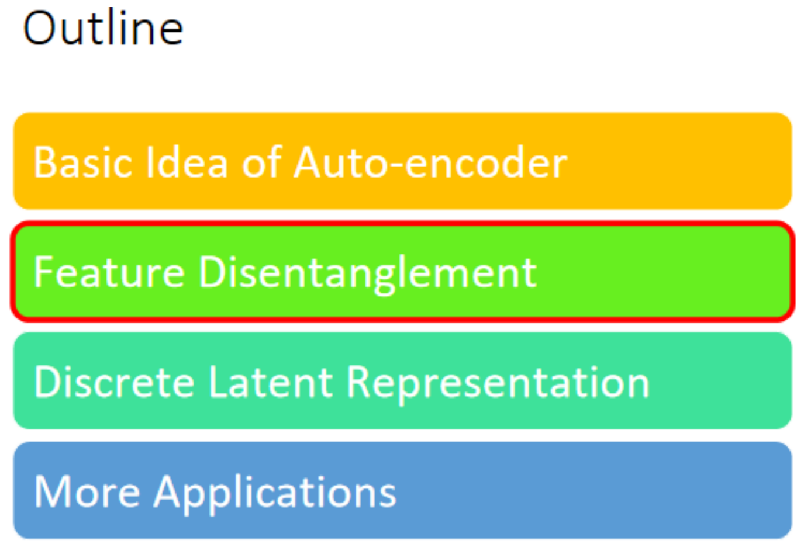

Disentangle 的意思就是,把一堆本来纠缠在一起的东西把它解开

那为什么会有 Disentangle 这个议题呢,我们来想想看,Auto-Encoder 它在做的事情是什么

Auto-Encoder 在做的事情是

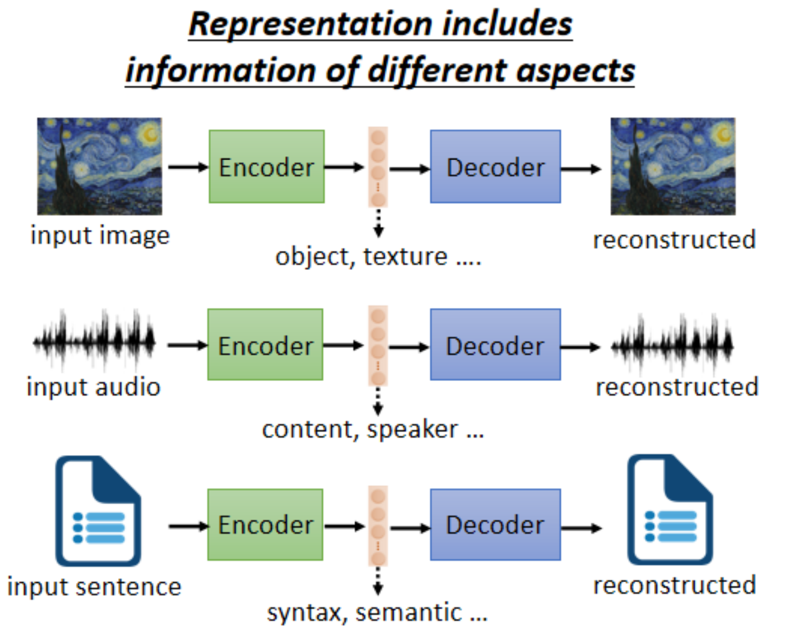

- 如果是图片的话,就是把一张图片变成一个 Code,再把 Code 呢 变回图片,既然这个 Code 可以变回图片,代表说这个 Code 裡面啊,有很多的资讯,包含图片裡面所有的资讯,举例来说,图片裡面有什么样的东西啊,图片的色泽纹理啊等等
- Auto-Encoder 这个概念也不是只能用在影像上,如果用在语音上,你可以把一段声音丢到 Encoder 裡面,变成向量 再丢回 Decoder,变回原来的声音,代表这个向量包含了,语音裡面所有重要的资讯,包括这句话的内容是什么,就是 Encoder 的资讯,还有这句话是谁说的,就是 Speaker 语者的资讯
- 那如果今天是一篇文章,丢到 Encoder 裡面变成向量,这个向量通过 Decoder 会变回原来的文章,那这个向量裡面有什么,它可能包含文章裡面,文句的句法的资讯,也包含了语意的资讯,但是这些资讯是全部纠缠在一个向量裡面,我们并不知道一个向量的哪些维,代表了哪些资讯

举例来说,如果我们今天把一段声音讯号丢进 Encoder,它会给我们一个向量,但是这个向量裡面,哪些维度代表了这句话的内容,哪些维度代表这句话的语者,也就是谁说的,我们没有这样的资讯

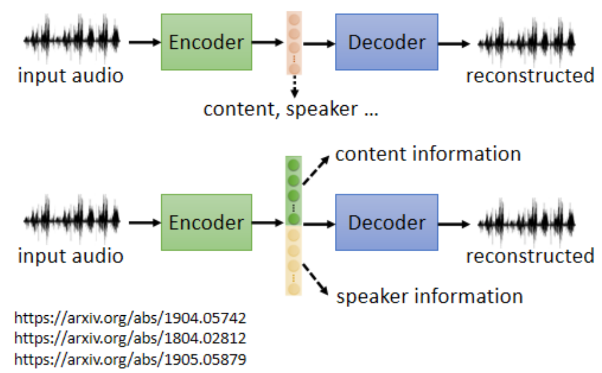

**而 Feature Disentangle 想要做到的事情就是,我们有没有可能想办法,在 Train 一个 Auto-Encoder 的时候,同时有办法知道,这个 Representation,或又叫做 Embedding,或又叫做 Code,我们这个 Embedding 的哪些维度代表了哪些资讯呢**

我们有没有可能做到说 Encoder 输出一个,举例来说 100 维的向量,我们知道说前 50 维就代表了这句话的内容,后 50 维就代表了这句话说话人的特徵呢,那这样子的技术就叫做 Feature Disentangle

我们就是主要就想告诉大家说,Feature Disentangle 是有办法做的,那至于实际上怎么做,我在这边就列几篇论文,给有兴趣的同学参考,如果你没有兴趣的话,就知道说这件事情是可行的,我们有可能知道 Auto-Encoder 裡面,每一个 Dimension 代表了什么样的资讯

## Application : Voice Conversion

这边举一个语音上的应用,这个应用叫做 Voice Conversion,Voice Conversion 的中文叫做语者转换,所以也许你没有听过语者转换这个词彙,但是你一定看过它的应用,它就是柯南的领结变身器

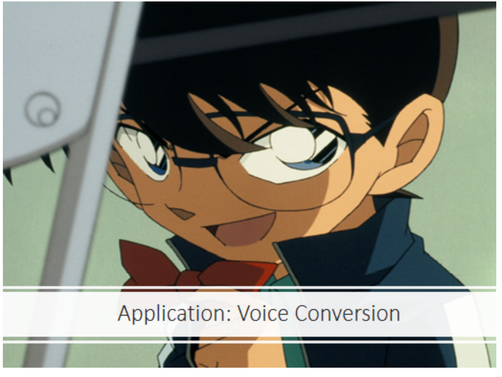

这个在二十年前,阿笠博士就已经做得很成功了啦

那只是过去,阿笠博士在做这个 Voice Conversion 的时候啊,我们需要成对的声音讯号,也就是假设你要把 A 的声音转成 B 的声音,你必须把 A 跟 B 都找来,叫他唸一模一样的句子

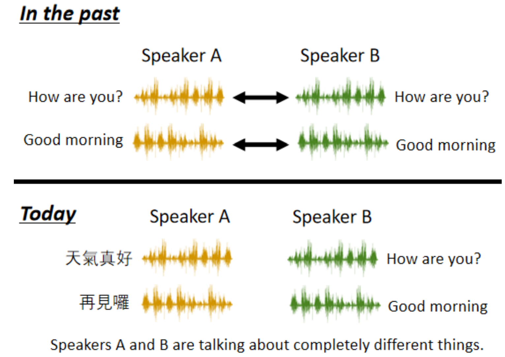

就 A 说好 How are you,B 也说好 How are you,A 说 Good morning,B 也说 Good morning,他们两个各说一样的句子,说个 1000 句,接下来呢,就结束了,就是 Supervised Learning 的问题啊,你有成对的资料,Train 一个 Supervised 的 Model,把 A 的声音丢进去,输出就变成 B 的声音,就结束了

但是如果 A 跟 B 都需要唸一模一样的句子,念个 500 1000 句,显然是不切实际的,举例来说,假设我想要把我的声音转成新垣结衣的声音,我得把新垣结衣找来,更退一万步说,假设我真的把新垣结衣找来,她也不会说中文啊,所以她没有办法跟我唸一模一样的句子

而今天有了 Feature Disentangle 的技术以后,也许我们期待机器可以做到,就给它 A 的声音 给它 B 的声音,A 跟 B 不需要唸同样的句子,甚至不需要讲同样的语言,机器也有可能学会把 A 的声音转成 B 的声音

那实际上是怎么做的呢,假设我们收集到一大堆人类的声音讯号,然后拿这堆声音讯号呢,去 Train 一个 Auto-Encoder,同时我们又做了 Feature Disentangle 的技术,所以我们知道在 Encoder 的输出裡面,哪些维度代表了语音的内容,哪些维度代表了语者的特徵

接下来,我们就可以把两句话,声音跟内容的部分互换

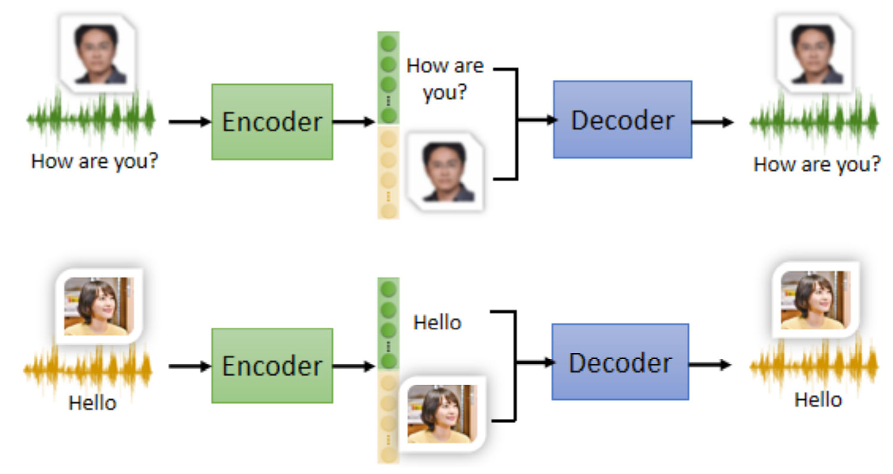

举例来说,这边是我的声音,我说 How are you,丢进 Encoder 以后,那你就可以抽出,你就知道说这个 Encoder 裡面,某些维度代表 How are you 的内容,某些维度代表我的声音

今天你把这个你老婆的声音丢进 Encoder,它就知道某一些维度,代表你老婆说的话的内容,某一些维度,代表你老婆声音的特徵,接下来我们只要把我说话的内容的部分取出来,把你老婆说话的声音特徵的部分取出来,把它拼起来,丢到 Decoder 裡面,就可以用你老婆的声音,讲我说的话的内容

这件事情真的有可能办到吗,以下是真正的例子,听起来像是这个样子,Do you want to study a PhD,这个是我的声音，那把我的声音丢到 Encoder 裡面以后呢,你可以想像说在 Encoder 裡面,我们知道哪些维度代表了念博班这件事,哪些维度代表了我的声音

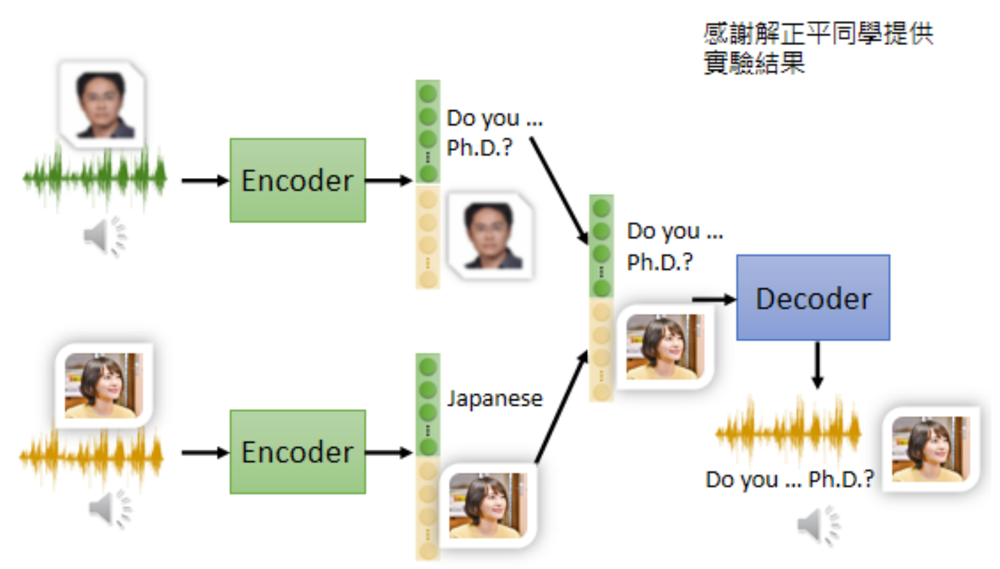

那为了简化起见,它输出 100 维的向量,前 50 维代表内容,后 50 维代表说话人的特徵,好 接下来这句话是你老婆说的,仕事忙しいのがな,不知道 不太确定在说什么,就是日文啊

接下来呢,就把我的声音的前 50 维,代表内容的部分取出来,把你老婆的,把你老婆的声音丢进 Encoder 以后,后 50 维的部分抽出来,拼起来,一样是一个 100 维的向量,丢到 Decoder 裡面,看看输出来的声音,是不是就是你老婆叫你念博班的声音,听起来像是这个样子,Do you want to study a PhD

那其实反过来也可以啦,就是换成把日文的部分拿出来,把我的声音的特徵拿出来,一样串成一个 100 维的向量,丢到 Decoder 裡面,它听起来就会变成这样,仕事忙しいのがな,我也不知道自己在说什么就是了

所以确实用 Feature Disentangle,你有机会做到 Voice Conversion,那其实在影像上,在 NLP 上,也都可以有类似的应用,所以可以想想看,Feature Disentangle 可以做什么样的事情

# Discrete Latent Representation

下一个要跟大家讲的应用,叫做 Discrete Latent Representation

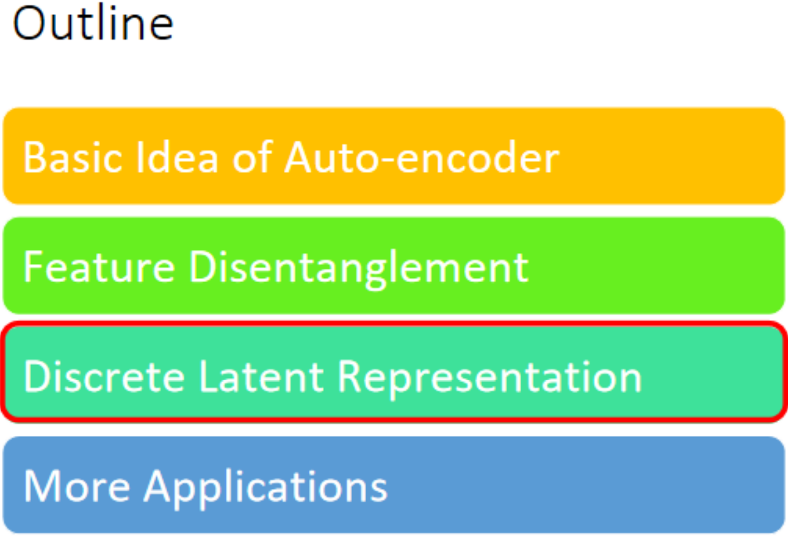

到目前为止我们都假设这个 Embedding,它就是一个向量,这样就是一串数字,它是 Real Numbers,那它可不可以是别的东西呢

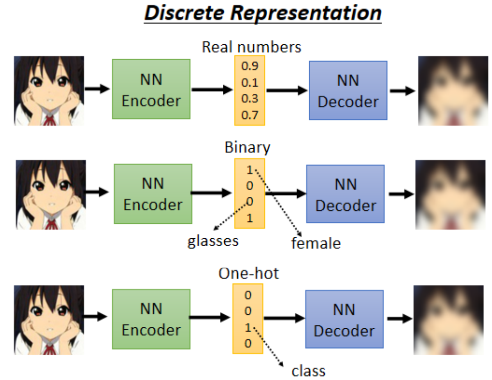

- 举例来说,它可不可以是 Binary,Binary 的好处也许是说,每一个维度,它就代表了某种特徵的有或者是没有,举例来说,输入的这张图片,如果是女生,可能第一维就是 1,男生第一维就是 0,如果有戴眼镜,就是第三维 1,没有戴眼镜 就是第三维是 0,也许我们把这个向量,这个 Embedding 变成 Binary,变成只有 0 跟 1 的数字,可以让我们再解释 Encoder 输出的时候,更为容易
- 甚至有没有可能这个向量,强迫它一定要是 One-Hot 呢,也就只有一维是 1,其他就是 0,如果我们强迫它是 One-Hot,也就是每一个东西图片丢进去,你只可以有,你的 Embedding 裡面只可以有一维是 1,其他都是 0 的话,那可以做到什么样的效果呢,也许可以做到 unSupervised 的分类,举例来说,假设你有一大堆的,假设你想要做那个手写数字辨识,你有 0 到 9 的图片,你把 0 到 9 的图片统统收集起来,Train 一个这样子的 Auto-Encoder,然后强迫中间的 Latent Representation,强迫中间的这个 Code 啊,一定要是 One-Hot Vector,那你这个 Code 正好设个 10 维,也许每一个 One-Hot 的 Code,所以这 10 维,就有 10 种可能的 One-Hot 的 Code,也许每一种 One-Hot 的 Code,正好就对应到一个数字也说不定,所以今天如果用 One-Hot 的 Vector,来当做你的 Embedding 的话,也许就可以做到完全在没有,完全没有Llabel Data 的情况下,让机器自动学会分类

其实还有其他,在这种啊 Discrete 的 Representation 的这个,技术裡面啊,其中最知名的就是 **VQVAE**, Vector Quantized Variational Auto-Encoder,

VQVAE 啊,是这样子运作的,就是你输入一张图片,Encoder 呢 输出一个向量,这个向量它是一般的向量,它是 Continuous 的,但接下来你有一个 **Codebook**

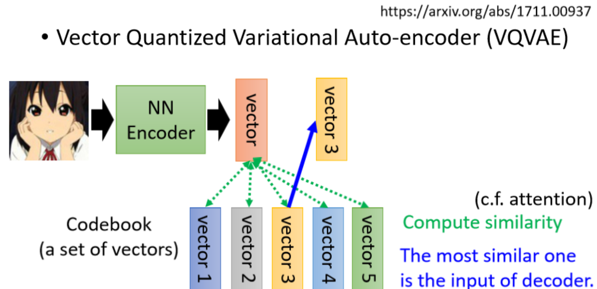

所谓 Codebook 的意思就是,你有一排向量,这排向量也是 Learn 出来的,你把 Encoder 的输出,去跟这排向量都去算个相似度,那你发现这件事情啊,其实跟 Self-attention 有点像,上面这个 Vector 就是 Query,下面这些 Vector 就是 Key,那接下来呢就看这些 Vector 裡面,谁的相似度最大,那你把相似度最大的那个 Vector 拿出来

这边就是那个,这个 Key 跟那个 Value,是等于是共用同一个 Vector

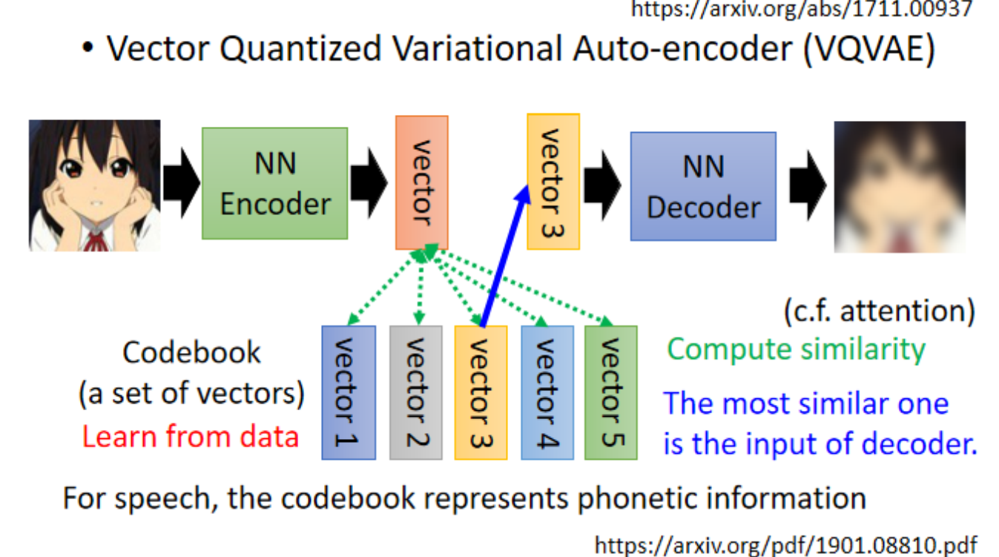

如果你把这整个 Process,用 Self-attention 来比喻的话,那就等于是 Key 跟 Value 是共同的 Vector,然后把这个 Vector 呢,丢到 Decoder 裡面,然后要它输出一张图片,然后接下来 Training 的时候,就是要让输入跟输出越接近越好

这一个 Decoder,这个 Encoder,这一个 Codebook,都是一起从资料裡面被学出来的,这样做的好处就是你就可以,你就有 Discrete 的这个 Latent Representation,也就是说这边 Decoder 的输入,一定是这边这个 Codebook,裡面的向量的其中一个,假设你 Codebook 裡面有 32 个向量,那你 Decoder 的输入,就只有 32 种可能,你等于就是让你的这个 Embedding,它是离散的,它没有无穷无尽的可能,它只有 32 种可能而已

那其实像这样子的技术啊,如果你拿它 把它用在语音上,你就是一段声音讯号输进来,通过 Encoder 以后产生一个向量,接下来呢,你去计算这个相似度,把最像的那个向量拿出来丢给 Decoder,再输出一样的声音讯号,这个时候你会发现说你的 Codebook 啊,可能可以学到最基本的发音部位

举例来说 你的,这个最基本的发音单位啊,又叫做 **Phonetic**,那如果你不知道 Phonetic 是什么的话,你就把它想成是 KK 音标,那你就会发现说,这个 Codebook 裡面每一个 Vector,它就对应到某一个发音,就对应到 KK 音标裡面的某一个符号,这个是 VQVAE

### Text as Representation

那其实还有更多疯狂的想法,Representation 一定要是向量吗,能不能是别的东西

举例来说,它能不能是一段文字,是可以的

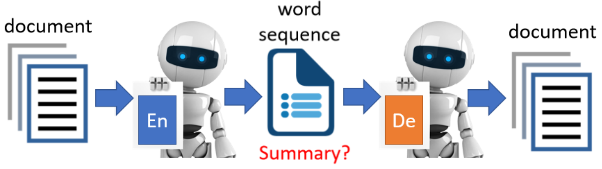

假设我们现在要做文字的 Auto-Encoder,那文字的 Auto-Encoder 的概念,跟语音的影像的没有什么不同,就是你有一个 Encoder,一篇文章丢进去,也许产生一个什么东西 一个向量,把这个向量丢到 Decoder,再让它还原原来的文章,但我们现在可不可以不要用向量,来当做 Embedding,我们可不可以说我们的 Embedding,就是一串文字呢

如果把 Embedding 变成一串文字,有什么好处呢,也许这串文字就是文章的摘要,因为你想想看,把一篇文章丢到 Encoder 的裡面,它输出一串文字,而这串文字,可以通过 Decoder 还原回原来的文章,那代表说这段文字,是这篇文章的精华,也就是这篇文章最关键的内容,也就是这篇文章的摘要

不过啊 这边的 Encoder,显然需要是一个 Seq2seq 的 Model,比如说 Transformer,因为我们这边输入是文章嘛,这边输出是一串文字嘛,这个 Decoder 输入是一串文字,输出是文章嘛,所以都是输入一串东西,输出一串东西,输入一串文字 输出一串文字,所以 Encoder 跟 Decoder,显然都必须要是一个 Seq2seq 的 Model

它不是一个普通的 Auto-Encoder,它是一个 seq2seq2seq 的 Auto-Encoder,它把长的 Sequence 转成短的 Sequence,再把短的 Sequence 还原回长的 Sequence,而这个 Auto-Encoder 大家训练的时候,不需要标注的资料,因为训练 Auto-Encoder,只需要收集大量的文章,收集大量没有标注的资料,在这边就是大量的文章就可以了

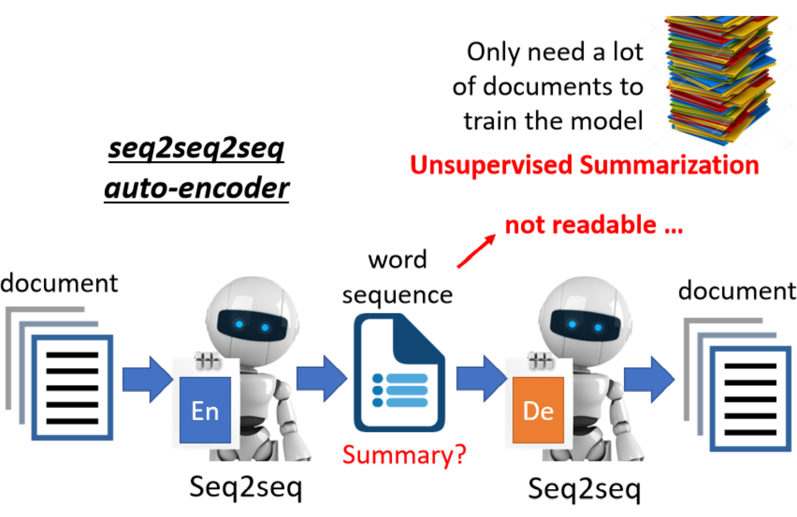

如果你真的可以训练出这个模型,如果这串文字真的可以代表摘要的话,你就是让机器自动学会做摘要这件事,让机器自动学会做,unSupervised 的 Summarization

但是真的有这么容易吗,实际上这样 Train 起来以后发现是行不通的,为什么,因为这两个 Encoder 跟 Decoder 之间,会发明自己的暗号啊,所以它会产生一段文字,那这段文字是你看不懂的,你看不懂的文字,这 Decoder 可以看得懂,它还原得了原来的文章,但是人看不懂,所以它根本就不是一段摘要,所以怎么办呢？

**再用 GAN 的概念,加上一个 Discriminator**

Discriminator 看过人写的句子,所以它知道人写的句子长什么样子,但这些句子,不需要是这些文章的摘要性,另外一堆句子,所以它知道人写的句子长什么样子

然后呢,这个 Encoder 要想办法去骗过 Discriminator,Encoder 要想办法产生一段句子,这段句子不只可以透过 Decoder,还原回原来的文章,还要是 Discriminator 觉得像是人写的句子,期待通过这个方法,就可以强迫 Encoder,不只产生一段密码可以给 Decoder 去破解,而是产生一段人看得懂的摘要

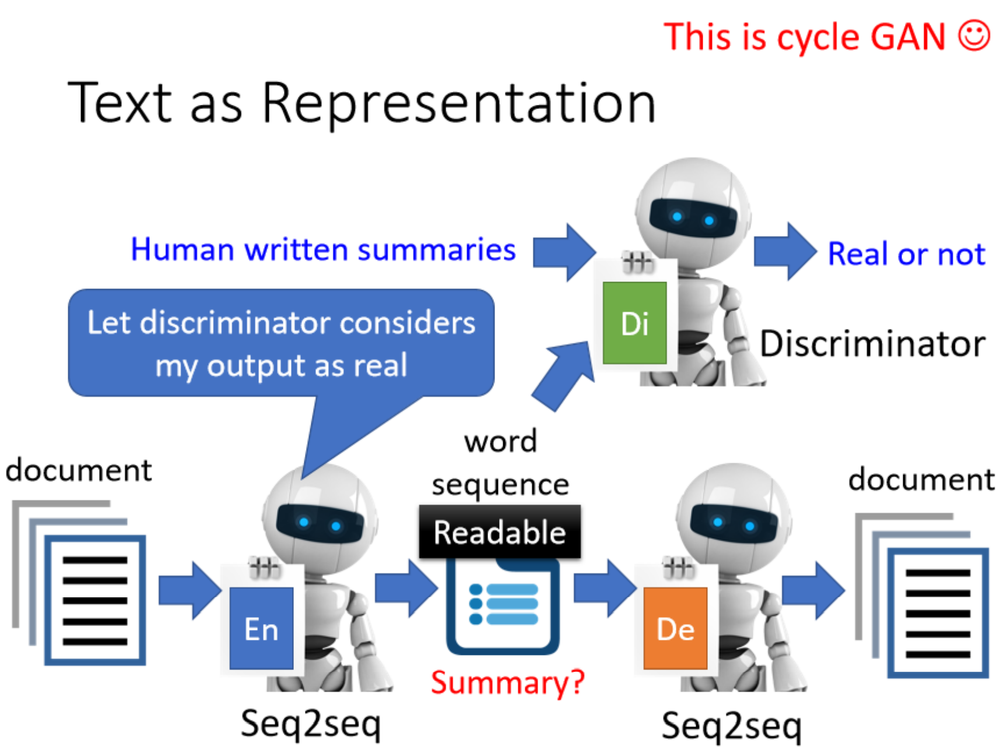

那你可能会问说,这个 Network 要怎么 Train 啊,这个 Output 是一串文字哦,那这个文字要怎么接给 Discriminator,跟这个 Decoder 呢,告诉你,看到你没办法 Train 的问题,就用 RL 硬做,这样这边就是 RL 硬做就结束了这样子

你可能会觉得这个概念有点像 CycleGAN,没错 你可以想这根本就是 CycleGAN,就是这是一个 Generator,这是另外一个 Generator,这是 Discriminator,你要输入跟输出越接近越好,其实这根本就是 CycleGAN,我们只是从 Auto-Encoder 的角度,来看待 CycleGAN 这个想法而已,

那实际上做的结果是怎么样呢,以下是真正 Network 输出的结果啦,你给它读一篇文章,然后它就用 Auto-Encoder 的方法,拿 300 万篇文章做训练以后,然后看看给它一篇新的文章,它可不可以是,那个 Encoder 的输出的句子,是不是就是人可以看得懂的摘要

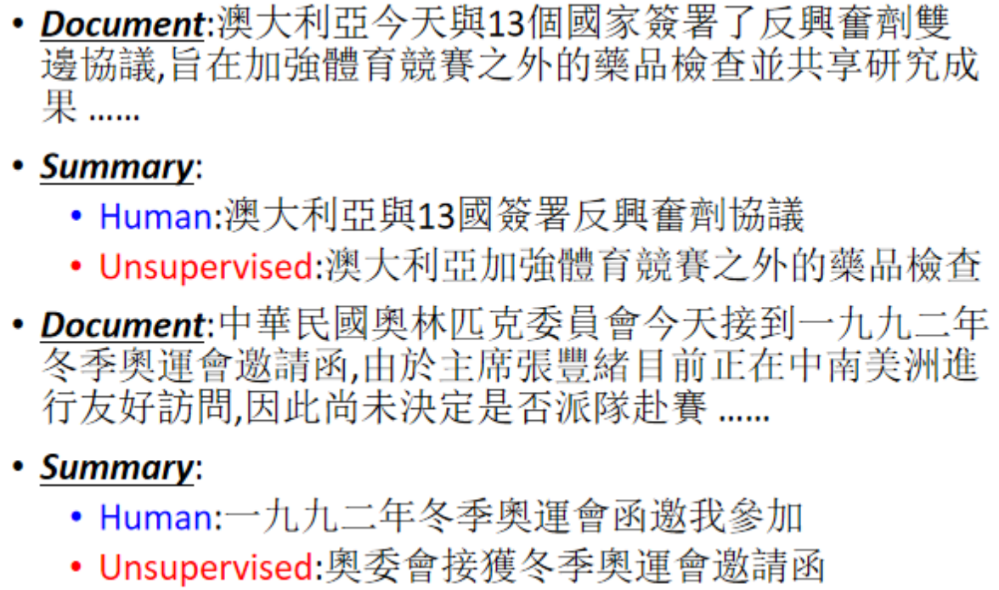

举例来说,给 Encoder 看这篇文章,它的输出是,澳大利亚加强体育竞赛之外的药品检查,看起来还可以,那这边有一个特别强的啦,就是这篇文章是,中华民国奥林匹克委员会,今天接到一九九二年冬季奥运会邀请函,丢给 Encoder 之后,它的输出是奥委会接获冬季奥运会邀请函,它知道把奥林匹克委员会,自己就缩写成奥委会,这个不知道怎么回事,它自己就学到了这件事情

当然很多时候,它也是会犯错的,我特别喜欢举这种极其犯错的例子

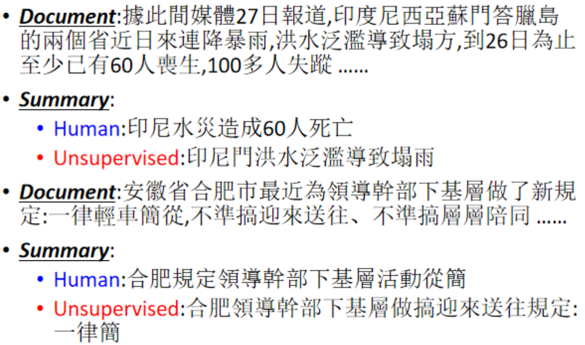

举例来说,你给它读这篇文章,印度尼西亚苏门答腊岛近日来连降暴雨,机器产生的摘要是什么呢

Encoder 的输出是,印尼门洪水泛滥,印尼门是什么东西呢,大概就是印度尼西亚苏门的缩写啦,可能人类写的句子裡面,常常出现罗生门 (风二门),等等什么门,所以机器觉得,Encoder 觉得印度尼西亚苏门,应该可以缩写成印尼门

那有时候它也会产生莫名其妙的句子啊,比如说把这篇文章给机器读了以后,Encoder 的输出是,合肥领导干部下基层做搞迎来送往规定一律简,不知道在说些什么,总之是个句子 不知道在说些什么,好 所以这个例子只是想要告诉你说,我们确实有可能,拿一段文字来当做 Embedding

其实还有更狂的,我还看过有拿 Tree Structure,当做 Embedding,就一段文字把它变成 Tree Structure,再用 Tree Structure 还原一段文字,

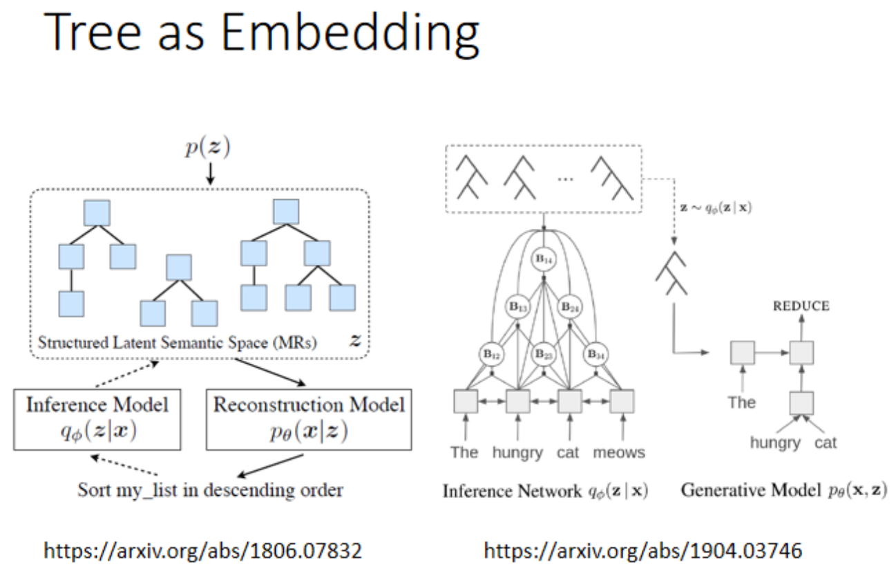

好 我把 Reference 列在这边给大家参考

# More Applications

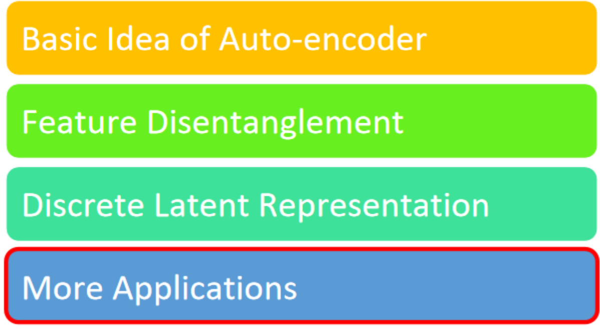

接下来啊,还有 Auto-Encoder 更多的应用,Auto-Encoder 还可以拿来做些什么事情呢,举例来说,我们刚才用的都是 Encoder,那其实 Decoder 也有作用

## Generator 

你把 Decoder 拿出来,这不就是一个 Generator 吗,我们说 Generator,不是就是要吃一个向量,产生一个东西,比如说一张图片吗,而 Decoder 不正好是吃一个向量,产生一张图片吗,所以 Decoder,你可以把它当做一个 Generator 来使用

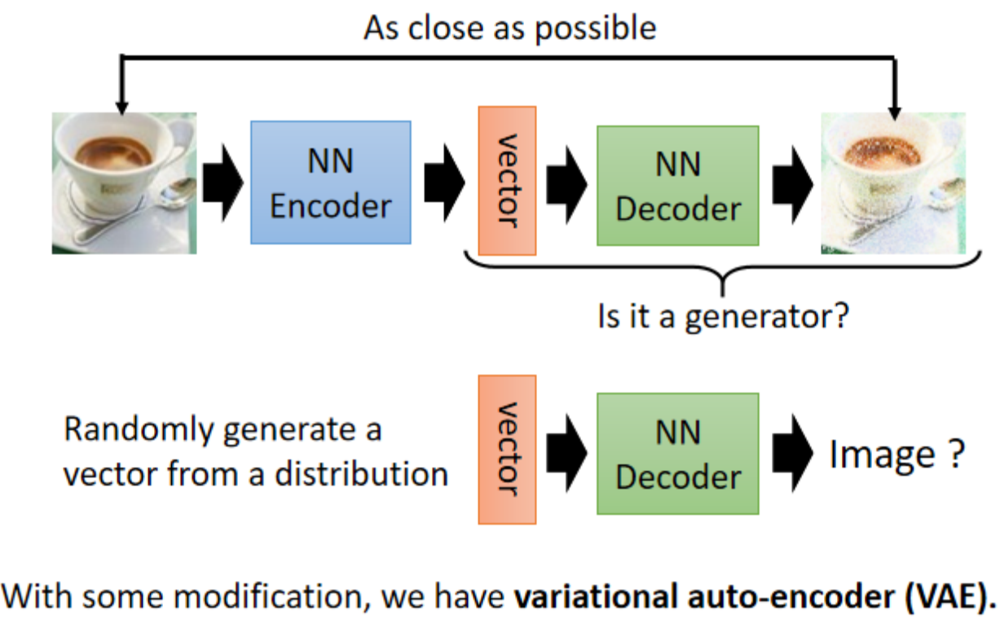

你可以从一个已知的 Distribution,比如说 Gaussian Distribution,Sample 一个向量,丢给 Decoder,看看它能不能够输出一张图

事实上在我们之前,在讲这个 Generative Model 的时候,其实有提到说除了 GAN 以外,还有另外两种 Generative 的 Model,其中一个就叫做 **VAE,Variarional 的 Auto-Encoder**,你看它名字裡面的 Auto-Encoder,显然是跟 Auto-Encoder 非常有关係的,它其实就是把 Auto-Encoder 的 Decoder 拿出来,当做 Generator 来用,那实际上它还有做一些其他的事情啊,至于它实际上做了什么其他的事情,就留给大家自己研究

所以 Auto-Encoder Train 完以后,也顺便得到了一个 Decoder

## Compression

Auto-Encoder 可以拿来做压缩

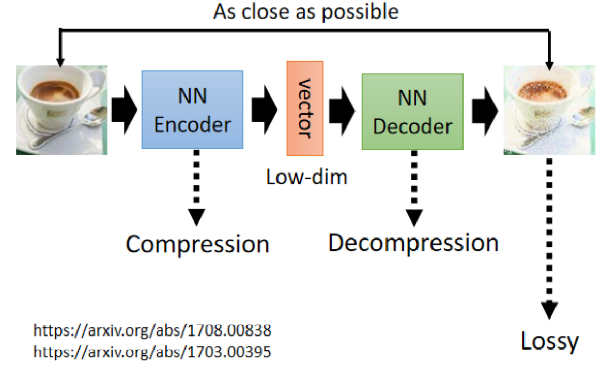

我们今天知道说你在做图片,我们图片如果太大的话,也会有一些压缩的方法,比如说 JPEG 的压缩,而 Auto-Encoder 也可以拿来做压缩,你完全可以把 Encoder 的输出,当做是一个压缩的结果,因为一张图片,是一个非常高维的向量,而一般我们 Encoder 的输出,是一个非常低维的向量,你完全可以把那个向量,看作是一个压缩的结果

所以你的 Encoder 做的事情,就是压缩,你的 Decoder 做的事情,就是解压缩

只是这个压缩啊,它是那种 lossy 的压缩,所谓 lossy 的压缩就是它会失真,因为在 Train Auto-Encoder 的时候,你没有办法 Train 到说,输入的图片跟输出的图片,100% 完全一模一样啦,它还是会有一些差距的

所以这样子的 Auto-Encoder 的压缩技术,你拿这样子的技术来做压缩,那你的图片是会失真的,就跟 JPEG 图片会失真一样,用这个 Auto-Encoder 来做压缩,你的图片也是会失真的

## Anomaly Detection 

那接下来,就是我们在作业裡面要使用的技术,在作业裡面我们会拿 Auto-Encoder,来做 Anomaly 的 Detection,那我在规划作业的时候,其实就是想要 Auto-Encoder 出一个作业,那 Auto-Encoder 的技术很多,那最后我决定做 Anomaly 的 Detection，因为这个是你在非常多的场合,都有机会应用到的一个技术

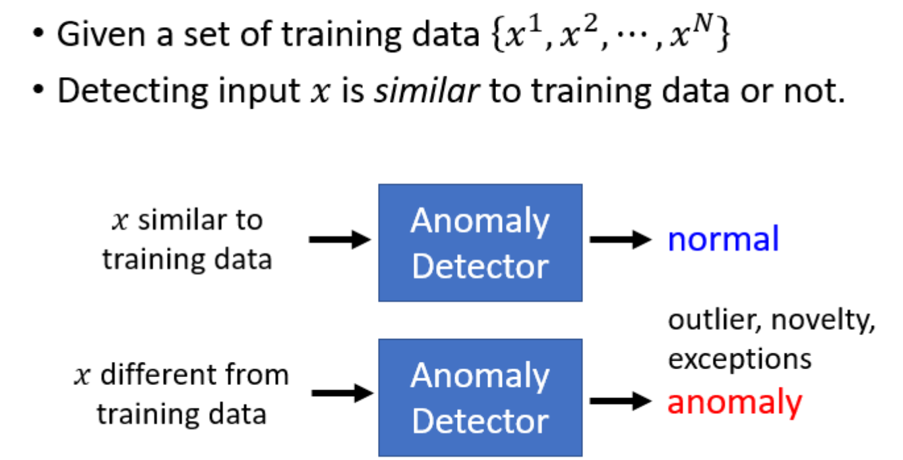

Anomaly 的 Detection ,假设你有一堆的训练资料,这边用 X1 到 XN 来表示我们的训练资料,而 Anomaly Detection,它的中文通常翻译成异常检测

异常检测要做的事情就是,来了一笔新的资料,它到底跟我们之前在训练资料裡面看过的资料,相不相似呢,也就是说你需要找出,你需要有一个异常检测的系统,这个异常检测的系统,是透过大量你已经看过的资料训练出来的

- 给它一笔新的资料,如果这笔新的资料,看起来像是训练资料裡面的 Data,就说它是正常的
- 如果看起来不像是训练资料裡面的 Data,就说它是异常的

那其实 Anomaly,Anomaly 这个词啊,有很多不同的其他的称呼,比如说有时候你会叫它 Outlier,有时候你会叫它 Novelty,有时候你会叫它 Exceptions,但其实指的都是同样的事情,你就是要看某一笔新的资料,它跟之前看过的资料到底相不相似,但是所谓的相似这件事啊,其实并没有非常明确的定义,它是见仁见智的,会根据你的应用情境而有所不同

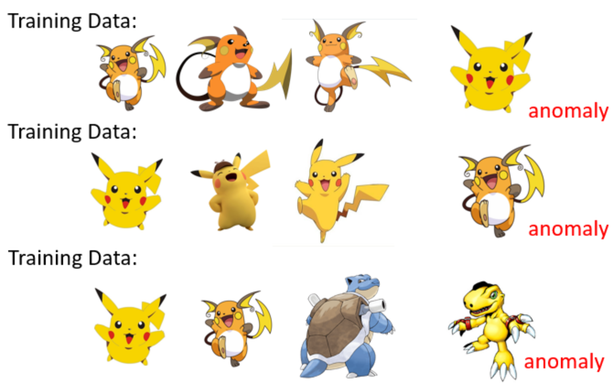

举例来说

- 假设现在你的训练资料这个都是雷丘,那这个皮卡丘就算是异常的东西
- 但是假设你的训练资料裡面,你所有的动物都是皮卡丘,那雷丘就是异常的东西,所以我们并不会说,某一个东西它一定就是 Normal,一定就是 Anomaly,我们不会说某个东西它一定是正常或异常,它是正常或异常,取决于你的训练资料长什么样子
- 或者是说假设你的训练资料裡面,通通都是宝可梦,那雷丘跟皮卡丘通通都算是正常的,而可能数码宝贝,亚古兽知道吗,这应该是亚古兽 对不对,亚古兽算是异常的

那个这个异常检测有什么样的应用呢

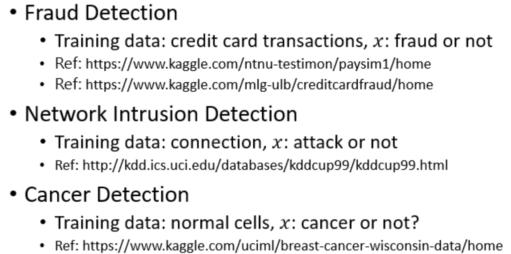

- 举例来说,它可以来做诈欺侦测,假设你的训练资料裡面,有一大堆信用卡的交易纪录,那我们可以想像说,多数信用卡的交易都是正常的,那你拿这些正常的信用卡训练的交易纪录,来训练一个异常检测的模型,那有一笔新的交易纪录进来,你就可以让机器帮你判断说,这笔纪录算是正常的 还是异常的,所以这种异常检测的技术,可以拿来做诈欺侦测
- 或者是它可以拿来做网路的这个侵入侦测,举例来说,你有很多连线的纪录资料,那你相信多数人连到你的网站的时候,他的行为都是正常的,多数人都是好人,你收集到一大堆正常的连线的纪录,那接下来有一笔新的连线进来,你可以根据过去正常的连线,训练出一个异常检测的模型,看看新的连线,它是正常的连线 还是异常的连线,它是有攻击性的 还是正常的连线
- 它在医学上也可能有应用,你收集到一大堆正常细胞的资料,拿来训练一个异常检测的模型,那也许看到一个新的细胞,它可以知道这个细胞有没有突变,也许有突变,它就是一个癌细胞等等

那讲到这边有人可能会想说,Anomaly Detection 异常检测的问题,我们能不能够把它当做二元分类的问题来看啊

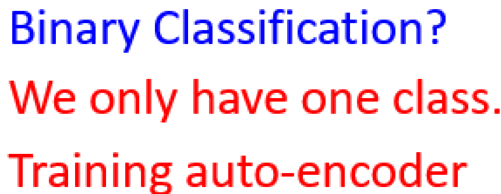

你说你要做诈欺侦测,你就收集一大堆正常的信用卡纪录,一堆诈欺的信用卡纪录,训练一个 Binary 的 Classifier,就结束啦,就这样子不是吗,

难点就是你要收资料。这种异常检测的问题它的难点,正在就在收资料上面,通常你比较有办法收集到正常的资料,你比较不容易收集到异常的资料,你可能有一大堆信用卡交易的纪录,但是多数信用卡交易的纪录可能都是正常的,异常的资料相较于正常的资料,可能非常地少,甚至有一些异常的资料混在正常的裡面,你也不太可,你可能也完全没有办法侦测出来,所以在这一种异常检测的问题裡面

我们往往假设,我们有一大堆正常的资料,但我们几乎没有异常的资料,所以它不是一个一般的分类的问题,这种分类的问题又叫做 **One Class 的分类问题,就是我们只有一个类别的资料,**那你怎么训练一个模型,因为你想你要训练一个分类器,你得有两个类别的资料,你才能训练分类器啊,如果只有一个类别的资料,那我们可以训练什么东西,这个时候就是 Auto-Encoder,可以派得上用场的时候了

举例来说,假设我们现在想要做一个系统,这个系统是要侦测说一张图片

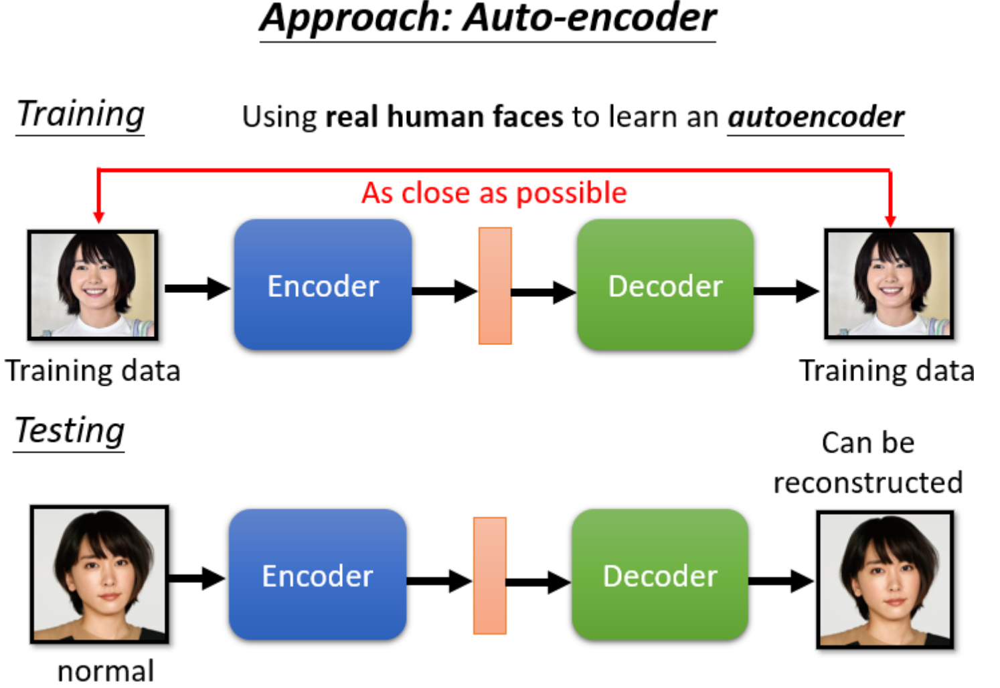

举例来说,它是不是真人的人脸,那你可以找到一大堆图片,它都是真正的人脸,那我们就拿这些真人的人脸,来训练一个 Auto-Encoder

这个是你老婆的照片,那你可以拿它来训练一个 Auto-Encoder,那你训练完这个 Auto-Encoder 以后,在测试的时候,如果进来的也是你老婆的照片,那因为在训练的时候有看过这样的照片,所以它可以顺利地被还原回来

你可以计算这一张照片通过 Encoder,再通过 Decoder 以后,它的变化有多大,你可以去计算这个输入的照片,跟这个输出的照片,它们的差异有多大,如果差异很小,你的 Decoder 可以顺利地还原原来的照片,代表这样类型的照片,是在训练的时候有看过的,不过反过来说,假设有一张照片是训练的时候没有看过的

举例来说这根本不是人的照

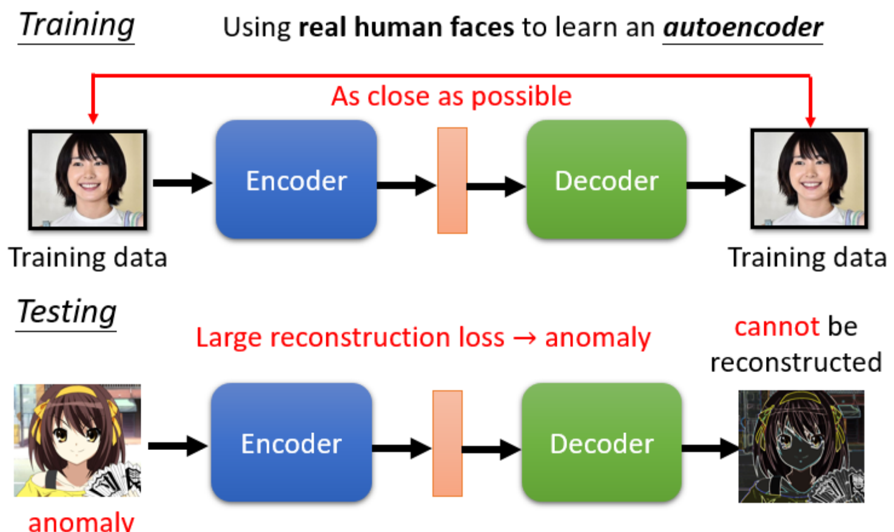

她是那个凉宫春日,但是她不是真人,她是一个动画的人物,她是二次元的人物,一个二次元人物的照片,输入 Encoder 再输出 Decoder 以后,

因为这是没有看过的东西,这是训练的时候没有看过的照片,那你的 Decoder,就很难把它还原回来,如果你计算输入跟输出的差异,发现差异非常地大,那就代表说,现在输入给 Encoder 的这张照片,可能是一个异常的状况,可能是训练的时候没有看过的状况,所以你就可以看 reconstruction 的 loss,这个 reconstruction 的好坏,来决定说你现在在测试的时候,看到这张照片,是不是训练的时候有看过同类型的照片,

这个就是我们,好 那这个就是我们在作业裡面,要大家做的事情啦

## More about Anomaly Detection

那这个异常检测啊,其实也是另外一门学问,那我们课堂上就没有时间讲了,异常检测不是只能用 Auto-Encoder 这个技术,Auto-Encoder 这个技术,只是众多可能方法裡面的其中一个,我们拿它来当做 Auto-Encoder 的作业,因为我相信,你未来有很多的机会用得上异常检测这个技术,那实际上有关异常检测更完整的介绍,我们把过去上课的录影放在这边,给大家参考,

•Part 1: https://youtu.be/gDp2LXGnVLQ

•Part 2: https://youtu.be/cYrNjLxkoXs

•Part 3: https://youtu.be/ueDlm2FkCnw

•Part 4: https://youtu.be/XwkHOUPbc0Q

•Part 5: https://youtu.be/Fh1xFBktRLQ

•Part 6: https://youtu.be/LmFWzmn2rFY

•Part 7: https://youtu.be/6W8FqUGYyDo

那以上就是有关 Auto-Encoder 的部分