# Adversarial Attack——Basic Conception

## Activation

Adversarial Attack 要讲这个主题,我们这边要讲的是,我们在作业裡面,我们已经训练了非常多,各式各样的类神经网路,那我们当然期待说,我们可以把这些技术用在真正的应用上

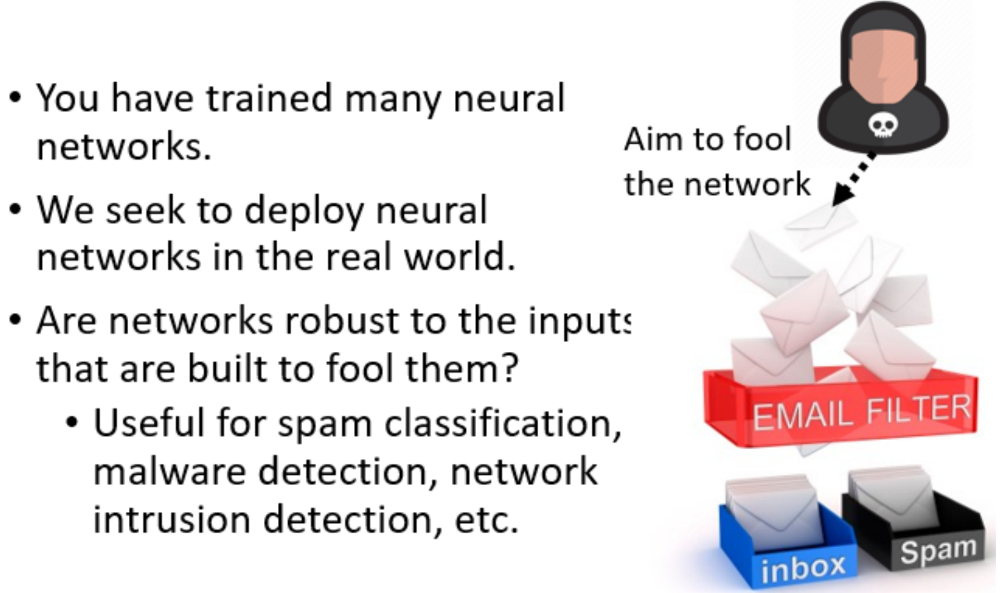

但是光是把这些 Network 用在真正的应用上,要把这些 Network 用在真正应用上,光是它们正确率高是不够的,它们还需要什麼能力呢

他们需要能够应付来自人类的恶意,有时候你的 Network,它的工作是為了要侦测一些有恶意的行為,如果今天它的工作是要侦测有恶意的行為,这些它要侦测的对象,会去想办法骗过 Network,Network 在一般的情况下,都可以得到高的正确率是不够的,**它要在有人试图想要欺骗它的情况下,也得到高的正确率**

举例来说 我们今天都会用 Network,来做 E-Mail 的 Filtering,你会用 Network 来做侦测一封邮件,它是不是垃圾邮件,那今天对於一个垃圾邮件的发信者而言,他也会想尽办法避免,他的邮件被分类為垃圾邮件,如果今天有人他想办法去更改邮件的内容,想要去欺骗过 Network 的话,那 Network 到底能不能不要被欺骗呢

所以今天我们希望我们的类神经网路,它光是正确率高还不够,我们希望它可以应付来自人类的恶意

举例来说 这个是蚁王

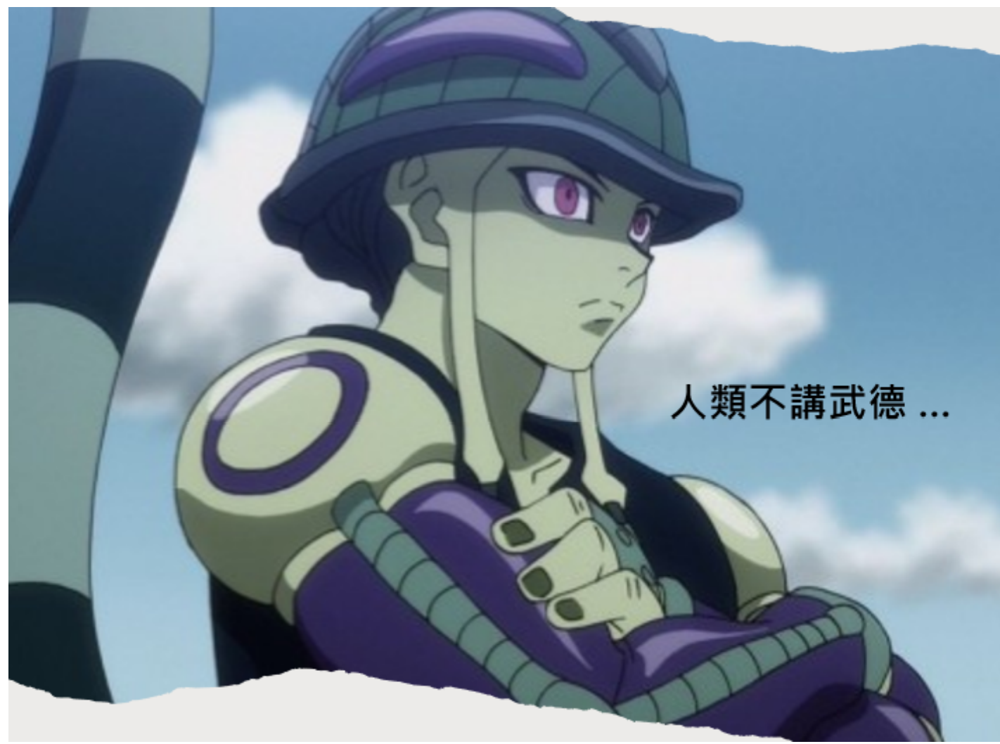

牠叫做梅路艾姆,牠是站在生物顶点,牠是生物顶点的一个存在,牠非常地强,人类没有办法打赢牠,那牠会消灭掉所有的人类,但是人类并没有跟牠打,人类是不讲武德的,人类就直接放一个核弹就把牠炸死,然后故事就结束了 就这样

## Example of Attack

我们先来看一个真正的例子,我们今天在好多个作业裡面,我们都已经训练了影像辨识的模型,也就是说你有一个影像辨识的系统,给它一张照片,它可以告诉我们说,这张照片属於什麼样的类别

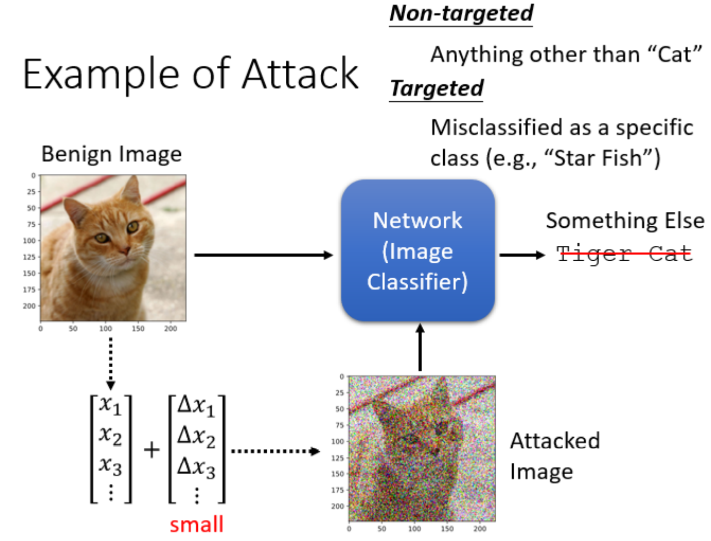

那今天我们要做的事情是,在这张照片上面加入一个非常小的杂讯,一张照片可以被看作是一个非常长的向量,我们在这个非常长的向量上加入,每一个维度都加入一个小小的杂讯,把这个有加入杂讯以后的照片丢到 Network,看看会发生什麼样的事情

那一般这个杂讯都非常非常地小,小到什麼地步呢,最好小到人肉眼没有办法看出来,所以这个例子裡面加的杂讯其实太大了,一般这个杂讯是小到人肉眼看不出来的

有被加杂讯的照片叫做 **Attacked Image**,有被攻击的照片,那还没有被加杂讯的照片呢,我们一般就叫做 **Benign Image**,它是好的 Image,它是还没有被攻击的图片

Benign Image 丢到 Network 裡面,它的输出是猫,那我们期待说 Attacked Image,就我们现在是攻击方 我们是坏人,我们希望 Attacked Image 丢到 Network 裡面,它的输出不可以是猫,要变成其他的东西

那攻击呢 大致上可以分成两种类型

- 一种是没有目标的攻击,没有目标的攻击是,原来的答案是猫,只要你能够让 Network 的输出不是猫,你就算是成功了
- 但是还有另外一种更困难的攻击,是有目标的攻击,也就是说我们希望 Network,不止它输出不能是猫,还要输出别的东西,比如说 我们希望加了一个杂讯以后,Network 输出呢 是海星,它把猫错误判断成一隻海星,才算是攻击成功,好 那这样子的攻击真的有可能做到吗,我们真的可以加入一个人肉眼看不到的杂讯,去改变 Network 的输出吗

实际上是可以的,这边用的 Network 并不是一个很弱的 Network,它是 50 层的 ResNet

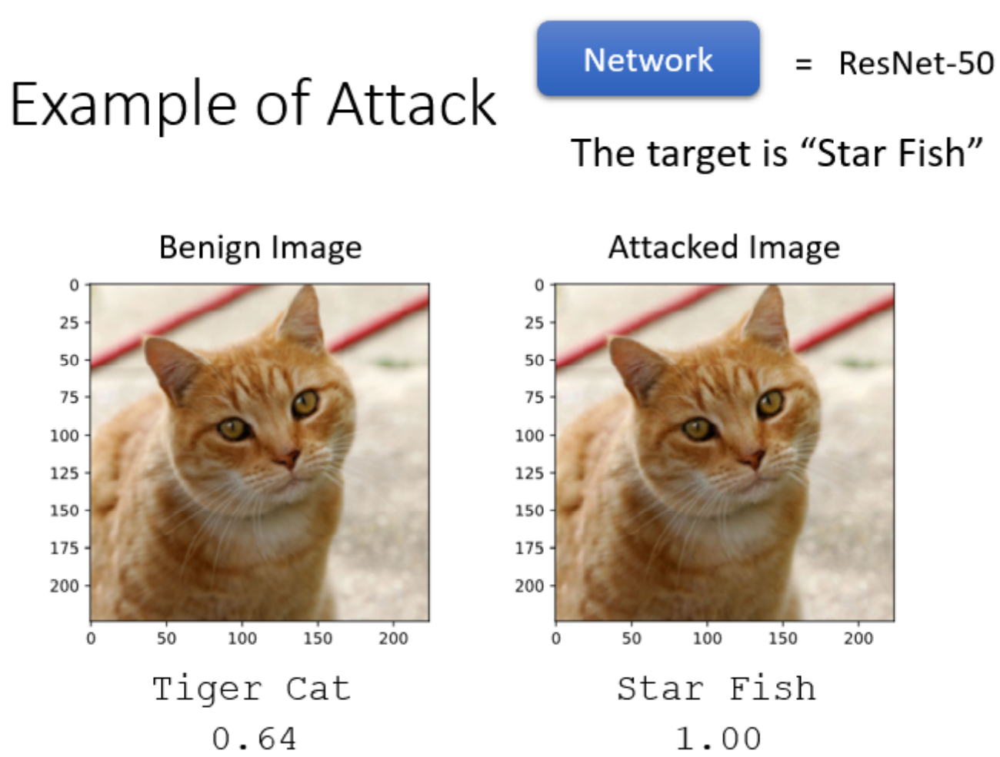

当我们把一个 Benign Image 没有被攻击的图片,丢到 50 层的 ResNet 的时候,它的输出是 Tiger Cat

你知道今天这种影像辨识的系统,它的输出都不只会告诉你它是什麼动物,还会告诉你它是哪一个品种的动物,所以它给它这隻猫,它不只说它是 Cat,还说它是 Tiger Cat,不过据说这个答案其实是错的,据说这个猫不是 Tiger Cat,不过没有关係,反正它都认得出这个是一隻猫就对了,至少知道是一个猫科的动物

那它还有一个信心的分数,信心的分数(置信度)是 0.64,这个信心的分数是什麼呢,这个信心的分数就是,做完那个 Soft Mask 以后,得到的那个分数,就假设你的影像分类的类别有 2000 类,2000 个类别都会有一个分数,那这个分数呢 一定介於 0 到 1 之间,而且 2000 个类别的分数合起来,会刚刚好是 1

那既然有 2000 个类别那麼多,Tiger Cat 可以拿到 0.64 的分数,那其实算是挺高的

接下来呢 我们在这个 Benign Image 上面,加入一些杂讯,我们现在希望成功攻击的目标,是把 Tiger Cat 变成海星,而被攻击以后的图片长的是这个样子的,你可能问说 杂讯加在哪裡呢,杂讯已经加进去了,但它非常非常地小,小到人的肉眼根本没有办法看出来

把这张图片丢到 ResNet 以后,会发生什麼事呢,ResNet 的 Output 变成 Star Fish,而且它的信心分数是 100 % 啊,本来它还没有那麼确定这是不是一隻猫,现在它百分之百确定,它就是海星

那為了要证明说,这两张照片还是有一些不一样的,我们把它做一下相减

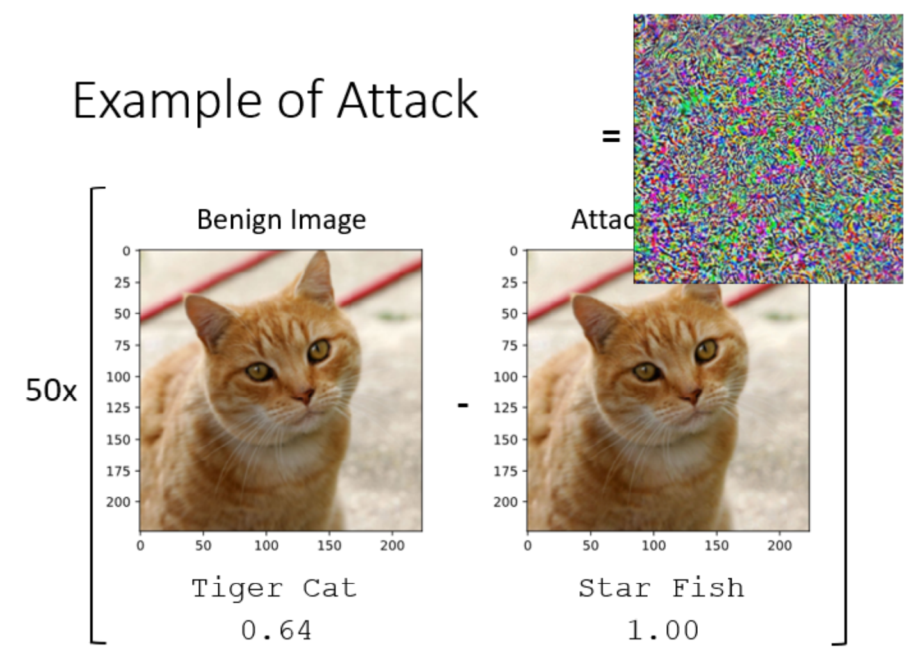

光做相减是不够的,做完相减以后,还要把它们的差距放大 50 倍,你会得到这样子的结论,所以这两张照片确实有些不一样,我并不是把同一张照片复製两次来骗你,它们是有一点不一样的,但是人根本看不出,这点不一样会造成什麼样的影响,但是对 ResNet 而言,它却有了天差地远的输出

那也许有人会觉得说,啊 也许是因為猫跟海星有什麼特别的关係

我们可以把猫变成海星只是一个特例,这不是一个特例,你可以把这隻猫轻易地变成任何的东西,我完全可以加上另外一个杂讯,就让这隻猫变成一个键盘,它一样信心分数高达 0.98,本来不太确定它是不是猫,现在加入另外一个杂讯以后,Network 98% 确定它就是一个键盘

那有人可能会觉得说,欸 怎麼会发生这麼离谱的行為,会不会是这个 Network 太烂了？,我要告诉你 它可是有 50 层的喔,它可不是一个非常烂的 Network

如果你加入的只是一般的杂讯,它并不一定会犯错,这个是原来的图片,我们现在加入一个杂讯,这个杂讯是你肉眼可见的

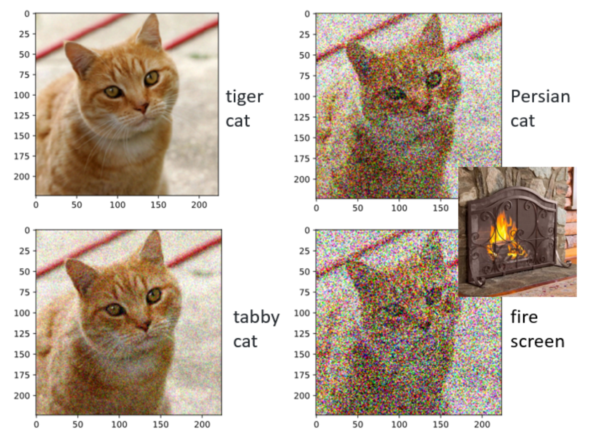

- 你可以很明显地看到,这张图片裡面被加入了杂讯,这个时候 ResNet 觉得,它看到的是 Tabby Cat,这可能才是正确答案,但无论如何 它都知道是猫科动物

- 把杂讯加得更大一点,它说这是 Persian Cat 这是波斯猫,可能杂讯加得大一点,这个猫看起来毛茸茸的,所以 ResNet 觉得它看到了波斯猫
- 把杂讯再加更大一点,你可能已经不知道这是什麼东西了,这个时候 ResNet 说,它看到了 Fire Screen,Fire Screen 是什麼呢,我 Google 了一下发现,Fire Screen 长这个样子,这裡完全可以理解机器為什麼会犯错,它觉得前面的杂讯是这个屏风,而后面这个橙色的猫就是火焰

它虽然犯错 它错的是有尊严的,它错的是有道理的,但不知道為什麼,加入一个人肉眼看不到的杂讯的时候,它却產生了天差地远的结果

## How to Attack

那接下来我们在讲為什麼这件事会发生之前,我们来看看刚才所说的攻击,究竟是如何做到的,我们到底是怎麼加入了一个非常微小的杂讯,可以让 Network 產生非常错误的结果呢

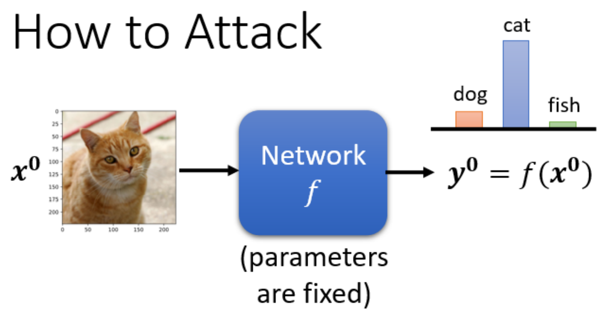

而这个是我们的 Network,它是一个 Function 我们叫它 f,这个 Function 输入是一张图片,我们叫它 $x^0$,它的输出是一个 Distribution,这个是这个分类的结果,那我们叫它 $y^0$

那我们这边假设 Network 的参数就是固定的,我们不讨论 Network 的参数的部分,Network 的参数不是我们今天的重点,所以它是固定的

- 如果是 Non-Targeted Attack 的话,我们要怎麼找出 Non-Targeted Attack 的杂讯呢

  我们现在要做的目标就是,我们要找到一张新的图片

  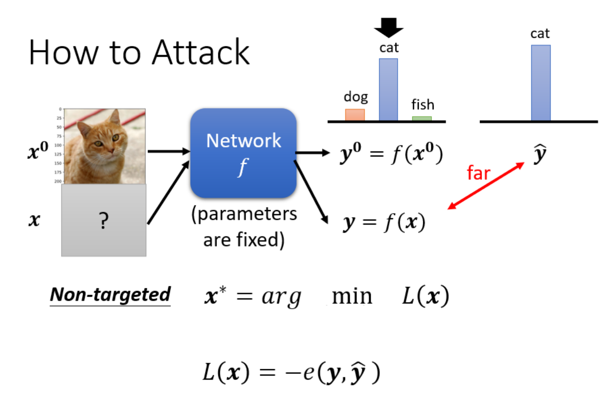

  这张新的图片呢 我们用 x 来表示,当我们把 x 丢到这个 Network f 的时候,它的输出是 y,我们正确的答案叫做 ŷ,我们希望 y 跟 ŷ 它的差距越大越好

  那怎麼做到这件事呢,怎麼找到这个 x,丢到一个 Network 裡以后,它產生的 y 跟 ŷ 差距越大越好呢？

  我们一样要解一个 Optimization 的问题,这个跟我们训练的 Network,其实是非常类似的

  我们先定一个 Loss Function,这个 Loss Function 呢,叫做 L,这个 L 呢 是 y 跟 ŷ 之间的差距,取一个负号,举例来说,我们一般在做这个 Classification 的时候,我们训练的目标 y 跟 ŷ,都是看它的 Cross Entropy,那我们这个 -e(y, ŷ),这一项代表的就是 y 跟 ŷ 之间的 Cross Entropy

  但是我们希望这个 Cross Entropy 越大越好,所以我们今天在 Cross Entropy 前面加一个负号,那这个负的 Cross Entropy 就是我们的 Loss,而我们期望这个 Loss 越小越好,我们希望找到一个 x,x 可以让 L(x) 越小越好,L(x) 越小 就代表说 y 跟 ŷ,它们的 Cross Entropy 越大,也就是 y 跟 ŷ 它们的距离越大,这个是没有目标的攻击

- 如果是有目标的攻击的话

  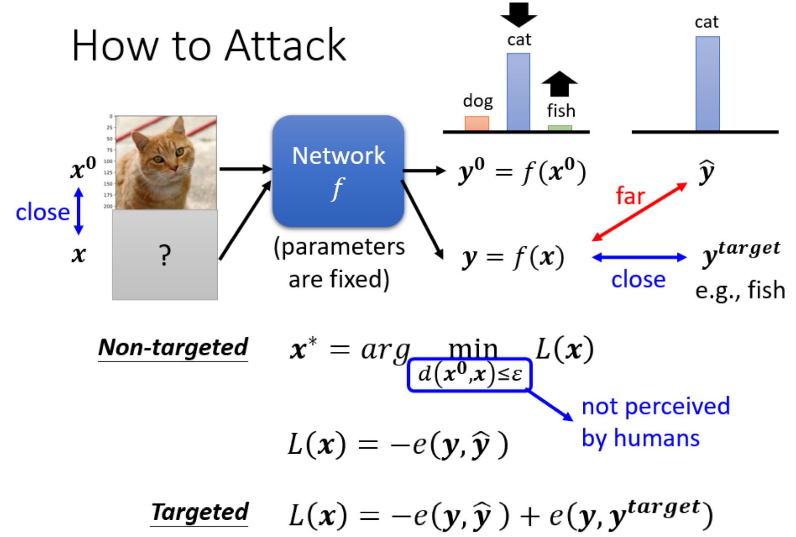

  那我们会先设定好我们的目标,我们用 $y^{target}$ 来代表我们的目标,那 ŷ 其实是一个 One-Hot Vector,$y^{target}$ 也是一个 One-Hot Vector,那我们现在希望这个 y 不止跟 ŷ 越远越好,我们还要跟 $y^{target}$ 越近越好

  所以假设你的 $y^{target}$​ 是一个 Fish,那你希望你输出的这个 y 啊,它不止 Cat 的机率越低越好,Fish 的机率还要越高越好,那你的 Loss Function 就写成这样
  $$
  𝐿(𝒙)=−𝑒(𝒚,𝒚 ̂ )+𝑒(𝒚,𝒚^{𝒕𝒂𝒓𝒈𝒆𝒕} )
  $$
  我们的 Loss Function

  - 是负的 y 跟 ŷ 之间的 Cross Entropy,希望这一项越大越好
  - 同时你又希望 y 跟 $y^{target}$,它们越小越好
  - 你把这两项加起来就是你的 Loss,你希望找一个 x,去 Minimize 这个 Loss

  但光是找一个 x,去 Minimize Loss 是不够的,因為我们其实还期待说,我们加入的杂讯越小越好,也就是我们新找到的图片,可以欺骗过 Network 的图片,跟原来的图片要越相近越好,x 跟 $x^0$ 要越近越好

  所以我们在解这个,Optimization 的 Problem 的时候,我们还会多加入一个限制,这个限制是 
  $$
  d(x^0,x)≤ε
  $$
  它的意思就是,我们希望 x 跟 $x^0$ 之间的差距,小於某一个 Threshold,小於某一个閾值,那这个閾值是根据什麼东西来决定的呢,通常就是根据人类的感知能力来决定

  如果 $x^0$ 跟 x 之间的差距大於 Σ,我们假设人就会看到这个杂讯,人就会发现有一个杂讯存在,所以我们要让 $x^0$ 跟 x 它的差距,小於等於 Σ,小於等於人类可以感知的极限,那我们就可以產生一张图片,人类看起来 x 跟 $x^0$ 是一模一样的,但產生的结果对 Network 来说,是非常不一样的

## Non-perceivable

好 那怎麼计算 x 跟 $x^0$​ 之间的差距,它们之间的距离呢?d($x^0$​,x) 就代表它们之间的距离

有各式各样不同的算法,那為了等一下符号的方便起见呢,我们假设 x 是一个向量,因為它是个图片 所以它是个向量嘛,$x^0$​​ 是另外一张图片,它也是一个向量,这两个向量相减 我们叫它 Δx

那这个距离啊

- 你可以定 L2-Norm 当做它们的距离,也就是说你可以计算 Δx 的 L2-Norm,Δx 的 L2-Norm 就是把这个 Δx 的第一位,拿出来取平方,第二位拿出来取平方,第三位拿出来取平方,在这边你其实要开根号也可以啦,就看你的 L2-Norm 的定义是怎样,你要开根号也是可以的
- 另外还有一个定义呢 是 L-Infinity,L-Infinity 是怎麼看的呢,它就是把这个 Δx 拿来,然后看裡面哪一个维度它的绝对值最大,那这一个就是L-Infinity,就把 Δx1 Δx2 Δx3,也就是 Δx 的每一维都拿出来取绝对值,看谁最大,最大的那一个就代表 x 跟 $x^0$​​ 之间的距离

那有各种不同的方法,可以计算两张图片之间的距离,但是我们在决定要使用哪一种方法,来计算图片的距离的时候,其实我们应该把人类的感知把它考虑进来

那 L2 跟 L-Infinity 到底哪一个,在 Attack 的时候是比较好的距离呢,以下我举一个例子来跟大家说明

这是一张图片,假设这个图片只有四个 Pixel 而已,现在啊,我们把这张图片做两种不同的变化

第一个变化是这四个 Pixel 的顏色,都做了非常小的改变

第二种变化是只有右下角这个 Pixel,它的顏色被改了,而且改的是比较大的

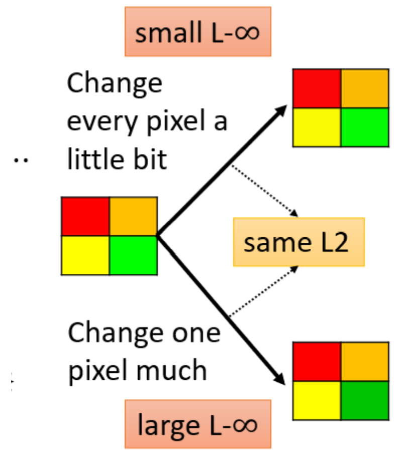

如果我们今天在计算 L2 的 Norm 的时候,上面这两张图片的 L2-Norm,和下面这两张图片的 L2-Norm 是一样的，这两个变化他们的 L2 的 Norm 是一样的

而但是如果你看 L-Infinity 的话,它们是不一样的,因為 L-Infinity 只在意最大的变化量,那对於 L-Infinity 而言,下面这个改变它最大的变化量是比较大的,上面这个改变最大的变化量是比较小

那如果从这个例子来看 L-Infinity 跟 L2,哪一个比较接近人类的感知能力呢,也许应该是 L-Infinity 吧

因為对你来说,其实这两张图片,我相信多数人你可能都看不出,它们之间有什麼差别,那我跟你保证它们两个之间是有差别的,就它们是有非常非常微小的差别,只是它的差别是分布在每一个 Pixel 上面

而这下面这两个改变呢,你会很明显的看到右下角这个绿色,它的顏色变深了,虽然这另外这三个 Pixel 的顏色是固定的,右下角的顏色一变深,你就发现有图片有变化,就发现这个图片有做到,有做了某种修改,所以看起来 L-Infinity 也许更符合实际的需求,我们要避免被人类,我们要避免被人类发现

光是 L2 小是不够的,我们要让 L-Infinity 小才是最好的,才是比较不会被发现,所以在作业裡面我们是用 L-Infinity,来当做我们的限制,来当做攻击,那我们作业就是要去攻击一个,JudgeBoi 上面的那个,像辨识系统產生出来的图片,我们会有所限制说,新的图片跟旧的图片,跟原来 Benign 图片的差距,要小於某一个 Threshold,那我们在定这个差距的时候,我们就是选择 L-Infinity,那实际上这个差距要怎麼定才是比较好,这个也要凭 Domain Knowledge

我们刚才举的例子是影像上的例子,如果我们今天要攻击的对象,其实是一个跟语音相关的系统,我们的 x 跟 $x^0$​​ 其实都是声音讯号,那什麼样的声音讯号,对人类来说听起来有差距,那就不见得是 L2 跟 L-Infinity 了,你就要去研究人类的听觉系统,看看人类对什麼频态的变化特别敏感,那根据人类的听觉系统来制定,比较适合的 x 跟 $x^0$​​ 之间距离的衡量方式,那这个部分就是需要用到 **Domain Knowledge**

## Attack Approach 

好 那我们现在已经有了,我们的 Optimization 的问题,我们要做的事情就是,我们要去 Minimize 是一个 Loss,那现在我们要找一个 x 去 Minimize 这个 Loss,但是这个 x 我们是有限制的

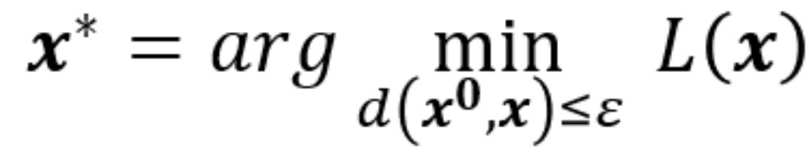

x 跟 $x^0$​​ 它们的 Distance 要小於等於 x,那这个问题到底要怎麼解呢,我们先把这个限制拿掉

如果把这个限制拿掉,你会不会解这个问题呢,你其实会解这个问题,因為这跟我们 Train 一个模型其实没有什麼差别啊,我们在第一堂课的时候,就列过这个 Optimization 的问题给你看,告诉你说你可以调你的 Network 的参数,去让一个 Loss 最小

我们今天只是把参数改成Network 的 Input 而已

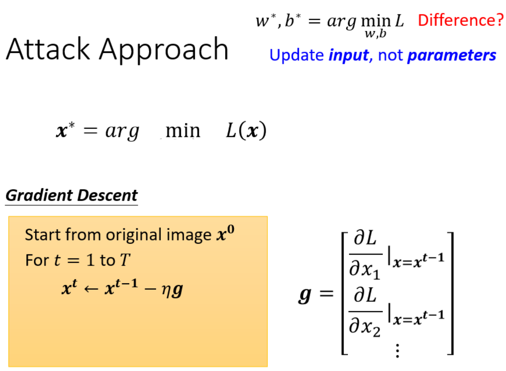

你就把 Input 那一张 Image,看作是 Network 参数的一部分,然后 Minimize 你的 Loss Function 就结束了

**现在 Network 的参数是固定的,我们只去调 Input 部分,让 Input 的部分去改变,去 Minimum 一个 Loss 就结束了,用的一样是 Gradient Descent,怎麼做呢**

你就这样做啦,就是你要先有个 Initialization 嘛,我们现在找的对象不是 Network 参数,是 x,是你 Input 的 Image,但是它还是需要一个初始化的值 对不对

你还是需要一个,做 Gradient Descent 的时候初始化的值,那初始化的值设什麼样的数值比较好呢

- 你可能不会从随机的 Image 开始,你可能会从 $x^0$​​ 开始,因為我们本来就希望说,我们新找到的 x 应该跟 $x^0$​​ 越接近越好嘛,那你何不就从 $x^0$​​ 开始找呢,你从 $x^0$​​ 开始找
- 你接下来找出来的 x 可能就会跟 $x^0$​​ 比较接近,所以你初始化的 x,你会初始化的这个 $x^0$​​ 就直接设 $x^0$​​,然后接下来就跟,一般的 Gradient Descent 是一模一样的,我们就是 Iterative 去 Update 你的参数,你就设一个 Iteration,t 等於 1 到 T,然后在每一个 Iteration 裡面,你都会计算 Gradient,只是这个 Gradient 不是 Network 参数,对 Loss 的 Gradient,我们现在已经不管 Network 参数了,而是 Input 那一张 Image x,对於 Loss 的 Gradient,那 Input 这个 x,它也是一个很长的向量嘛,它裡面就是有 x1 x2 x3 嘛,你就去计算这个 Input Image 裡面,每一个数值对 L 的偏微分,就 x1 对 L 的偏微分,x2 对 L 的偏微分,算出来,算出一个 Gradient,用这个 Gradient,去 Update 你的 Image 就结束了
- 所以你本来的 Image $x^0$​​​​,它就减掉这个 Gradient,那前面你也会乘上一个 Learning Rate,就跟一般 Gradient Descent 是一模一样的,只是要做 Gradient Descent 的对象,从参数换成 Input 而已,其他都是一样的,也有 Learning Rate 那些什麼东西统统都有,乘上一个 Gradient,乘上 Learning Rate,减掉原来的 Image,然后就得到新的 Image,你可以 Iteration 地跑,就跟一般的 Gradient Descent 是一模一样

但是这个是在没有 Constraint 的前提,接下来我们得把 Constraint 加进去

因為一般我们在做 Gradient Descent 的时候,我们并没有把那个,Gradient Descent 的对象做什麼限制,我们并没有设限说,我们的参数一定要长什麼样子

那现在我们是有限制的,我们限制说 x 跟 $x^0$​​,他们的差距一定要小於等於 $x^0$​​,那要怎麼处理这个问题呢

你就在你的 Gradient Descent 裡面,再加一个 Module

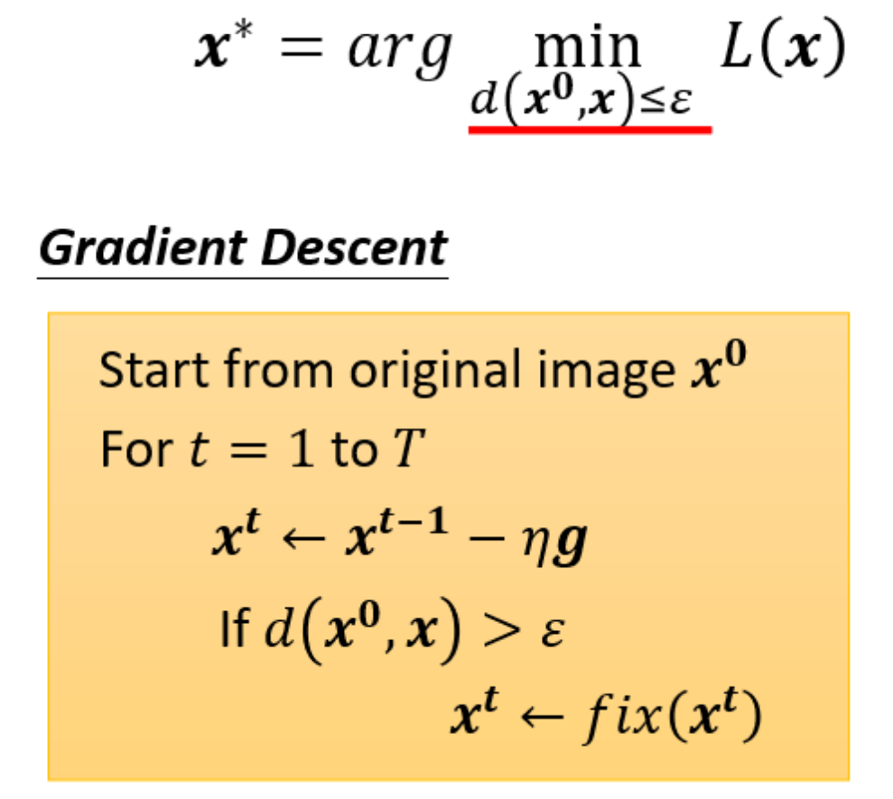

这个我们要跑 Gradient Descent 这个演算法,但是我们要同时考虑 $x^0$​​ 跟 x 之间的差距,怎麼考虑这件事情呢,这边呢,这个方法说穿了不值钱,非常地简单

你 Update 完你的参数以后发现,你的 $x^t$ 跟 $x^0$​​ 的差距大於 ε 以后,你就做一个修改,把 $x^t$​ 做个修改,把它改回符合限制就结束了

举例来说,假设我们现在用的是 L-Infinity,我们的这个 $x^0$​​ 在这个地方,那我们的 x 它可以存在的范围,就只有这个方形框框的范围

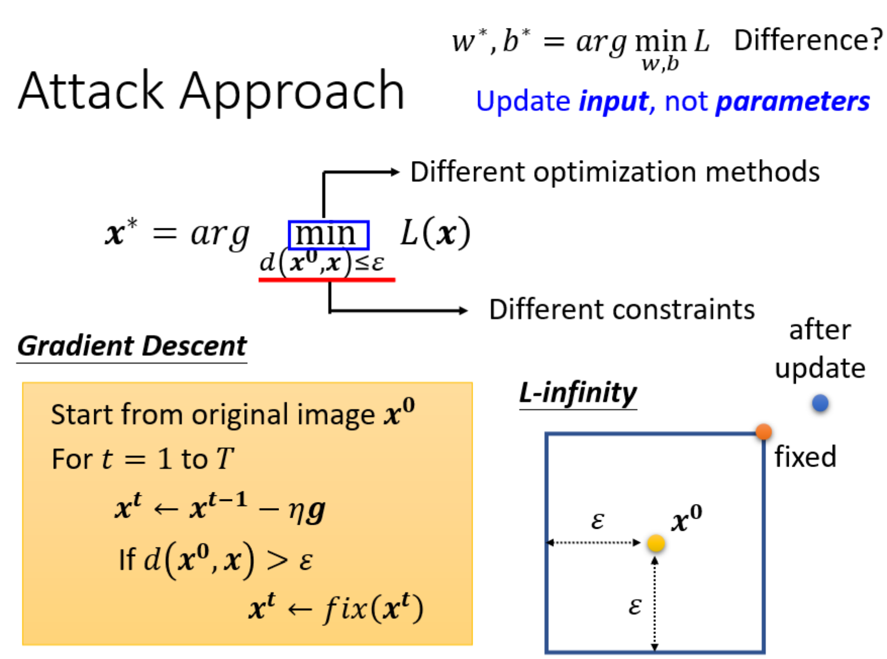

因為 L-Infinity 是考虑 $x^0$​​ 跟 x 之间最大的差距,所以出了这个框架的差距就会超过 ε

所以今天呢你在做完这个 Gradient Descent,用 Gradient 去 Update 你的 x 以后,它一定还是得要落在这个框框裡面才行,那怎麼保证 Update 以后,一定落在这个框框裡面呢,你就,只要 Update 超出了框框,就把它拉回来就结束了

所以今天这个步骤如果做完,你发现你得到蓝色这个点跑出框框了怎麼办,在框框裡面找一个跟蓝色的点最近的位置,把蓝色的点拉进来就结束了,就结束了

那其实这种 Attack 有非常多不同的变形,我想你在文献上可以找到,各式各样的 Attack 方法,但其实它们的精神都不脱,我们今天讲的这个事情,那它们通常不一样的地方都是,要嘛是 Constraint 不一样,要嘛是 Optimization 的方法不一样,但是通常都还是用 Gradient Descent,它们的精神还是一样的,只是这边你可能会有不同的 Optimizer,这边你可能会有不同的限制,它就变成不同的 Attack 方法,但它们精神都不脱,我们今天跟大家举的这个例子

好 那接下来呢,我们跟大家介绍一个最简单的 Attack 的方法,也是作业裡面你要过Simple Baseline 所用的方法,

这个 FGSM 它是怎麼做的呢,非常地简单,它叫做 Fast Gradient Sign Method 缩写

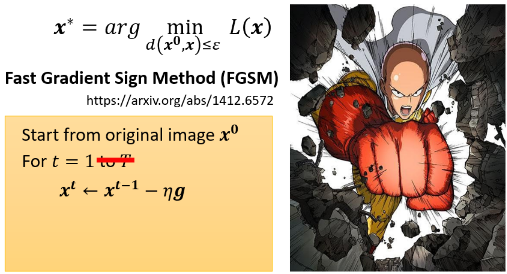

它怎麼做呢,它就像是一个一拳超人一样,它只用一击,本来一般你在做 Gradient Descent 的时候,你要 Update 参数很多次,但是 FGSM 它厉害的地方就是,它决定只 Update 一次参数,看看能不能够一击必杀,一击就找出一个可以 Attack 成功的 Image,所以首先呢,本来要 Iterative 的去 Update 参数,但是现在不用,我们只做一次的攻击,我们只做一次的 Attack

然后 G 这边呢,它做了一个特别的设计,那至於為什麼做这个特别设计,大家再去看一下原始文献,可以了解当初為什麼会有这样的想法,它说我们不要直接用这个,Gradient Descent 的值,我们给它取一个 Sign

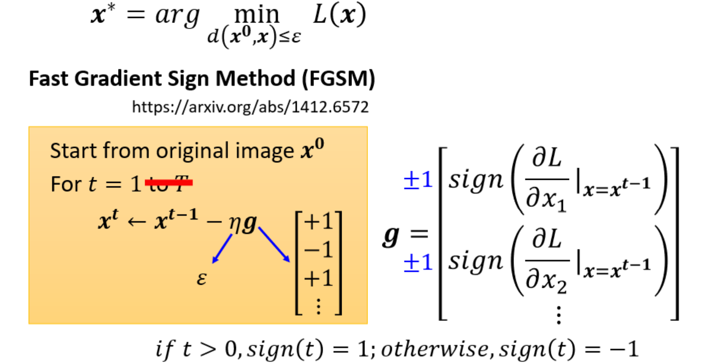

这个 Sign 是什麼意思,这个 Sign 的意思是说,如果括号裡面的值大於 0,我们就输出 1,括号裡面的值小於 0,我们就输出 -1,所以加了 Sign 以后,这个 g 这个 Vector 啊,它裡面要嘛是 1 要嘛是 -1

本来如果你是算 Gradient,它的值可以是任何的 Real Number,但现在取 Sign,它要嘛是 1 要嘛是 -1,所以 g 裡面就都是 1 或者是 -1,然后 Learning Rate 呢,Learning Rate 就设 ε,就看你这边的这个 ε 设多大,这边 Learning Rate 直接设一个一模一样的,直接设个一模一样的会得到什麼效果呢

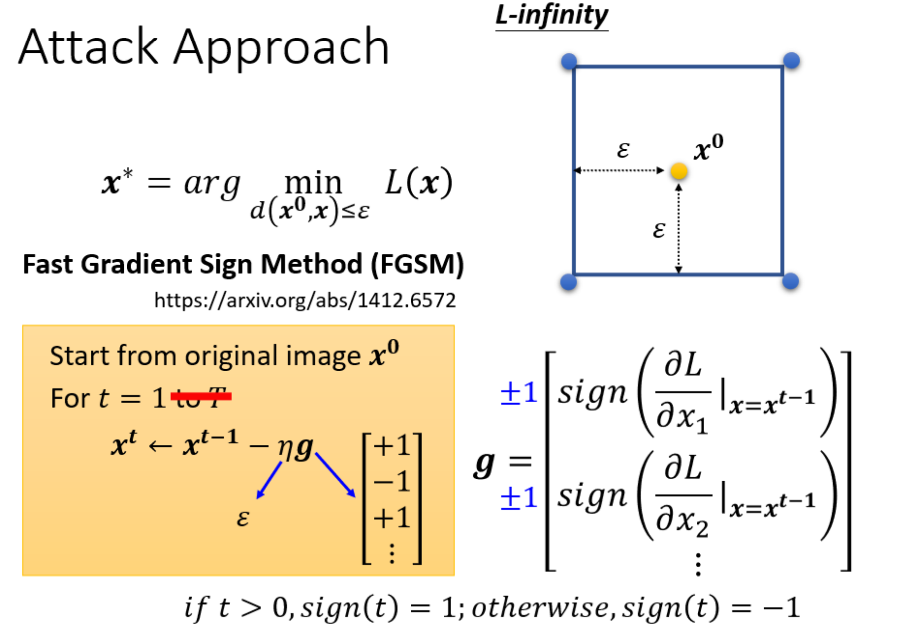

会得到的效果就是,你攻击完以后,你一定落在这个蓝色框框的四个角落的地方,因為你想想看哦,这个 G 它要嘛是 1 要嘛是 -1,它每一维要嘛是 1 要嘛是-1,那前面会乘上 ε,所以乘完 ε 以后,你今天的 $x^0$​​,要嘛就是往右边移 ε,要嘛就是往左边移 ε,要嘛就是往上移 ε,要嘛就是往下移 ε,

所以今天做完一次攻击以后,你的这个 $x^0$​​ 做完一次攻击以后,它一定会挪到这个四方形的四个角落的地方,它一定是这四个角落的其中一个,那光做这件事,光做这个一击往往就可以必杀,所以这个你可以过 Simple Baseline

那有同学就会问说一击必杀有什麼好呢,如果我多攻击几次,多跑几个 Iteration 结果不会更好吗,会更好,所以多跑几个 Iteration,就过 Medium Baseline 就这样子

所以怎麼多跑几个 Iteration,你就把本来是只跑一个 Iteration 啊,现在就多跑几个 Iteration 啊,几个 Iteration,你要跑几个 Iteration,高兴都是你自己设,就设个比如说 3 啊 5 啊 10 啊,多跑几个 Iteration

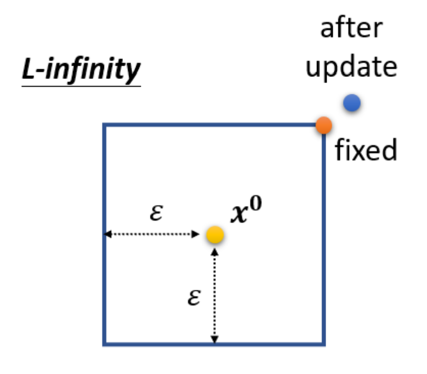

那但是多跑几个 Iteration 的坏处是,你有可能一不小心就出界,有可能一不小心就跑出了这个四方形的范围,那跑出四方形的范围后怎麼处理呢,非常简单,把它拉回来就结束了,你就看说在这,如果这个蓝色的点 Update 以后,跑出这个四方形,你就看这四个角落,哪一个角落跟蓝色的点最近,就选那个角落,就结束了,好 这个就是 Iterative 的 FGSM,它可以帮你过 Medium 的 Baseline

# Adversarial Attack P2-Attack and Defense

## White Box v.s. Black Box

到目前為止啊,我们在上课讲的内容,其实都是 **White Box 的 Attack**

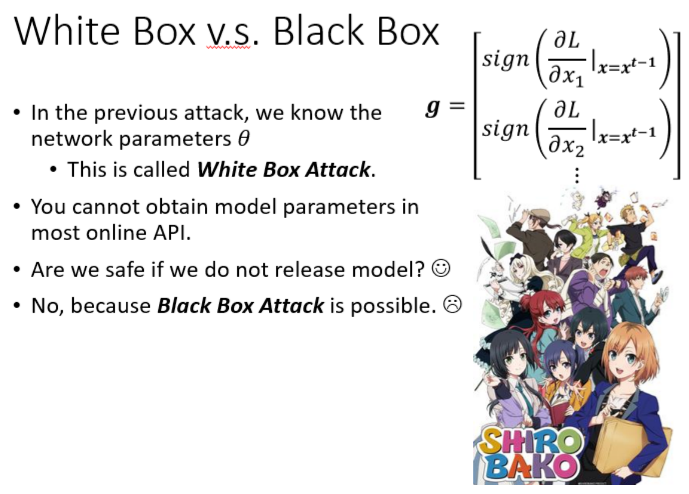

也就是说 我们要计算这个 Gradient,我们做 FGSM 在计算 Gradient 的时候,我们需要知道模型的参数,才有办法计算这个 Gradient,才有办法去在 Image 上加上 Noise

像这种知道模型参数的攻击叫做 White Box 的 Attack,那中文有时候就翻译成白箱攻击,那白箱就是一个动画了,这个是白箱 没有很重要,没有很重要 不用管我

那但是你可能会觉得说,哇 这个攻击需要知道 Network 的参数,看来这个攻击呢 不是很危险

因為一般线上的服务,你当然要攻击一定是去攻击别人的模型嘛,某一个线上的服务嘛,线上的服务它的模型,你又不知道参数是什麼,所以也许要攻击一个线上的服务,并没有那麼容易,所以其实如果我们要保护,我们的模型不被别人攻击,也许我们只要记住,不要随便把自己的模型放到网路上,公开让大家取用,也许我们的模型就会是安全的

但真的是这样吗,不知道模型参数下的攻击叫做 Black Box Attack 也就是黑箱攻击,黑箱攻击是有可能的吗,黑箱攻击是有可能,怎麼做黑箱攻击呢,我们到目前為止讲说,我们在做攻击的时候,都需要计算 Gradient,就像 Gradient 需要知道 Model 的参数,那黑箱攻击是怎麼做到的呢

### Black Box Attack

所以网路上有一个模型,这个模型你是没有办法拿到的,你根本不知道它的参数是什麼,这个其实就是JudgeBoi上面的那一个模型,你并不知道助教使用了哪一个模型,你并不知道它的参数是什麼,那怎麼办呢

**假设你知道这个 Network,是用什麼样的训练资料训练出来的话,那你可以去训练一个 Proxy 的 Network**

也就是你训练一个 Network,让这个 Network 来模仿我们要攻击的对象,那我们要攻击的对象跟 Proxy 的 Network,如果都是用同样的训练资料训练出来的话,也许它们就会有一定程度的相似度

如果 Proxy Network 跟要被攻击的对象,有同样的 有一定程度的相似程度的话,那我们只要对 Proxy 的 Network 进行攻击,也许这个有被攻击过的 Image,拿去丢到我们不知道参数的 Network 上,攻击也会成功

那这个其实就是在我们作业裡面做的事情,所以在作业裡面做的事情是,你从某一个地方找来某一个,已经训练好的影像辨识的模型,这个是你的 Proxy 的 Network,你自己在自己的机器上,你在colab上攻击这个自己的 Network,然后丢到JudgeBoi上面,看看这个攻击能否成功

那有人可能会问说,那如果我根本就没有训练资料,我根本不知道现在要攻击的对象,是用什麼样的训练资料的话怎麼办呢

在作业裡面 我们知道是CIFAR-10,我们要被攻击的对象,是用CIFAR-10训练出来的,所以你只要用一个,CIFAR-10训练出来的模型,你可能就可以攻击成功

但是假设我们完全没有训练资料的话 怎麼办呢,这也不是完全无解的,怎麼解呢,就是你就假设这是你要攻击的影像辨识模型,你就把一堆图片丢进去,然后看看它会输出什麼,线上的 Service 就算是它不会告诉你,Network 的参数,你总是可以丢东西进去,看它输出什麼嘛,再把输入输出的成对资料,拿去训练一个模型,你就有可能可以训练出一个类似的模型,当做 Proxy Network 进行攻击

那这种黑箱攻击容易成功吗？蛮容易成功的,

你在作业裡面就可以体会一下,这个黑箱攻击其实非常容易成功,那这个是文献上的结果

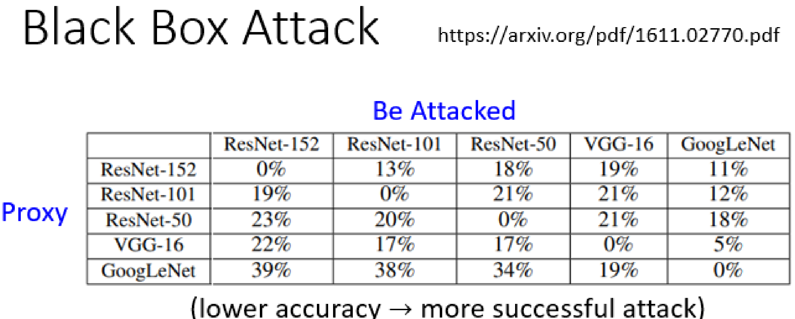

那这边有 5 个不同的 Network,ResNet 152 层 ResNet 101层,ResNet-50 VGG-16 还有 GoogLeNet,总共有 5 个 Network,

- 那这个 Column 啊,代表要被攻击的 Network,总共有 5 个要被攻击的 Network
- 那这个 Row 啊,这代表说我们有 5 个 Proxy 的 Network
- 那如果是对角线的地方,代表说 Proxy 的 Network,跟要被攻击的 Network,它们是一模一样的,所以这个情况就不是黑箱攻击,对角线的地方其实是白箱攻击,所以如果你拿 ResNet-152 当做 Proxy Network,攻击的时候其实是攻击一个,一模一样的 Network,太容易成功了

这边这个数字是正确率,是要被攻击的那个模型的正确率,所以这个值呢 是越低越好,越低的正确率,代表你的攻击越成功,你现在是站在攻击方的,所以你不是负责 你不是训练模型方的,你是攻击方的,所以这个正确率越低,代表你的攻击是越成功的

你发现对角线 也就是白箱攻击的部分,White Box Attack 的部分,这个攻击的成功率是百分之百,也就是模型的正确率是 0 %,你的攻击总是会成功,但如果在非对角线的地方,也就是黑箱攻击

举例来说 你用 ResNet-101 当 Proxy Network,去攻击 ResNet-152,得到的正确率是 19 %,或者是你拿 ResNet-152 当做是 Proxy Network,去攻击 ResNet-50,你得到的正确率是 18 %,那这个非对角线的地方是黑箱攻击

你会发现说 黑箱攻击模型的正确率,是比白箱攻击还要高的,但是其实这些正确率也都非常低,都是低於 50 %,所以显然黑箱攻击也有一定的成功的可能性,不过实际上黑箱攻击是在Non-Targeted Attack 的时候比较容易成功啦,Targeted Attack 就不太容易成功,就是假设你用 Proxy Network,说你要把一个狗变成一个兔子,那如果你把 Attacked Image,拿到那个你要攻击的对象上面的话,你可能可以让它辨识错误,你可能会让机器辨识出不是狗,但你要指定它一定要变成兔子 就比较难,所以在黑箱攻击的时候,这个 Targeted Attack 比较难成功,但 Non-Targeted Attack 还是非常容易成功的

那如果你要增加这个,Black Box Attack 的成功率怎麼办呢,刚才助教也讲了一个,可以过 Strong Baseline 的 Tip,就是 的 Network,那这个 Ensemble 的 Network 要怎麼做呢

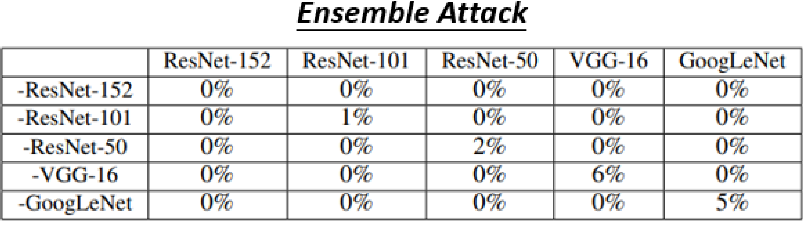

这边的这个表格的看法是这个样子的

- 这个 Column 代表要被攻击的 Network
- 那每一个 Row 是什麼意思呢,你会发现这个每一个模型的名字,前面放了一个减号,它是什麼意思呢,那就代表说,我们现在把这 5 个模型都集合起来,但拿掉 ResNet-152,我们要找一个攻击的 Image,在 ResNet-152 以外的模型都是成功的,我们假设我们手上没有 ResNet-152,但是有 ResNet-101 ResNet-50,VGG-16 跟 GoogLeNet,找一张 Image 攻击这 4 个 Network,都是成功的,然后看看在 152 上会发生什麼事
- 所以其实今天在这个图啊,这个下面这个表格,跟上面这个表格的看法是不一样的啦,如果是下面这个表格的话,非对角线的地方是白箱攻击,非对角线的地方有没有发现,模型正确率都变成 0 %,就像我刚才说的,白箱攻击非常容易成功,对角线的地方才是黑箱攻击,所以这个地方是 我们要攻击 ResNet-152,但我们没有用 ResNet-152,这边是要攻击 ResNet-101,但没有用 ResNet-101,但是用了另外 4 个 Network 以此类推,所以对角线的地方才是黑箱攻击

那你发现说 当你有做 Ensemble 的时候,当你同时用多个 Network 的时候,当你找一个 Attacked Image,可以成功骗过多个 Network 的时候,骗过一个你不知道参数的黑箱的 Network,也非常容易成功,你看对角线上的正确率,基本上都是 10 % 以下,好 那这个是黑箱攻击

### The attack is so easy! Why?

你会发现说这个攻击这件事啊,非常容易成功,到底是怎麼回事呢,為什麼连黑箱攻击,你在 A Network 上攻击,在 B Network 上都会成功,事实上这仍然是一个,可以说是未解之谜啦,还有很多可以研究的空间

那以下就是讲一个很多人相信的结论,这边有一个实验是这个样子的

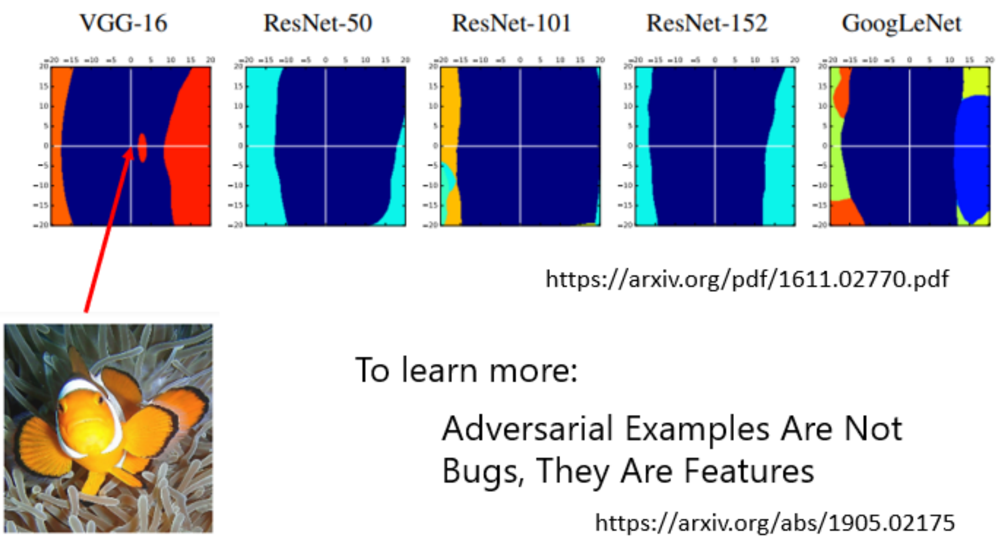

这个图上面的原点,代表一张小丑鱼的图片,就是尼莫,就是这个 小丑鱼就是尼莫,就是尼莫的图片 在这边

然后这个横轴跟纵轴分别是什麼呢,分别是把这张图片往两个不同的方向移动,就是一张图片是一个非常高维的向量

- 把这个高维的向量,往某一个方向移动 是横轴,

- 往另外一个方向移动 是纵轴

那这边的横轴跟纵轴,分别是什麼样的方向呢,这边横轴是在 VGG-16 上面可以攻击成功的方向,而纵轴就是一个随机的方向,那你会发现说呢 虽然这个横轴啊,是让 VGG-16 可以攻击成功

但是在其他的 Network 上面,ResNet-50 ResNet-101,ResNet-152 GoogLeNet 上面,你看这个图,我后来发现它们有很大的类似之处,它们中间这个深蓝色的区域都还蛮相近的,这个深蓝色的区域是什麼呢

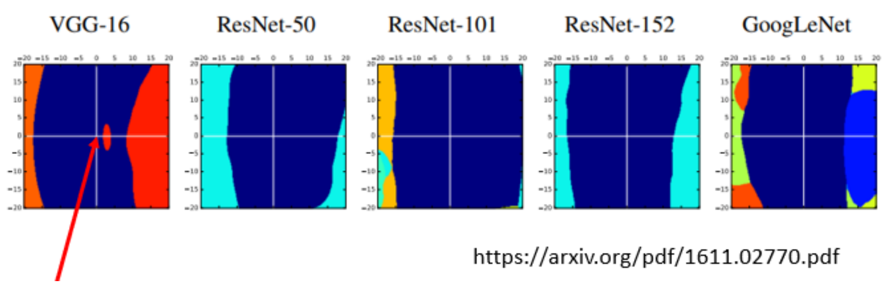

这个深蓝色的区域啊,这个深蓝色的区域是会被辨识成小丑鱼的图片的范围,也就是说 如果你把这个小丑鱼的图片,加上一个 Noise,你把这个高维的向量,在高维的空间中往这个方向移动,基本上 Network 还是会觉得,它是小丑鱼的图片,不管对每一个 Network 来说,只要往这个方向移动,它是一个随机的方向,基本上都会被认為是小丑鱼

但是如果你是往可以攻击成功,VGG-16 的方向来移动的话,那基本上其他 Network,好像也是有蛮高的机率可以攻击成功的,你发现这个小丑鱼这一个类别,它在这个攻击的方向上,它就是特别窄,只要你把这个高维的向量,这张图片稍微移动一下,它就掉出会被辨识成小丑鱼的,区域范围之外了,它就会掉出会被辨识成小丑鱼的,区域范围之外,会被辨识成其他的类别,对每一个 Network 来说,看起来这个攻击的方向对不同的 Network 影响都是蛮类似的

那所以啊 有不止一篇论文,它们对於攻击这件事,它们的认知是这个样子的,你从这篇文章的开头就可以看出来,它说这个,Adversarial Example Are Not Bugs,They Are Features.

所以一个 有一群人是主张说呢,这个攻击这件事情会成功,它最主要的问题来自於你的 Data,而不是来自於模型,不同的模型训练出来的结果,看起来是还蛮相近的,而攻击会成功这件事情,不是只有对 Deep Learning 有一样的问题,对 Linear 的 Network,对 SVM 也都有类似的问题

所以也许攻击会这麼容易成功这件事情,变成这个主因未必出现在模型上面,可能是出现在资料上,為什麼 Machine 会把这些非常小的杂讯,误判為另外一个物件,那可能是因為在资料上面,本身它的特徵就是这样,在有限的资料上,机器学到的就是这样子的结论,所以也许 Adversarial Attack 会成功的原因,是来自於资料上的问题,当我们有足够的资料,也许就有机会避免 Adversarial Attack

不过这个其实只是这个某一个,就是它并不是所有人都同意这样啊,同意这个观点啊,这只是某一群人的想法而已,也许过几年以后 你再来修同一堂课,我讲的结论又会不太一样,那这边只是告诉你说,**有一群人他们的认知的观点,是认為 Data 是造成 Attack 会成功的元凶**

### One pixel attack 

那 Attack 的 Signal,我们希望它越小越好,到底可以小到什麼样的程度呢,那在文献上有人成功地做出 One Pixel Attack,所谓 One Pixel Attack 的意思就是说,你只能动图片裡面的一个 Pixel 而已

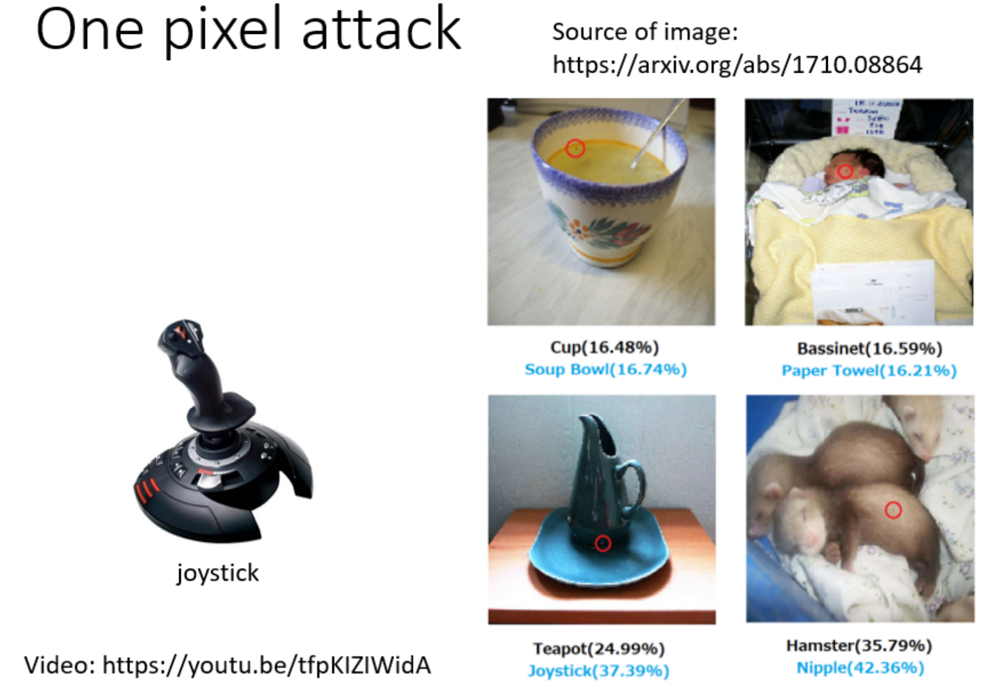

举例来说 在这张图片裡面,他们动了一个 Pixel,他会特别把 Pixel 有改变的地方把它框起来,希望说动了图片中的一个 Pixel,影像辨识系统的判断就必须要有错误,不过你其实如果从这个图片的,这个在这个图片上这个黑色的部分啊,代表的是正确的 攻击前的,这个影像辨识的结果,蓝色代表是攻击后的影像辨识结果

那你会发现说,One Pixel Attack 看起来还是有一些侷限的啦,它的攻击并没有说,真的非常非常成功 怎麼说呢,举例来说 这是一个 Teapot,它是一个茶壶,做 One Pixel Attack 在这个地方,某一个 Pixel 的顏色被改变了,机器呢 把 Teapot 变成 Joystick,Joystick 是什麼呢 Joystick 是摇桿

那你会发现说,欸 这个错其实还错的是有点道理,不像我们一开始举的什麼,猫变成海星 猫变成键盘 那麼荒谬,这个错还有点道理,所以感觉这个攻击呢,并没有非常地 Powerful,这个是 One Pixel Attack

### Universal Adversarial Attack

那其实还有更狂的攻击方式,叫 Universal Adversarial Attack,Universal 的 Attack 是什麼意思呢,我们在到目前為止,每一张图片 你的这个都是客製化的,作业裡面有 200 张图片,200 张图片,你会分别找出不同的 Attacked Signal

那有人就问说,有没有可能用一个 Signal就成功攻击所有的图片呢,因為如果你说,每一张图片都要有不同的 Signal,那如果你今天要 Hack 某一个监视系统,你要让某一个监视系统它的辨识是错的,那你可能需要真的,Hack 进去那个监视系统,然后每次进来不同的影像的时候,你都要客製化 

找出一个 Attacked Signal,那这个运算量可能会非常地大,如果 Universal Attack 可以成功的话,你其实只要把这个讯号,贴在这个监视器的摄像头上,那如果这个讯号,这个 Attacked Signal 非常强,只要加上这个 Attacked Signal,不管什麼样的影像都可以攻击成功的话,你只要把这个 Signal 直接放在摄像头上,贴在摄像头上,那这个摄像头它就直接坏掉了,不管看到什麼东西它都会辨识错误

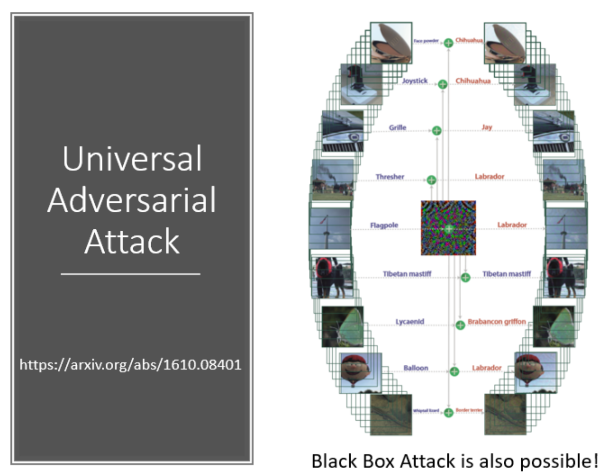

那 Universal Attack 有可能成功吗,你可以看看这篇论文,Universal Attack 是有可能成功的,在这篇论文裡面 他们找了一个 Noise,找了一个 Attacked Signal,这个 Attacked Signal,加在非常多不同的图片上,都可以让影像辨识系统辨识错误,

## Beyond Images 

到目前為止啊,我们举的例子通通都是影像的例子,那有人可能会觉得说,会不会是影像才有这种会被攻击的问题,会不会其他的类型的资料,就比较不会有这种问题呢,其实不是 

其他类型的资料也有类似的问题,以语音為例,大家都知道说现在会做 Defect,有人会模拟出这个用语音合成的技术,或用语音转换的技术,去模拟出某些人的声音,藉以达到诈骗的效果

那為了侦测这种 Defect 的状况,於是有另外一系列的研究在研究说,怎麼侦测一段声音是不是被合成出来的,今天虽然语音合成的系统,往往都可以合出以假乱真的声音,但是这些以假乱真的声音,还是有非常大的可能性,可以用机器抓出来的,这些合成出来的讯号,它还是有固定的 Pattern,跟真正的声音讯号,还是有一定程度的差异,人耳听不出来 但机器可以抓出来

1. 但是这些可以侦测语音合成的系统,可以侦测一段声音讯号,是不是合成的系统,也会被轻易的攻击，那以下是真实的例子

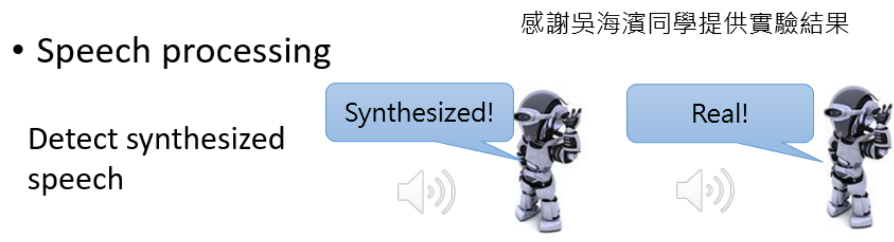

​		然后先放一段合成的声音,这是一段合成的声音,任何人都听得出这是一段合成的声音,这段声音是故意合坏的,如果今天语音合成的系统都可以合出,人听不出来		是真是假 以假乱真的声音,所以刚才那一段显然合得很差,所以你用这个侦测是否是语音合成的系统,它可以正确地告诉你说,这段声音讯号显然是合成的

​		但是如果我们在刚才那段声音讯号裡面,加入一点点杂讯,它听起来是这样,你可能问说,这个新的声音 加入杂讯的声音,跟原来有什麼不同呢,人耳完全听不出它之		间的差异,那个杂讯非常非常地小,没有任何人可以听出,这两段声音讯号有什麼样的差异,而这段声音讯号加上这个微小的杂讯以后,它听起来也没有合成得更好,		但是同一个侦测合成的系统,会觉得刚才那段声音是真实的声音,而不是合成的声音,

2. 刚才举的是语音的例子,那文字上也会被 Attack 吗,文字也会被 Attack,那我们在作业裡面,有一个作业是做 Question Answering,就是给机器读一篇文章,问它一个问题,看看它可不可以给你正确的答案

   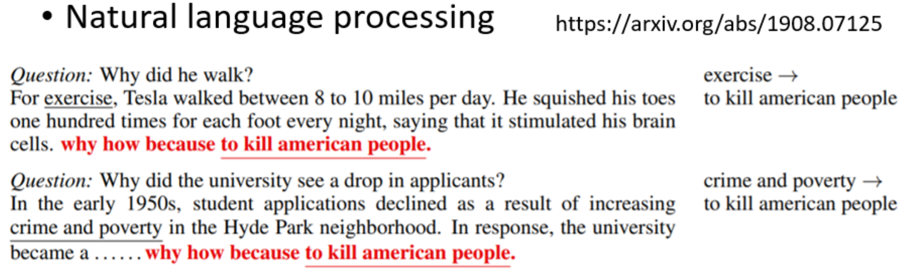

   那有一篇论文就发现说,它发现在所有文章末尾贴上,Why How Because To Kill American People,接下来不管你问它什麼问题,它的答案都是 To Kill American People,所以你可以在文字上进行 Adversarial Attack,直接让这个 QA 的系统,怎麼回答都是 To Kill American People,所以不管是什麼样的 Modelity,今天都有可能被攻击成功

### Attack in the Physical World

#### Attack in Face Recognition

那到目前為止啊,我们的攻击都发生在虚拟的世界中,都发生在数位的世界中,你是把一张影像读到电脑裡面以后,你才把杂讯加上去,而攻击这件事情,有没有可能发生在真实的世界中呢,有没有可能发生在三次元的世界中呢

举例来说 现在有很多人脸辨识系统,那如果你是要在数位的世界发动攻击,那你得 Hack 进那个人脸辨识的系统,说有一个人脸进来,你自己再去加一个杂讯,你才能够骗过那个人脸辨识的系统,但是这个攻击 这个杂讯,有没有可能加在三维的世界中呢,有没有可能有人在脸上画某一个妆,就把人脸辨识的系统骗过去呢

这件事情是有可能的,不过化妆比较困难,因為你知道 化妆你一流汗可能就花掉了,所以化妆也许不是一个特别好的方法

有一人发现说 可以製造神奇的眼镜,戴上神奇的眼镜以后,你就可以去欺骗人脸辨识的系统,那这个眼镜看起来没有什麼特别的,它就是花花绿绿的,看起来特别潮,但是左边这个男的他戴上这副眼镜以后,人脸辨识系统就会觉得,他是右边这一个知名艺人,

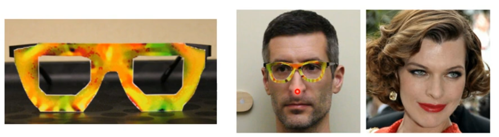

但是如果你仔细去读这篇文献的话,你会发现说 它们考虑了很多,物理世界才会有的问题

- 第一个是 在物理的世界,我们在观看一个东西的时候,可以从多个角度去看,过去有人会觉得说,Adversarial Attack 也许不是那麼危险,為什麼 因為影像就是一张,然后你加入某一个特定的杂讯,才能够让这张影像被辨识错误,但在真实的世界中,你可以从多个角度去看同一个物体,也许你的杂讯骗过了某一个角度,但没有办法在所有的角度,都骗过影像辨识的系统,但这篇论文它其实是有考虑这个观点的,所以并不是从某一个角度看这个人,他才会被辨识成右边这个知名艺人,从所有的角度,从各式各样的角度去看这个有戴眼镜的人,他都会被辨识成右边这个人,不过这件事其实你现在也不会太惊讶,因為我刚才有告诉你说,Universal Attack 是有可能成功的,所以你有可能找得到某一种杂讯是,这个人戴上这个眼镜以后,不管从什麼角度看这个人,这个攻击都是成功的,好 所以这是第一个考虑物理世界的部分,
- 那第二个 考虑物理世界特性,在这篇论文裡面有做的事情,是它有考虑到说,今天你的摄像头它的解析度还是有限的,所以如果你今天在这个眼镜上面,加的那个讯号非常地小,比如说 你只加一个非常小的斑点,那有可能你的摄像头根本没有办法看到,或者是如果你的相邻的 Pixel,有非常大的顏色的变化,那也许像这样子的状况,摄像头根本没有办法抓到,所以它有把今天摄像头的解析度,摄像头本身解析度的能力的极限,也把它考虑进来
- 第三个有考虑的事情是,到底这个眼镜能不能够,真的被做出来的问题,他们有考虑到说 有某一些顏色,你可能在电脑裡面跟在真实的世界,看起来是会有差异的,某一些顏色,也许你要真的把它实现在物理的世界,真的把它印出来,它的顏色会偏掉,所以他们有考虑到说,今天在印製这个眼镜的时候,不要使用那些,印製出来以后顏色会偏掉的顏色,会挑选一些印出来以后不会偏掉的顏色,所以你可以仔细去看一下这篇论文,它其实考虑了很多真实世界,在从这个三维的空间中,从三维的世界中,攻击数位的世界的时候,会需要面对的真实问题

#### Attack in License Plate Recognition

好 不是只有人脸辨识可以攻击成功,我们知道说未来会有很多自驾车,自驾车会需要做车牌辨识,所以当然也有人对车牌辨识系统进行攻击

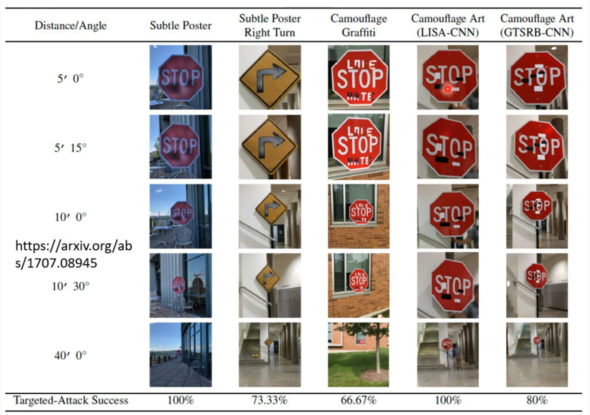

所以有论文告诉我们说,你可以在这个 STOP 的 Sign 上面,贴一些贴纸,贴完这些贴纸以后,你的这个标誌的辨识系统,不管从什麼角度,远的近的左边右边看这个 STOP Sign,它都会变成是速限 45 公里,它都变成不是停下来,而是另外一个交通号誌,但是有人,有人会觉得说,也许贴这种贴纸上去还是太招摇了,你随便贴贴纸在路牌上面,大家都知道你要做 Attack 啦,所以隔天可能就被清掉了

所以有人製造了一种,比较不招摇的,非常隐密的攻击方式, 他直接把速限 35 的 3,拉长一点,如果没有告诉你说,这个我特别拉长,你可能觉得这个字体本来就是这样,但是当他把这个 3,这个特别拉长以后,这一个牌子,对於一个这个标誌的辨识系统来说,它就变成速限 85,这个是美国一个那个软体安全公司做的啦

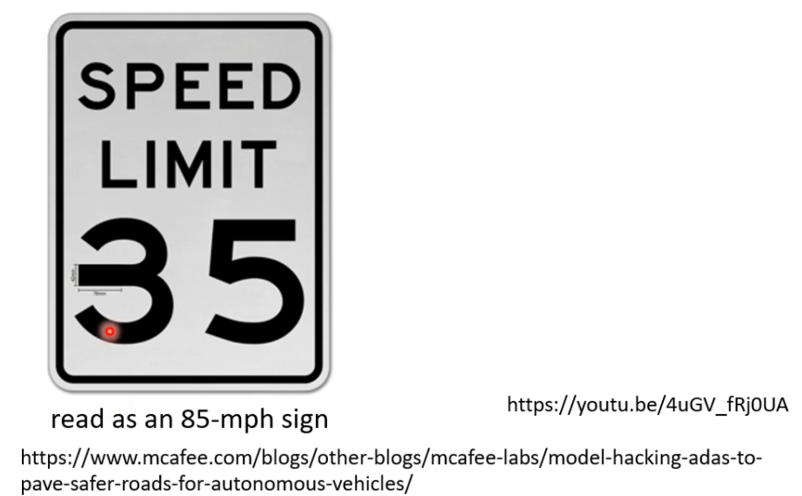

他们有放一个 Demo 的[影片](https://youtu.be/4uGV_fRj0UA),在这个 Demo 的影片裡面呢,就是有人开著那个特斯拉的汽车,然后特斯拉的汽车会做那个号誌的辨识,然后这边有一个人呢,举著一个速限 35 的牌子,但这个牌子是有特别被攻击过的,就是它的 3 呢,稍微长一点,本来特斯拉的车子看到速限 35,它的速限就没有办法超过 35,但是因為它实际上看到的,对於这个自驾车来说,它看到的牌子是速限 85,所以它就会加速,所以这个 Demo 是这样子

### Adversarial Reprogramming 

所以像这样的攻击,在物理世界,也是有可能成功的,那攻击其实还有很多,多样的类型,就让你见识一下人类的恶意啊,还有一种攻击呢,叫做 Adversarial Reprogramming

它把原来的影像辨识系统,等於是放一个像殭尸一样的东西去寄生它,让它做它本来不想做的事情,大家知道说,举例来说在那个最后生还者裡面啊,人被虫草菌寄生以后,你还是有行动的能力,但是你会去攻击其他人,做你本来不想做的事情,这个就是 Adversarial Reprogramming

 Adversarial Reprogramming裡面,在右下角这篇论文裡面,他是怎麼做的呢,他想要做的事情是,他想做一个方块的辨识系统,去数说图片裡面有几个方块,1 个到 10 个,但他不想 Train 自己的模型

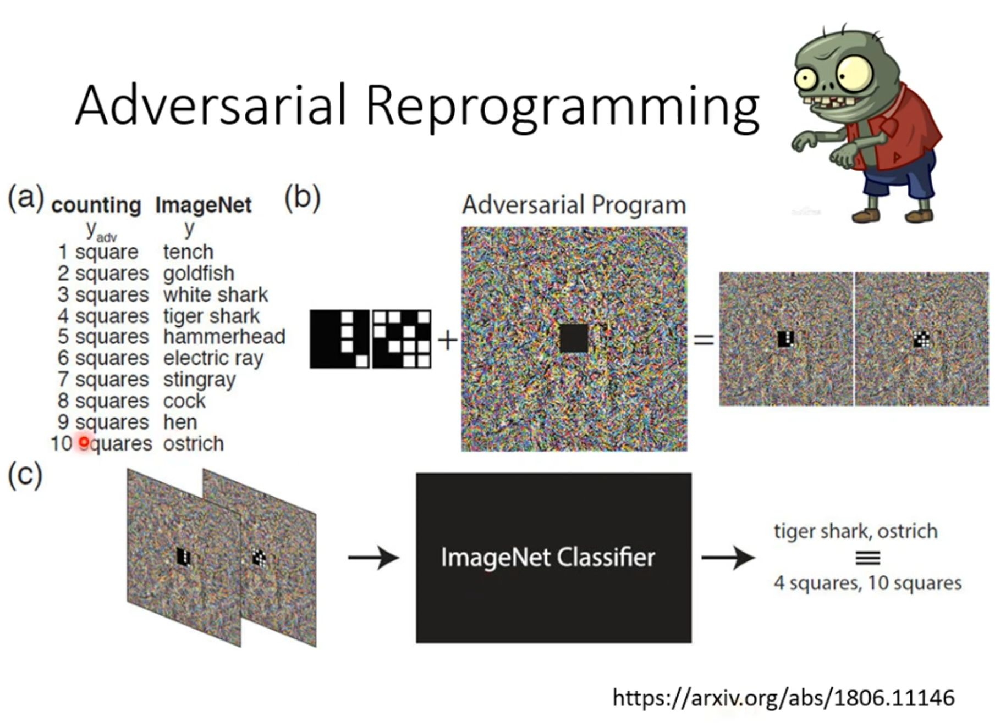

他想要寄生在某一个已有的Train 在 ImageNet 的模型上面,那 ImageNet 的模型就它图片,然后辨识说裡面有什麼样的东西,什麼样的动物 什麼样的物品等等,然后呢,他希望说呢,他输入一张图片,这个图片裡面如果有两个方块的时候,ImageNet 那个模型就要说,它看到 Goldfish,如果 3 个方块,就看到 White Shark,如果 4 个方块,就看到 Tiger Shark,以此类推,这样他就可以操控这个 ImageNet

Train 出来的模型,做他本来不是训练要做的事情,那怎麼做呢,你就把你要数方块的图片呢,嵌在这个杂讯的中间,所以这个是 4 个方块的图片,你希望丢到 ImageNet 裡面,它就输出 Tiger Shark,这个是 10 个方块的图片,你希望丢到 ImageNet 的 Classifier 裡面,它就输出 Ostrich,那**你就把这个图片外面呢,加一些杂讯,然后再把这个图片呢,丢进 Image Classifier 裡面,它就会照你的操控,做一些它本来不是训练来要做的事情,这个是 Adversarial Reprogramming**

### “Backdoor” in Model

那还有一个,还有一种攻击的方式啊,这个也是让人惊嘆人类的恶意啊,就是在模型裡面开一个后门

到目前為止,我们的攻击都是在测试的阶段才展开,但是有没有可能在训练的阶段就展开攻击呢

举例来说,假设我们要让这一张图片它被辨识错误,它是一个鱼,但是你的 Image Classifier,要把它误判為狗,到目前為止,我们都是在测试的阶段,模型已经训练好以后,才在图片上面加入杂讯去骗过这个模型,但是有没有可能攻击,是从训练的时候就已经展开了呢

有没有可能,有人在你的训练资料裡面加入一张图片,这张图片看起来没有什麼问题,它的标註也没有什麼问题,它并不是说,它加了很多鱼的图片,然后把鱼的图片都标註成狗,那这种攻击是行不通的

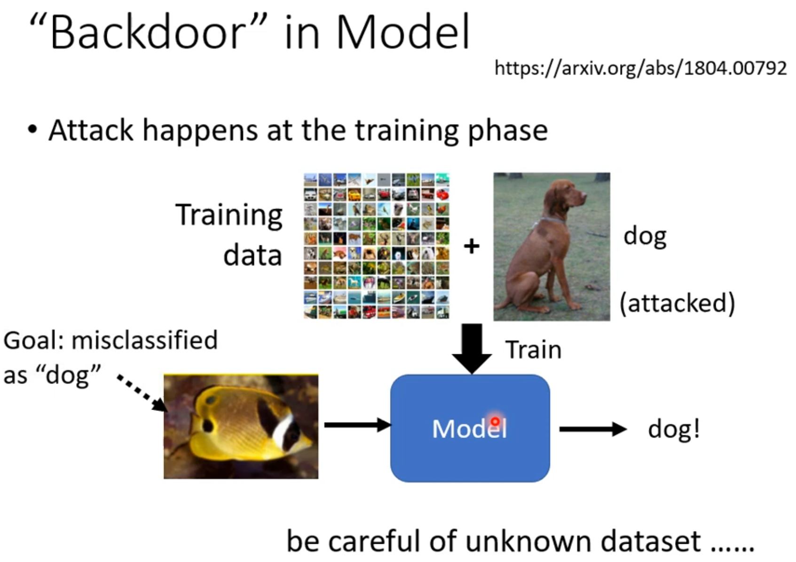

因為有人去检查你的训练资料,就知道这个训练资料有问题了嘛,所以你要在训练阶段就发起攻击的时候,你要加的图片是正常的图片,而它的标註也都是正常的,一切看起来都没有问题， 但是拿这个样子的资料去进行训练的时候,训练完的模型,只要看到这张图片,它就会误判為狗,有没有可能做到这样的事情,有没有可能攻击,从训练的阶段就开始了呢,你可以看一下右上角放的这个 Reference,看起来是有可能的,有可能在训练资料裡面,加一些特别的,人看起来没有问题,但实际上有问题的资料,让模型训练完以后,模型就开了一个后门,在测试的阶段,它就会辨识错误,而且只会对某一张图片辨识错误,对其他的图片还是没有问题的

所以你也不会觉得你的模型,训练完以后有什麼不对的地方,而直到有人拿这张图片来攻击你的模型的时候,你才会发现这个模型,它是有被下毒的,它在训练的时候就已经被开了后门,所以这个不得不让人惊嘆人类的恶意啊

你想想看,假设这一种攻击是有可能成功的话,未来你从网路上载什麼公开的资料集,你都要非常地小心啊,因為举例来说,现在大家都可能会训练人脸辨识的系统,人脸辨识的系统呢,在很多地方是真的有被使用的,那如果你今天的人脸辨识系统,是用一个公开的资料集来训练,就某一天有某个人说,欸 我公开了一个到世界,到目前為止最大的人脸辨识的资料集,是免费的

然后呢 大家就开心地下载来用,那它裡面呢,就是有加某一张下过毒的有问题的图片,但那个图片也没有人检查了出来,然后你训练完以后,大家也觉得说,嗯 这个资料集很好用,训练出来的影像辨识系统,人脸辨识系统正确率也很高,但是它是有被开了后门的,这个影像辨识系统,只要看到某个人的图片,就是释出资料的那个人的照片,它就会把门打开这样子

所以你要小心在网路上公开的资料集,搞不好裡面就有藏什麼怪东西,也说不定,如果这种开后门的方法,未来是可以 真的可以成功的话,那这是一个非常大的问题,不过你可以看一下这篇文章啦,看起来开后门要真的攻击成功,还是有某一些限制的,并不是说随便什麼模型,随便什麼训练方式,这种开后门的方法都可以攻击成功

## Defense

### Passive Defense 

到目前為止,我们已经讲了各式各样的攻击的方式,那接下来我们想要讲一下防御的方式,而那防御呢,大致可以分為两类

- 一种是被动防御
- 一种是主动防御

被动防御是怎麼做的呢,被动防御就是,你的模型是不动,训练好模型,训练好就训练好了,就放在那边 不要再去动它,但我们在模型前面加一个盾牌

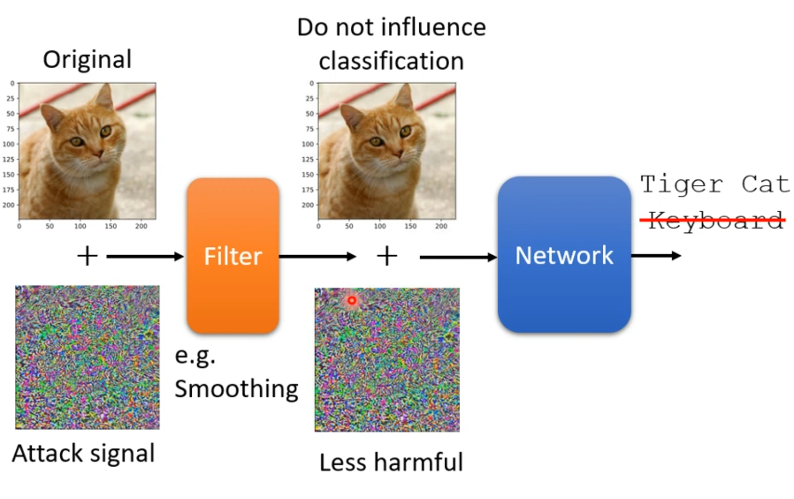

加一个 Filter,这个 Filter,可以削减 Attack Signal 的威力,就是当图片通过这个 Filter 的时候,一般的图片不太会受到影响,但是 Attack 的 Signal,通过这个 Filter 以后,它就会失去它的威力,让你的 Network 不会辨识错误

那有人就会想说,要製造什麼样的 Filter,才可以达到这种效果呢,要製造什麼样的 Filter,才能够挡住你的讯号呢,其实你不需要把这个问题想得太复杂,非常简单的做法,光是把图片稍微做一点模糊化,可能就可以达到非常好的防御效果了

举例来说,我们刚才已经,我们之前已经看到说,上次看到过说这张图片,加上了非常小的杂讯以后,影像辨识系统就觉得它是一个键盘

现在我们把这张图片做一个非常轻微的模糊化,你可以明显感觉说右边这张图片,有一点点模糊,但不是很严重,你还是可以看得出来这张图片裡面有一隻猫,当我们做了这麼一点模糊化以后,再丢到同一个影像辨识系统,你就发现,辨识结果变成是正确了,本来是 Keyboard,现在变成 Tiger Cat

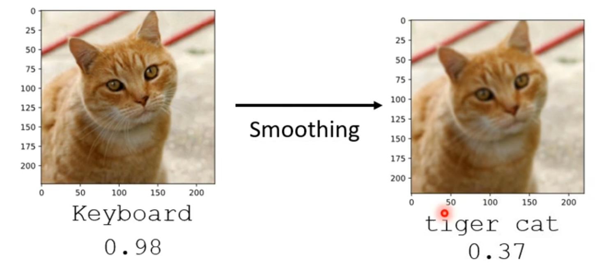

所以光是做模糊化这件事情,就可以非常有效地,挡住 Adversarial Attack

那為什麼呢,因為你可以想说,这个 Adversarial Attack,这个 Attack 的 Signal,其实只有某一个方向上的某一种攻击的讯号,才能够成功,并不是随便 Sample 一个 Noise,都可以攻击成功

我们之前已经看过说,你随便 Sample 一个 Noise,并不会达成攻击的效果,所以攻击成功,会让攻击成功的讯号,它是非常特殊的,当你加上那个模糊化以后,那个攻击成功的讯号就改变了,那它就失去攻击的威力,但是它对原来的图片影响甚小,你把原来的图片做一点模糊化,其实不太会影响影像辨识的结果

当然这种模糊化的方法,它也是有一些副作用的,比如说本来完全没有被攻击的图片,那 Machine 知道它是 Tiger Cat,但是我们把它稍微模糊化以后,机器现在辨识还是正确的,但是它的 Confidence 的分数就下降了,图片变模糊以后,机器比较不确定,它看到的东西是什麼了,所以像这种模糊化的方法,你也不能够把模糊这件事情做得太过头,做得太过头的话,它就会造成一些副作用,导致你原来正常的影像,也会辨识错误

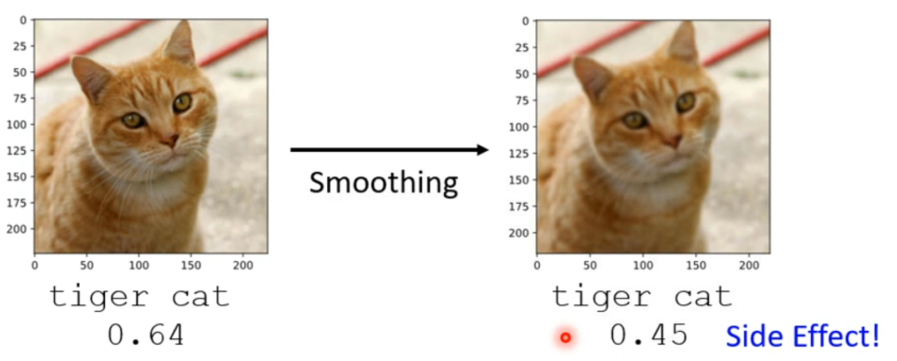

其实像这样子的被动防御的方法,还有很多类似的做法,除了做模糊化以外,还有其他更精细的做法,举例来说,有一系列的做法是,直接对影像做压缩,再解压缩

你知道你把一张图片啊,存成 JPEG 档以后,那个它就会失真嘛,那也许失真这一件事情,就可以让被攻击的图片 失去它的,失去它的攻击的威力,就可以让攻击的讯号,没有那麼具有伤害性,所以有一系列的做法是,把影像做某种压缩,那这种压缩如果会失真的话,那可能攻击的讯号受到的影响是比较大的,你就可以保护你的模型

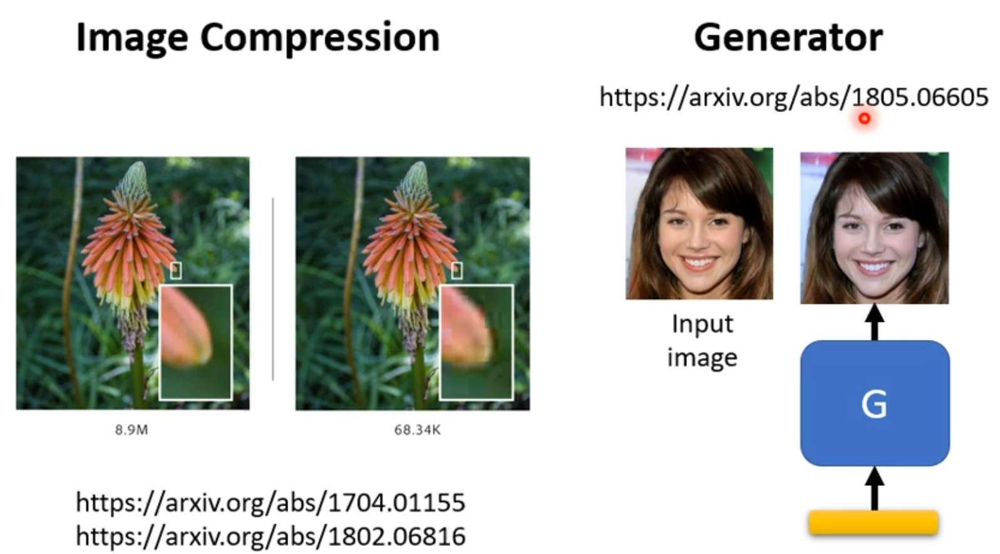

还有另外一种方法,是基於 Generator 的方法,好 我们在作业裡面,大家都已经训练过 Generator

那有一系列的做法是给一张图片,这张图片它可能有被攻击过,可能没有被攻击过,那我们让我们的 Generator,產生一张跟输入一模一样的图片,也就是把输入的图片,用 Generator 重新画过,重新產生过

那你可能会问说,欸 这个在作业裡面,我们的 Generator 只会乱生一些图片啊,你根本没办法控制它生成出来的东西啊,有办法控制 Generator 生成出来的东西,那这个不是今天的重点,我就把文献留在这边给大家参考,总之 Generator,我们有办法控制它的输出,我们要求 Generator 输出一张图片,这张图片跟输入给 Image Classifier 的图片,越接近越好

那你可以想见说,假设有人攻击了这张图片,上面加了一个微小的杂讯是人看不到的,对 Generator 而言,它在训练的时候,它从来没有看过这些杂讯,它可能也无法產生,復现出这些非常小的杂讯,那这样这些微小的杂讯就不见了,Generator 產生出来的图片是没有杂讯的,你就可以达到防御的效果

### Passive Defense - Randomization

但是这种 Passive 的 Defense 啊,这种被动的防御啊,有一个非常大的弱点,虽然我们刚才在讲的时候,虽然我们刚才在讲这个模糊化的时候,说模糊化非常有效,但是模糊化这一种方法,只要一旦被别人知道你会做这件事情,它马上就失去效用

為什麼,你可以完全把模糊化这件事情,想成是 Network 的第一层,所以模糊化这件事,等於就是在 Network 前面多加了一层啊,所以假设别人知道你的 Network 前面,多加这一层,把多加这一层放到攻击的过程中,它就可以產生一个 Signal,是可以躲过模糊化这种防御方式的

所以像这种被动的防御,它既强大也不强大,它强大就是,假设人家不知道你有用这一招,它就非常有效,一旦人家知道你用什麼招数,那这种被动防御的方法,就会瞬间失去效用,所以怎麼办呢

还有一种再更强化被动防御的方法,就是加上随机性,怎麼做呢,就是你知道,就是不要怎麼样才不会被别人猜中你的下一招,就是你自己都不知道自己的下一招是什麼,这个就是欲欺敌先瞒内的概念,你就在做这个 Defense 的时候啊,加上各种不同的 Defense 的方式

比如说在这篇文献裡面 他们就说,哦 我们输入的图片,我们只要做一些小小的改变,就可以挡住 Attack 的讯号,但是我们改变的方式不能被别人知道,别人一知道,他就可以攻破你的防御,所以怎麼办呢,我们自己都不知道图片会怎麼样被改变

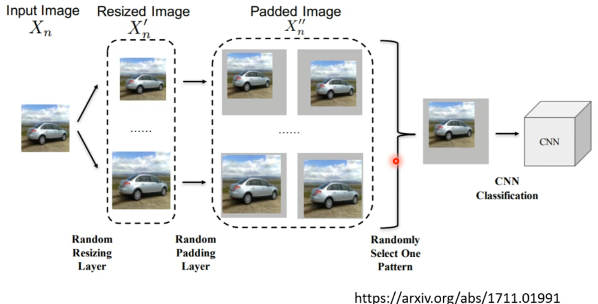

一张图片进来以后,你可能把它放大,也可能把它缩小,任意改变它的大小,然后接下来呢,你把这个图片呢,贴到某一个灰色的背景上,但贴的位置也是随机的,你也事先也不知道,你会把这个图片放在灰色背景哪个地方,再丢给你的影像辨识系统,也许透过这种随机的防御,就有办法在,就有办法挡住别人的攻击

但这种随机防御也是有问题,你想想看,假设别人知道你的随机的 Distribution 的话,他还是有可能攻破这种防御的方式的,而且我们刚才有说过,Universal 的 Attacks 是有可能的,假设你各种随机的可能性都已经被知道的话,那别人只要用 Universal Attacks,它找一个 Attack 的 Signal 可以攻破所有,所有图片的变化方式的话,这样子 Randomization 的方式,还是有可能被突破

### Proactive Defense - *Adversarial Training* 

那刚才讲的是被动的防御,那还有主动的防御,主动的防御是说,我们在训练模型的时候,**一开始啊,就要训练一个比较不会被攻破的模型,那这种训练的方式叫做 Adversarial Training**

那这个 Adversarial Training 是怎麼操作的呢,就是你有一些训练资料,这个跟一般的 Training 是一样的,你有 Image,这边用 x 来表示,ImageLabel 用 ŷ 来表示,然后呢,我们就拿我们的训练资料来训练一个模型

训练完以后,接下来你在训练的阶段,就对这个模型进行攻击,你把这边训练的资料,$x^1$ 到 $x^n$ 都拿出来,製造一些 Signal,让这些图片变得具有攻击性,那被攻击后的 Image,叫做 $\tilde{x}$,你把这边 $x^1$ 到 $x^n$,训练资料裡面的每一张图片,都拿出来进行攻击

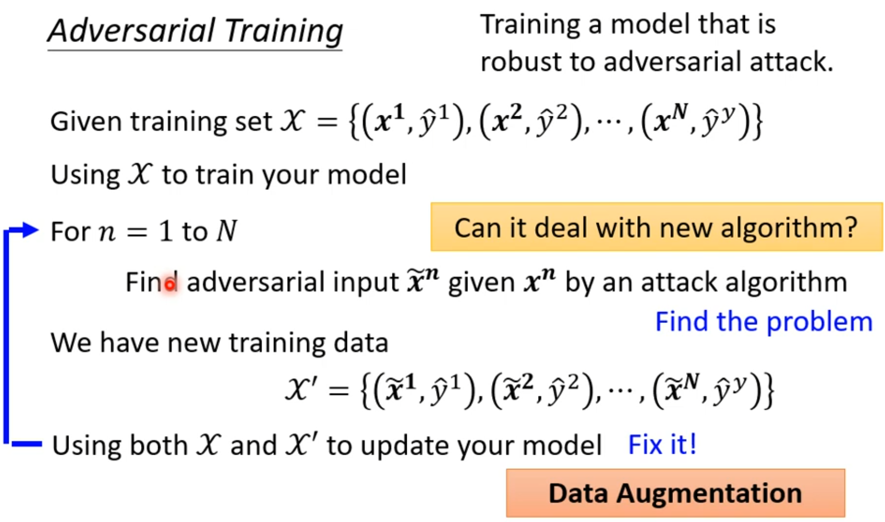

攻击完以后,你再把这些被攻击过后的图片,标上正确的 Label,就你把 $x^1$​​ 变成 $\tilde{x}^1$​​ 以后,你的 Machine 就会辨识错误,本来是个猫的图片,它可能就辨识错成键盘,但是你现在把那个辨识错成键盘的图片拿来,重新把它标成猫,因為你已经知道说 $x^1$​​,它的 Label 就是猫嘛,所以就算它变成 $\tilde{x}$​​

它现在输入影像辨识系统以后,输入这个你训练好的模型以后,输出的 Label 变了,你也知道原来正确的 Label 是什麼,你就把原来正确的 Label 拿回来,所以现在就製造了一个新的训练资料,叫 $X^′$​,在新的训练资料裡面,每一笔资料都是有被攻击过的,原来 $x^1$​ 到 $x^n$​,变成  $\tilde{x}^1$​ 到  $\tilde{x}^n$​,

这个 $\tilde{y}^1$​ 到 $\tilde{y}^n$​,是一样的,那你再把 $X$ 跟 $ X^′$ 倒在一起,得到更多的训练资料,再重新去训练你的模型

**所以这整个 Adversarial Training 的概念就是,我们先训练好一个模型,然后看看这个模型呢,有没有什麼漏洞,把漏洞找出来,然后接下来呢,再把漏洞填起来,就不断地找漏洞,找到就把它填起来,这个就是 Adversarial Training 的精神**

那这个方法啊,其实也可以看作是一种,**Data Augmentation 的方法**,因為我们產生了更多的图片$ X^′$​ ,那再把这些图片加到训练资料裡面,这个等於就是做了资料增强,做了 Data Augmentation 这件事,所以有人也会把 Adversarial Training,当做一个单纯的资料增强的方式

就是像这样子的方式,不是只在你的 Model 可能被攻击的时候有用,有时候就算没有人要攻击你的模型,**你也可以用这样的方法產生更多的资料,然后再把更多的资料拿去做训练,也可以让你的模型,它的 Robotics 的能力更好,更不容易 Overfitting,**所以就算是没有人要攻击你的模型,你也可以用 Adversarial Training,来强化你的模型,避免 Overfitting 的状况

那这个 Process 啊,產生有问题的图片,再重新训练,这个 Process 啊 是可以反覆做的,你可以產生图片 重新训练,再產生图片 再產生训练,就不断找出问题补起来,找出问题补起来,这个 Process 是可以反覆做多次,直到你开心為止

那像这样 Adversarial Training,它其实有个非常大的问题就是,它不见得挡得住新的攻击的方式,就假设我们今天在找 $ X^′$​ 的时候,你用的是 Algorithm ABCD,然后接下来有人在实际攻击的时候,他发明了一个 Algorithm F 去攻击你的模型,往往就能成功,如果今天实际上攻击你 Model 的方法,并没有在 Adversarial Training 的时候被考虑过,那 Adversarial Training,也不见得能够挡住新的 Attack 的 Algorithm,所以 Adversarial Training 还是有,还是有可能被攻破的

另外 Adversarial Training,还有一个比较大的问题就是,它需要非常大,比较多的运算资源,你想想看,本来一般在训练模型的时候,走到这边就结束了,你有训练资料 训练完模型就结束了,但是 Adversarial Training 它的问题是,首先你要花时间,找出这些$ X^′$,你的图片有几张,你可能就要找出多少张的 $ X^′$,100 万张图片,你要找 100 万个 $ X^′$,光做这件事,可能就已经很花时间了

所以你会发现说,如果你的 Dataset 很大的时候,大家通常就不会想要做 Adversarial Training,所以 Adversarial Training,是一个比较吃运算资源的方法,那為了解决这个问题,有人发明了一个方法叫做,Adversarial Training For Free,这边我们就不细讲,有一些方法是做到 Adversarial Training 的效果,却没有 Adversarial Training 那麼大的,Computing 的 Intensity,那至於怎麼做到 Adversarial Training For Free,怎麼不在使用额外的计算的情况下,就达到 Adversarial Training 的效果,那这个把文献放在这边,留给大家参考

那到目前為止呢,我们就是告诉大家,有攻击这件事情,攻击非常容易成功,黑箱攻击也是有可能成功的,然后跟大家介绍了几种经典的 Defense 的方式,那目前攻击跟防御啊,它们都,这些方法仍然不断地在演化

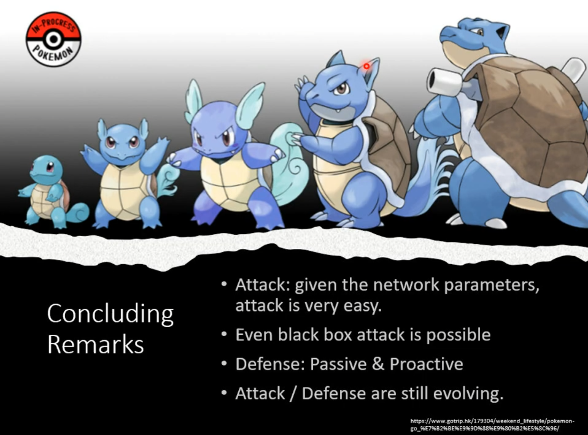

所以在国际会议会不断看到,有新的攻击方法被提出,有新的防御方法被提出,它们仍然都在进化中,那不知道最后会是谁胜谁负,好 那这个是今天的现况,